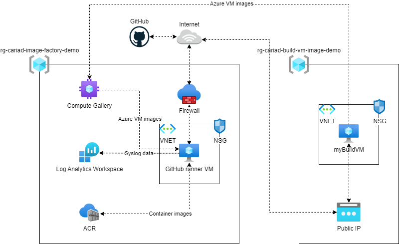

# CARIAD EngIT Frame – tech task – WP10 - Image Factory
## Delivered

- Terraform code
- GitHub Actions workflows
- Bash script for automated deployment
- Example application code, tests and Dockerfile
- Example VM template and tests

## Prerequisites

Before running the code, ensure that you have the following tools installed:

1. `Azure CLI`: [Install Azure CLI](https://learn.microsoft.com/en-us/cli/azure/install-azure-cli-windows?tabs=azure-cli)
2. `Terraform`: [Install Terraform](https://developer.hashicorp.com/terraform/install)

### Deployment Requirements

To ensure a successful deployment, please verify the following prerequisites:

1. **Service Principal**
   - The Service Principal must be assigned the **Owner** role at the **Subscription** level where the deployment will occur.
   - Generate a valid secret and provide it to the deployment script.
   - **Azure Tenant ID**: Ensure you have the Azure Tenant ID for the tenant where the subscription resides.
   - **Application Client ID**: Obtain the Application Client ID associated with the Service Principal.
   - **Subscription ID**: Confirm the Subscription ID for the resource deployment. 

2. **Resource Groups**
   - Ensure that the Resource Groups named **rg-cariad-image-factory-demo** and **rg-cariad-build-vm-image-demo** does not already exist in the Subscription.

3. **Internet Access**
   - The machine executing the deployment must have internet access to facilitate the process.

## Setup
### Step 1
### GitHub Repository Setup
Create a private GitHub repository within your organization with GitHub Pro, GitHub Team, or GitHub Enterprise Cloud plan and import the code.

To ensure that no workflows can be modified by users create a ruleset within the repository by following these steps:
1. Navigate to the `Settings` tab in your repository 
2. Select `Rules` on the left side menu 
3. Select `Ruleset` 
4. Click on the `New ruleset` button and choose `New push ruleset` 
5. Type in a name for your ruleset 
6. Select enforcement status `Active` if it isn't already 
7. Add bypass entries to the list if you wish (some of the options incluse roles and teams) 
8. In the `Push rules` section enable the `Restrict file paths` option 
9. Press `Add file path` button and add `.github/**/*` file path to the list
10. At the bottom of the page press `Save changes`

If you wish to add the same protection to the terraform code navigate to the ruleset that was just created and repeat steps 9. and 10. to add `terraform/**/*` file path to the ruleset.

To ensure that the workflows work propperly please add the required secrets to your GitHub repository by following these steps:
1. Navigate to the `Settings` tab in your repository
2. Select `Secrets and variables` on the left side menu
3. Select `Actions`
4. Select the `Secrets` tab if it isn't already selected
5. Press `New repository secret`
6. Type in a name for your secret
7. Enter the value of your secret
8. Press `Add secret`
9. Repeat steps 5. through 8. to add all of the secrets from the list below

List of secrets to add:
- `AZURE_TENANT_ID` (Your azure tenant ID)
- `AZURE_SUBSCRIPTION_ID` (ID of the target subscription in which you'll deploy the resources)
- `AZURE_CLIENT_ID` (ID of the service principal that you'll use to deploy the resources)
- `AZURE_CLIENT_SECRET` (Secret of the service principal that you'll use to deploy the resources)
- `ADMIN_USERNAME` (Admin username of the VM that will act as your self-hosted GitHub runner)
- `ADMIN_PASSWORD` (Admin password of the VM that will act as your self-hosted GitHub runner)
- `RUNNER_TOKEN` (Token used when registering the self-hosted GitHub runner)

To ensure that the workflows work propperly please add the required variables to your GitHub repository by following these steps:
1. Navigate to the `Settings` tab in your repository
2. Select `Secrets and variables` on the left side menu
3. Select `Actions`
4. Select the `Vaiables` tab if it isn't already selected
5. Press `New repository variable`
6. Type in a name for your variable
7. Enter the value of your variable
8. Press `Add variable`
9. Repeat steps 5. through 8. to add all of the variables from the list below

List of variables to add:
- `ACR_NAME` (Name of the created container registry) (For the purpose of this task the value should be set to: `acrcariadimagefactorydemo`)
- `APP_NAME` (Name of your application) (For the purpose of this task the value should be set to: `my-python-app`)
- `PLATFORMS` (A comma separated list of platforms for container images) (e.g. `linux/amd64,linux/arm64`) (Gor the purpose of this task the value should be set to: `linux/amd64,linux/arm64`)
- `GALLERY_NAME` (Name of the created image gallery) (For the purpose of this task the value should be set to: `igcariadimagefactorydemo`)
- `IMAGE_VERSION` (Used to form your custom VM image name) (e.g. `1.0.0`)
- `USER_ASSIGNED_IDENTITY_ID` (Your managed identity ID) (e.g. `/subscriptions/<AZURE_SUBSCRIPTION_ID>/resourcegroups/rg-cariad-image-factory-demo/providers/Microsoft.ManagedIdentity/userAssignedIdentities/id-cariad-image-factory-demo`)
- `IMAGE_DEFINITION_NAME` (Your image definition name) (e.g. `Ubuntu2204Definition`)
- `IMAGE_TEMPLATE_NAME` (Your template name) (e.g. `Ubuntu2204ImageTemplate`)
- `VNET_NAME` (Name of the created VNET) (For the purpose of this task the value should be set to: `vnet-cariad-image-factory-demo`)
- `SUBNET_NAME` (Name of the created subnet) (For the purpose of this task the value should be set to: `subnet-cariad-image-factory-demo`)

### Step 2
### Deploy the self-hosted GitHub runner, Container Registry and Image Gallery

#### Prepare the Deployment Script

1. Ensure the following directory structure is in place:

- scripts/
    - deploy-image-factory.sh

2. Navigate to `scripts` folder

 ```bash
 cd scripts
 ```

3. Open the `deploy-image-factory.sh` file and configure the necessary environment variables with your credentials:
 ```bash
 ADMIN_USERNAME="YOUR_ADMIN_USERNAME"
 ADMIN_PASSWORD="YOUR_ADMIN_PASSWORD"
 ARM_TENANT_ID="YOUR_TENANT_ID"
 ARM_SUBSCRIPTION_ID="YOUR_SUBSCRIPTION_ID"
 ARM_CLIENT_ID="YOUR_CLIENT_ID"
 ARM_CLIENT_SECRET="YOUR_CLIENT_SECRET"
 RUNNER_TOKEN="YOUR_GITHUB_RUNNER_TOKEN"
 ```

4. Make sure the `deploy-image-factory.sh` script has execute permissions:
 
 ```bash
 chmod +x deploy-image-factory.sh
 ```

#### Execute the Deployment Script

1. Run the script with elevated privileges to start the deployment process:
 ```bash
 ./deploy-image-factory.sh
 ```

2. Terraform will prompt with the plan of the deployment, type `yes` and hit `enter` to proceed.

3. Wait for the deployment script to complete.

# Architecture Diagram



# Terraform Infrastructure Code

This Terraform configuration provisions a Virtual Machine (VM) used as a self-hosted GitHub runner, Container Registry and Image Gallery, along with all related resources.

## Directory Structure

All resources are deployed as modules, with the following directory structure:

- `main.tf`: Resource definitions
- `variables.tf`: Variable declarations
- `outputs.tf`: Output definitions

## Provider

`terraform/main/providers.tf`
This configuration uses the `azurerm` provider to manage Azure resources.

Provider configuration:
```hcl
terraform {
  required_providers {
    azurerm = {
      source  = "hashicorp/azurerm"
      version = "3.92.0"
    }
    azuread = {
      source  = "hashicorp/azuread"
      version = "2.47.0"
    }
  }
}
provider "azurerm" {
  features {}
  client_id       = var.client_id
  client_secret   = var.client_secret
  subscription_id = var.subscription_id
  tenant_id       = var.tenant_id
}
```

## Main Variables

`terraform/main/variables.tf`
```hcl
variable "client_id" {
  description = "The Client ID for the Service Principal used to authenticate with Azure. This is part of the Azure AD application registration."
  type        = string
}

variable "client_secret" {
  description = "The Client Secret for the Service Principal used to authenticate with Azure. This is the secret key associated with the Azure AD application."
  type        = string
  sensitive   = true
}

variable "subscription_id" {
  description = "The ID of the Azure Subscription where resources will be deployed. This uniquely identifies the subscription within Azure."
  type        = string
}

variable "tenant_id" {
  description = "The Tenant ID of the Azure Active Directory instance used for authentication. This is also known as the Directory ID."
  type        = string
}

variable "admin_username" {
  description = "The username for the administrative account on Linux VMs. This will be used for SSH access to the virtual machines."
  type        = string
}

variable "admin_password" {
  description = "The password for the administrative account on Linux VMs. This should be a strong password meeting Azure's complexity requirements for Linux VMs."
  type        = string
  sensitive   = true
}

variable "runner_token" {
  description = "The token used to register and authenticate GitHub Actions self-hosted runners. This token is specific to your GitHub repository or organization."
  type        = string
  sensitive   = true
}
```

`terraform/main/locals.tf`
```hcl
locals {
  tags = {
    project-name = "cariad-image-factory"
    environment  = "demo"
    owner        = "gojko.bozic@p3-group.com"
  }
}
```

## Resources

The following resources are defined in the Terraform code:

- **Resource Group**
- **Virtual Machine**
   - **Network Interface Card (NIC)** *(subresource of Virtual Machine)*
   - **OS Disk** *(subresource of Virtual Machine)*
- **Virtual Network**
   - **Subnet** *(subresource of Virtual Network)*
- **Public IP**
- **Network Security Group** *(associated with Subnet)*
- **Data Collection Rule**
- **Log Analytics Workspace**
- **Azure Compute Gallery**
- **Container Registry**
- **Managed Identity**
- **Firewall**
- **Routing Table**

For the purpose of this task, the following **inbound** Network security group rules are permitted for all addresses:

- Port 22 *(SSH)*

In a production envrionment the whitelist shall include only specific addresses as necessary.

## Important Notes
- Since provisioning is done locally, the `terraform.tfstate` file will be generated in the `terraform/main` directory. For future deployments, users should back up this file. The best practice is to configure a backend block for the `azurerm` provider and store the `terraform.tfstate` file in an `Azure Storage Account`.

### Firewall setup
The list of allowed URLs can be updated in the `terraform/main/main.tf` in the firewall module definition by adding more entries to the `allowed_urls` block. 

Current list of allowed URLs is:
```hcl
  allowed_urls = [
    "*.microsoft.com",
    "*.github.com",
    "github.com",
    "*.githubusercontent.com",
    "*.gitlab.com",
    "*.azure.com",
    "*.windows.net",
    "*.azureedge.net",
    "*.microsoftonline.com",
    "*.login.microsoftonline.com",
    "*.blob.core.windows.net",
    "${module.container_registry.name}.azurecr.io", # Azure Container Registry
    "*.docker.com",
    "*.docker.io",
    "*.quay.io",
    "*.archive.ubuntu.com",
    "*.security.ubuntu.com",
    "*.pypi.org",
    "*.pypi.io",
    "*.npmjs.com",
    "*.rubygems.org",
    "*.packages.microsoft.com",
    "*.nuget.org",
    "aka.ms"
  ]
```

### Runner VM setup script
The runner VM setup script is defined in the `terraform/virtual_machine/runner_setup.sh` file as a custom data cloud-init script. Below is the breakdown of the script steps:

```
#!/bin/bash

set -e
set -o pipefail

# Function to retry commands
retry_command() {
    local -r cmd="$1"
    local -r max_attempts=3
    local -r sleep_time=5
    
    for attempt in $(seq 1 $max_attempts); do
        echo "Attempt $attempt of $max_attempts: $cmd"
        if eval "$cmd"; then
            return 0
        fi
        echo "Command failed. Retrying in $sleep_time seconds..."
        sleep $sleep_time
    done
    
    echo "Command '$cmd' failed after $max_attempts attempts."
    return 1
}

# Update system packages and install required dependencies
echo "Updating system packages..."
retry_command "sudo apt-get update"
retry_command "sudo apt-get install -y curl jq ca-certificates zip"

# Install Azure CLI
echo "Installing Azure CLI..."
retry_command "curl -sL https://aka.ms/InstallAzureCLIDeb | sudo bash"

# Add Docker's official GPG key and repository
echo "Setting up Docker repository..."
sudo install -m 0755 -d /etc/apt/keyrings
retry_command "sudo curl -fsSL https://download.docker.com/linux/ubuntu/gpg -o /etc/apt/keyrings/docker.asc"
sudo chmod a+r /etc/apt/keyrings/docker.asc

# Add Docker repository to Apt sources
echo \
  "deb [arch=$(dpkg --print-architecture) signed-by=/etc/apt/keyrings/docker.asc] https://download.docker.com/linux/ubuntu \
  $(. /etc/os-release && echo "$VERSION_CODENAME") stable" | \
  sudo tee /etc/apt/sources.list.d/docker.list > /dev/null

# Update package list and install Docker
retry_command "sudo apt-get update"
retry_command "sudo apt-get install -y docker-ce docker-ce-cli containerd.io docker-buildx-plugin docker-compose-plugin"

# Configure Docker to enable containerd snapshotter
echo '{"features": {"containerd-snapshotter": true}}' | sudo tee /etc/docker/daemon.json > /dev/null

# Restart Docker service
sudo systemctl restart docker
sudo systemctl enable docker

# Download GitHub Runner
echo "Downloading GitHub Runner..."
RUNNER_VERSION=$(curl -s https://api.github.com/repos/actions/runner/releases/latest | jq -r '.tag_name' | cut -c 2-)

# Create a new user for the GitHub Runner
echo "Creating user 'action'..."
sudo useradd -m action -G docker 

# Create runner directory
echo "Creating runner directory..."
RUNNER_DIR="/home/action/actions-runner"
mkdir -p $RUNNER_DIR
sudo chown -R action:action $RUNNER_DIR
cd $RUNNER_DIR

# Download and extract the GitHub Runner package
echo "Downloading GitHub Runner package..."
retry_command "curl -o actions-runner-linux-x64-$RUNNER_VERSION.tar.gz -L https://github.com/actions/runner/releases/download/v$RUNNER_VERSION/actions-runner-linux-x64-$RUNNER_VERSION.tar.gz"

echo "Extracting GitHub Runner package..."
tar xzf actions-runner-linux-x64-$RUNNER_VERSION.tar.gz
sudo chown -R action:action $RUNNER_DIR

# Configure the runner
echo "Configuring GitHub Runner..."
runuser -l action -c "$RUNNER_DIR/config.sh --url https://github.com/P3-Digital-Services/WP10-Image-Factory --token ${runner_token} --labels ubuntuFactoryRunner --name ImageFactoryRunner --runnergroup Default --work $RUNNER_DIR --unattended --runasservice"

# Install the runner as a service
echo "Installing GitHub Runner as a service..."
sudo ./svc.sh install

# Update service to run as 'action' user
echo "Updating service user..."
sudo sed -i 's/User=root/User=action/' /etc/systemd/system/actions.runner.P3-Digital-Services-WP10-Image-Factory.ImageFactoryRunner.service
sudo systemctl daemon-reload

# Start the GitHub Runner service
echo "Starting GitHub Runner service..."
sudo ./svc.sh start

# Install Grype and Syft scanners
install_scanner() {
    local name=$1
    local url=$2
    echo "Installing $name..."
    if curl -sSfL "$url" | sh -s -- -b /usr/local/bin; then
        echo "$name installed successfully"
    else
        echo "Failed to install $name. Please check network connectivity and try again."
        return 1
    fi
}

install_scanner "Grype" "https://raw.githubusercontent.com/anchore/grype/main/install.sh"
install_scanner "Syft" "https://raw.githubusercontent.com/anchore/syft/main/install.sh"

echo "### GitHub Runner installation completed successfully ###"
```

### Runner VM monitoring setup
System logs of the virtual machine used as the self-hosted GitHub runner are made available in the azure log analytics workspace. This is achieved by installing an azure monitor agent on the machine and connecting it to the log analytics workspace through `azurerm_virtual_machine_extension` located in the `terraform/virtual_machine/main.tf` file, followed by creating a data collection rule and associating it with the virtual machine.

The logs can be viewed by running the following query in the log analytics workspace:
```
Syslog | where Computer == "GithubRunner" | project-away TimeGenerated, Computer, HostIP, Type, _ResourceId, SourceSystem
```

## Task 1
### Container Images
To build a container image run the `Container Images` workflow defined by the `.github/workflows/docker-build.yaml` file. Workflow is protected from modification by users by the ruleset created in step 1 of the setup section and utilizes the self-hosted GitHub runner running in an air-gapped environment created in step 2 of the setup section. 

Custom user tests can be placed in the `docker/custom_tests/` directory and the file names should end with `.sh`. Test file `docker/custom_tests/test1.sh` has been provided as an example. Make sure to use the `DOCKER_IMAGE` environment variable in the test file as shown in the example.

The format of the `DOCKER_IMAGE` variable is `<ACR_name>.azurecr.io/<image_name>:${{ github.sha }}`.

Anchore is utilized for quality gate checks for container images security vulnerabilities and for generating the SBOM. 
By setting the `fail-build` argument to `true` workflow can be terminated here as a result of a failed quality gate check, when set to `false` the workflow will continue regardless of the result of the scan.
SBOM is available in the workflow run `Artifacts` section when the run completes.
<https://github.com/anchore/scan-action>

When the workflow is initiated it executes the following steps:
1. Repo checkout
2. Setup docker buildx to enable multi-platform builds
3. Cache docker layers
4. Login to azure container registry
5. Build docker image
6. Export Docker image environment variable `DOCKER_IMAGE`
7. Run custom user tests 
8. Scan docker image for vulnerabilities 
9. Generate SBOM 
10. Push docker image to azure container registry

## Task 2
### Azure Virtual Machine Images
To build a container image run the `Azure Virtual Machine Images` workflow defined by the `.github/workflows/vm-image-build.yaml` file. Workflow is protected from modification by users by the ruleset created in step 1 of the setup section and utilizes the self-hosted GitHub runner running in an air-gapped environment created in step 2 of the setup section.

Custom user tests can be placed in the `vmimage/tests/` directory and the file names should end with `.sh`. Test file `vmimage/tests/test1.sh` has been provided as an example.

`Create Image Builder template` step creates a template for image building by using provided bicep templates located in `vmimage` directory. `vmimage/ubuntu-linux-vm-22.04-definition.bicep` and `vmimage/ubuntu-linux-vm-22.04.bicep` files provided as an example.

`Create test VM` step creates a machine from the produced azure VM image that will run custom user tests.

Grype is utilized for checking azure VM images security vulnerabilities and Syft for generating the SBOM.

`Run test scripts and capture results` will go through all of custom user tests the results of which will be uploaded as an artifact in the next steps.

At the end the workflow will clean up all of the resources used in the image building and testing process.

When the workflow is initiated it executes the following steps:
1. Repo checkout
2. Login to Azure using Managed Identity
3. Create Image Builder template
4. Run Image Builder
5. Wait for Image Builder to complete
6. Get Image Version details
7. Get VNet and Subnet IDs
8. Create test VM
9. Install Syft on VM
10. Run syft scan and download SBOM
11. Run Grype scan
12. Upload SBOM file
13. Upload Grype results
14. Run test scripts and capture results
15. Zip test results
16. Upload test results
17. Clean up resources
18. Error Logging