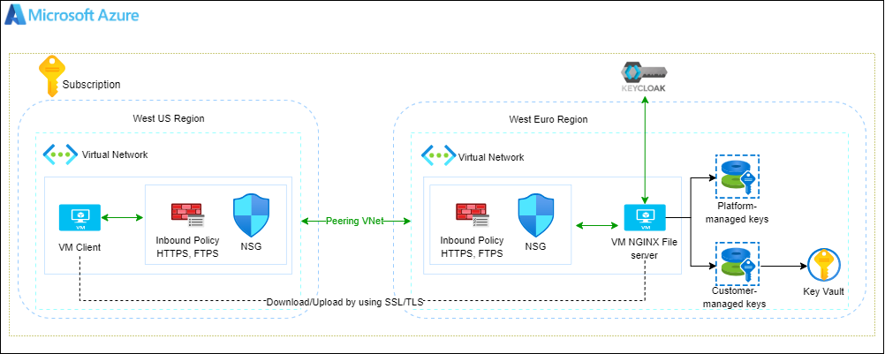
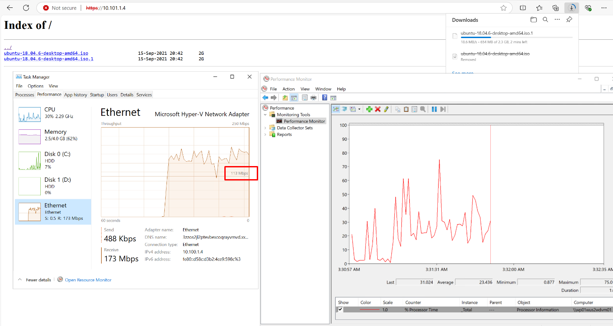

# Central Deployment Infrastructure

## 1. Azure Configuration and Architecture

### Architecture



**US-West Configuration:**

- Resource Group: Create a resource group to manage all associated resources in the US-West region.
- Virtual Network (VNet): Set up a VNet to segment the infrastructure and provide isolation.
- Subnets and NSGs: Configure subnets for resource segregation and apply Network Security Groups (NSGs) to define the inbound and outbound security rules.
- Security Policies: Inbound policies for HTTPS and FTPS to allow secure file transfer.

**EU Configuration:**

- Resource Group: Create a resource group for all resources in the central or western EU region.
- Virtual Network (VNet): Set up the VNet to host the infrastructure securely.
- Subnets and NSGs: Configure the necessary subnets and apply NSGs, just like in the US-West region, to enforce security rules and allow traffic.
- File Server: Deploy an NGINX-based file server to manage uploads and parallel downloads. Use HTTPS and FTPS to secure data transfers.

## 2. Connecting the Configurations

- Peering VNet: Use VNet peering between the US-West and EU VNets to enable seamless communication between regions with low latency. Ensure that the peering allows forwarding of traffic between the VNets.
- Routing and Security: Validate that the routes are properly configured, and NSG rules are appropriately set to allow traffic while maintaining security.

## 3. File Server Setup

Deploy in the EU Region: The file server will be deployed in the EU region to serve clients in both locally and globally.

## 4. Performance Optimization

Performance optimization is critical to ensure the best user experience when accessing resources across regions.

- Network Optimization: Ensure that network configurations (peering settings and NSG rules) are tuned for optimal performance.

- Bandwidth Allocation: Prioritize file transfer traffic, using Load Balancer to route traffic based on performance metrics.
- Latency Minimization: Reduce latency through proper routing and peering between regions.
- File Server Tuning:
  - NGINX Configuration: Optimize the file server settings to allow multi-part transfer to reduce load times for larger files. Enable connection pooling, caching, and request queuing.
    - Worker Processes and Connections: NGINX is single-threaded per worker process, so having more worker processes allows NGINX to handle more requests concurrently.

        ```yml
        worker_processes auto;  # Automatically sets based on the number of CPU cores
        worker_connections 1024;  # Each worker can handle 1024 connections
        ```

    - Keep-Alive Connections: Keep connections open longer to reduce overhead of opening new connections

      ```yml
      keepalive_timeout 65;
      keepalive_requests 10000;
      ```

    - Sendfile, TCP Cork/Push, and Buffering:
      - Sendfile: Avoids copying data between user space and kernel space.
      - TCP_NOPUSH: Improves performance by sending headers in one packet.
      - TCP_NODELAY: Disables buffering of small packets, reducing latency.

      ```yml
      sendfile on;
      tcp_nopush on;
      tcp_nodelay on;
      ```

    - Enable HTTP/2. HTTP/2 allows multiplexing, which makes the delivery of multiple resources faster.

      ```yml
      sendfile on;
      tcp_nopush on;
      tcp_nodelay on;
      ```

  - Scale Testing: Perform load testing to measure bandwidth for single and parallel downloads, ensuring that the server can handle high traffic without degradation.​

    

- Performance Metrics: Track key performance metrics like throughput, latency, and error rate. Regularly review Azure Monitor and Azure Application Insights for identifying bottlenecks and potential improvements.

## 5. Secure Connection Concept

Securing the connection between the US office and the EU-based file server is paramount to ensure data integrity and compliance with data security standards.

- Secure Design:
  - Establish an authenticated and authorized connection from the US office to the EU web service.
  - Ensure end-to-end encryption using SSL/TLS for both data in transit and data at rest on the file server.
  - Use HTTPS and FTPS protocols for secure communication between clients and the file server, ensuring encryption during file transfer.
- Authentication and Authorization:
  - Use KeyCloak for managing identities and ensuring that only authorized users can access the file server.
  - Implement Role-Based Access Control (RBAC) to limit user privileges, allowing users only the necessary permissions to perform their tasks.
- Data Encryption:
  - In Transit: Use TLS to secure data transfers. Enforce SSL/TLS for communications between clients and the file server, including for peering between regions.
  - At Rest: Ensure that data on the file server is encrypted using Azure-managed keys or customer-managed keys (CMK), according to company policy or regulatory requirements.

## 6. How to run

### Prerequisites

- Install Ansible
- Install TerraForm
- Azure Account Permission Contributor.

### Azure Resource Naming Convention

`${var.system_code}-${var.environment_code}-${var.project_name}-${var.location_code}-${var.<resource-name>}-01`

### Steps to Run Terraform

1. Ensure your machine has Azure CLI installed, and that your Azure account has Contributor permissions on the Azure Subscription you're working on.

    ```bash
    az login
    az account set --subscription <subscription-id>
    ```

2. Modify the `subscription_id` value in the `./terraform/versions.tf` file located in the root directory.

3. (Optional) You can also customize your values in the `./terraform/terraform.tfvars` file located in the root directory.

4. Execute the following Terraform commands to create Azure resources for the project:

    ```bash
    terraform init
    terraform validate
    terraform plan
    terraform apply
    ```

### Steps to Start Ansible Playbook

1. Ensure your machine has Ansible installed.

2. Create an SSH key for the remote nodes:

    ```bash
    ssh-keygen
    ```

3. Copy the SSH key to the remote nodes:

    ```bash
    ssh-copy-id <user-name>@<remote-node-ip>
    ```

4. Declare the file inventory:

    - Content of the file:

    ```ini
    <remote-node-ip> ansible_user=<user-name>

    [file-server:vars]
    file_server_ip=<remote-node-ip>
    ```

5. Start the Ansible playbook:

    ```bash
    ansible-playbook -i <path>/hosts file-server.yaml
    ```
