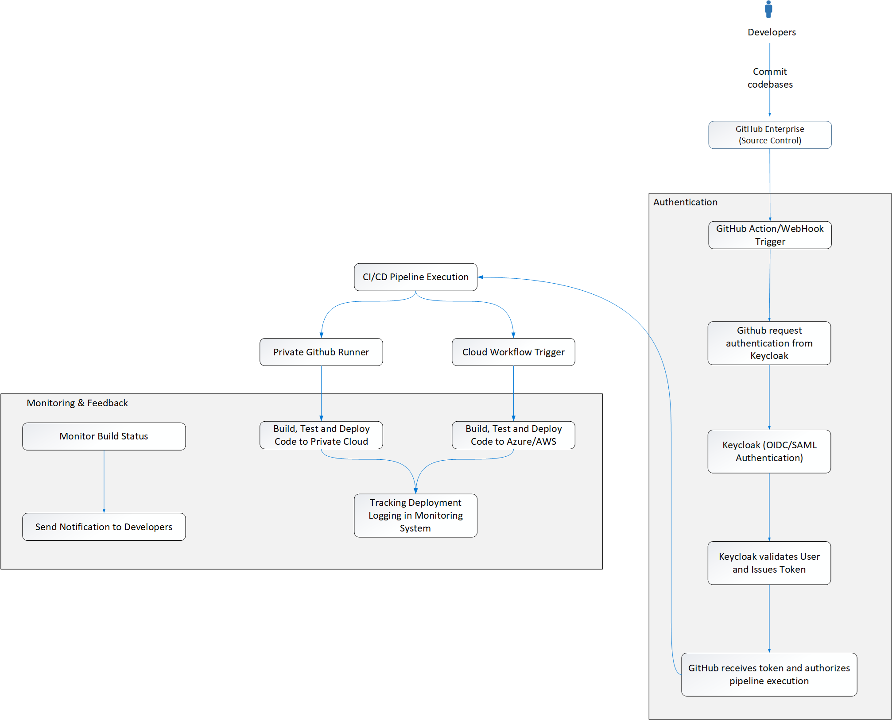

# Cloud-Agnostic Authentication Architecture Documentation

# 1. An explanation of the architecture

## Overview

The cloud-agnostic authentication architecture that supports the GitHub Enterprise service in both private cloud and Azure cloud environments is described in this document. Keycloak serves as the main Identity Provider (IDP) in the architecture, with additional backup and failover mechanisms added for dependability and availability.

More than 10,000 users can access the system securely thanks to a strong authentication system. Federated identity providers (Azure AD), session replication, backup authentication, multi-protocol support, and extensive monitoring and logging capabilities are among the essential elements.

## Important Elements

Primary IDP: Keycloak is the core IDP handling all authentication requests. It federates with Azure Active Directory (Azure AD) to support Azure cloud users while providing native authentication for the private cloud.

- **Backup/Fallback IDP**: In case of a failure of the primary Keycloak instance, backup mechanisms are in place, including a secondary Keycloak instance, Azure AD, or LDAP, ensuring continued authentication services.

- **Protocols**: The architecture supports OAuth 2.0, OpenID Connect (OIDC), and SAML protocols for authentication. These are widely accepted, secure, and flexible, making them suitable for cloud-agnostic architectures.

- **Session Replication**: To ensure session persistence and availability, user sessions are replicated across Keycloak instances running in different regions. This ensures users remain authenticated even if one instance goes down.

- **Offline Token Mechanism**: In the event of IDP unavailability, users can continue using offline tokens that allow limited access for a predefined time, ensuring service continuity.

- **CI/CD Integration**: GitHub is integrated into the CI/CD pipelines, and OAuth and Personal Access Tokens (PAT) are used for secure access control and authorization.

- **Monitoring & Logging**: ELK Stack and Azure Monitor are used to track and log authentication events, while Azure Sentinel or a similar SIEM system is used for real-time security monitoring.
  
## Security Framework

The architecture adheres to the **Zero Trust Security Model**, ensuring strict identity verification for every user and device. It complies with security standards such as ISO 27001, SOC 2, and GDPR by using encryption, role-based access control (RBAC), and regular auditing.

# 2. Architecture

## KeyCloak Features

## KeyCloak Integration Architecture

 
\pagebreak

## Logical Architecture

### Key Benefits

- High Availability and Redundancy through multi-node and multi-region setups.
- Scalability across global regions for performance and reliability.
- Federation with Multiple IdPs for flexible and secure authentication.
- Single Sign-On (SSO) for seamless access to multiple applications.
- Advanced Monitoring and Logging to ensure system health and security.
- Secure Access Control using token-based and fine-grained access mechanisms.
- Simplified User Access for both corporate and external users with a unified system.

 
\pagebreak

## Physical Architecture

### Key Benefits

- Hybrid Cloud Flexibility using Azure and AWS.
- Centralized Identity Management via Keycloak, supporting SSO.
- High Availability and Scalability with load balancing and multi-zone databases.
- Robust Security through multi-layered firewall systems and SIEM integration (Azure Sentinel).
- Microservices and Containerization with Kubernetes for scalable application deployment.
- Comprehensive Monitoring of applications and security events with industry-standard tools.
- User-friendly Access through seamless SSO integration and secure access protocols.

# 3. How GitHub integrate with KeyCloak

### CI/CD Flowchart

### Explanation of the Flow

1. **Developer Commits Code:** The CI/CD process begins when the developer commits code to GitHub Enterprise, which serves as the source control system.

2. **GitHub Webhook Trigger:** A webhook in GitHub Enterprise triggers the CI/CD pipeline upon a new commit.

3. **Keycloak Authentication:**

    - GitHub Enterprise sends an authentication request to Keycloak using OIDC/SAML to verify the identity of the user triggering the pipeline.
    - Keycloak authenticates the user and issues a token.
    - GitHub verifies the token and authorizes the CI/CD pipeline to proceed.

4. **Pipeline Execution:** The CI/CD pipeline proceeds with building and testing the code after authentication is successful.

5. **Deployment to Environments:** The pipeline deploys the code to both Azure/AWS and the Private Cloud environments.

6. **Monitoring & Feedback:** The build and deployment status are monitored, and feedback is sent to the developer. The monitoring tools track the deployment's progress and health.

### How GitHub Enterprise Server and Keycloak communicate

# 3. Reliability Analysis

## **Potential Failure Scenarios**

### **1. IDP Failure (Keycloak Down)**

The architecture includes a backup IDP (Keycloak), which automatically takes over when the primary IDP is unavailable. The failover process is handled by a **load balancer** that detects the unavailability of Keycloak and redirects traffic to the backup IDP. A secondary instance of Keycloak is hosted in a separate region or zones. This backup IDP can be triggered during failure of the primary IDP, ensuring authentication requests are still handled without disruption.

### **2. Authentication Protocol Failure**

Multiple authentication protocols are supported (OAuth 2.0, OIDC, SAML). If one protocol experiences failure (e.g., OAuth) due to misconfigurations, outages, or vulnerabilities, can cause issues in the authentication flow., another can be used as a fallback.

### **3. Session Loss or Timeout**

Sessions are replicated across multiple regions using distributed session management tools like **Infinispan**. Even if one region goes down, the session remains available in another region. Keycloak instances in each region will replicate sessions using distributed storage. Even if a network partition occurs, users in unaffected regions will remain authenticated.

### **4. DNS or Routing Failure**

DNS-based failover mechanisms ensure that, in case of regional outages, user traffic is automatically routed to a healthy region through services like Azure Load Balancer.

### **5. Full System Failure**

Offline tokens allow users to continue accessing critical services for a limited period, even when the entire authentication infrastructure is down.

## **Service Availability Measures**

- **Multi-Region Redundancy**: Keycloak instances are deployed in multiple regions, ensuring geographic redundancy and fault tolerance.

- **Load Balancers**: Intelligent load balancers ensure traffic is routed to available IDP instances, minimizing service disruption.

- **Auto-scaling**: The system supports auto-scaling to handle increased traffic and ensure service availability during high-load periods.

- **Caching (Offline Tokens)**: Offline tokens are used to maintain access during temporary IDP outages, providing a seamless user experience.
  - **Offline Tokens**: Offline tokens provide users with temporary access to services even when the IDP is down. These tokens are issued when users initially authenticate and allow them to continue accessing services without requiring real-time validation by the IDP. This is particularly useful during unexpected outages or maintenance windows.
  - **Token Expiry**: The offline token expiration is configured to balance security and availability. It ensures that users do not hold long-lived tokens while also providing sufficient time for IDP recovery.

- **Monitoring & Alerting**:
  - **Proactive Monitoring**: ELK Stack (Elasticsearch, Logstash, Kibana) is used to proactively monitor the health of Keycloak and associated authentication services. Monitoring tools track authentication failures, latency issues, and any abnormal behavior.
  - **SIEM Integration**: A Security Information and Event Management (SIEM) system, such as Azure Sentinel, provides real-time monitoring of security events, alerts administrators to potential threats or failures, and triggers automated responses to mitigate issues.
  - **Auto-Healing Mechanisms**: The architecture leverages cloud-native auto-scaling and self-healing capabilities to recover from failures. For example, if a Keycloak instance fails, the system can automatically provision a new instance, maintaining service availability.

# 4. How the Zero Trust Model Applies

### 1. **Identity Verification**

At the heart of the Zero Trust Model is the **continuous verification** of identity, which ensures that all users and devices are properly authenticated before granting access. In this architecture, **Keycloak** acts as the **central Identity Provider (IDP)**, enforcing stringent identity verification rules.

**Keycloak's Role**:

- **Multi-Factor Authentication (MFA)**: Keycloak can enforce MFA for all users. MFA ensures that even if a user's credentials are compromised, additional authentication factors (such as mobile app approvals, hardware tokens, or biometrics) provide enhanced security.
- **Identity Federation**: Keycloak federates with **Azure AD**, **AWS Cognito** and **LDAP**, extending identity verification across multiple clouds and environments, while still applying the same high-security standards for access. Whether the user is authenticating through Azure AD or Keycloak, their identity is verified against the centralized policies enforced by the system.

### 2. **Least Privilege Access**

The Zero Trust Model dictates that users should only be granted the minimum access necessary to perform their roles, preventing unnecessary exposure to sensitive systems or data. This principle is enforced through **Role-Based Access Control (RBAC)** and **Attribute-Based Access Control (ABAC)**.

**RBAC/ABAC in Keycloak**:

- **RBAC**: Roles are defined in Keycloak for each user or group of users, ensuring that they can only access the resources necessary for their job functions (e.g., read/write access to repositories in GitHub).
- **ABAC**: Attribute-based policies can be used to refine access rules based on context (e.g., time of day, location, device security posture). For example, a user might only be allowed to access certain GitHub repositories during working hours or from secure, corporate-approved devices.

### 3. **Continuous Monitoring and Session Security**

Zero Trust doesn't stop at the point of authentication. It also involves **continuous monitoring** of user activity and security posture throughout the session. This is crucial to detect potential threats or breaches in real-time.

**Monitoring in This Architecture**:

- **SIEM Integration**: **Azure Sentinel** (or a similar SIEM solution) monitors authentication events, user behavior, and system interactions. It provides real-time alerts for suspicious activities such as failed login attempts, abnormal access patterns, or potential brute-force attacks.
- **Session Monitoring**: Session data, including session duration, idle times, and abnormal activity patterns, is tracked. Keycloak allows **session timeouts** and automatic session termination based on idle time, reducing the risk of session hijacking.
- **ELK Stack**: The **ELK (Elasticsearch, Logstash, Kibana)** stack provides deep insights into authentication logs, allowing security teams to trace failed attempts, unauthorized access attempts, and anomalies.

### 4. **Granular Access Control**

In a Zero Trust framework, access control is **context-aware** and dynamically adjusted based on several factors, including the user's role, their location, the device being used, and the security posture of that device.

**Granular Access Control in Keycloak**:

- **Contextual Access Decisions**: Keycloak can be configured to evaluate **contextual information** about the user, device, or environment before granting access. For example, a user may be required to authenticate again if they attempt to access sensitive resources from a public network.
- **Real-time Threat Detection**: Integrated SIEM systems can analyze user behavior in real-time and automatically enforce **adaptive security policies**. If a user's behavior deviates from normal patterns, access can be revoked or additional authentication can be requested.

### 5. **Micro-Segmentation**

The Zero Trust model emphasizes **micro-segmentation** within the network, meaning that even once a user or device gains access to the network, they are limited to only the resources that are explicitly allowed.

**Micro-segmentation**:

- **GitHub Repositories**: Users are only granted access to the specific GitHub repositories they are authorized to use. For instance, developers might have access to certain codebases but are restricted from more sensitive repositories.
- **Network Segmentation**: Traffic between **Azure cloud** and the **private cloud** is segmented, ensuring that access to critical internal resources is controlled and monitored. This can be done using **virtual network peering** or **firewall rules** that enforce strict access policies between different parts of the network.

### 6. **Policy Enforcement Across Multiple Clouds**

In a hybrid cloud setup, enforcing consistent security policies across multiple environments is challenging. The Zero Trust model enables **uniform policy enforcement** across cloud and on-premises systems.

**Policy Enforcement**:

- **Federated Identity Management**: Through **Keycloak** and its integration with **Azure AD**, **AWS Cognito** and **LDAP**, security policies (such as MFA, RBAC, and ABAC) are enforced uniformly across both cloud (Azure) and on-premises environments. This ensures that no matter where the user is authenticating from, they are subjected to the same rigorous policies.
- **Centralized Policy Control**: All access control policies are centrally managed through Keycloak, ensuring that **policy drift** does not occur between environments. This also simplifies the auditing process, as security teams can verify compliance with policies from a single interface.

### 7. **Secure Access to GitHub and CI/CD Pipelines**

Access to GitHub repositories and CI/CD pipelines is tightly controlled and monitored using Zero Trust principles.

**GitHub Access Control**:

- **OAuth and PAT Integration**: OAuth tokens and **Personal Access Tokens (PATs)** are used for secure authentication to GitHub repositories. These tokens are tightly scoped to the user’s role, ensuring that they can only access what they are authorized to.
- **Real-Time Monitoring**: All authentication and access attempts to GitHub are logged and monitored through the ELK Stack and SIEM systems, providing real-time security alerts for unauthorized access attempts or changes to critical repositories.

# 5. How OAuth 2.0 Works

OAuth 2.0 works through a sequence of interactions between the resource owner, client, authorization server, and resource server. Here’s a step-by-step guide to how OAuth 2.0 works:

## **Key Players in OAuth 2.0**

There are four main roles or entities involved in the OAuth 2.0 process:

1. **Resource Owner (User)**: The user who owns the data or resources that the application (client) is trying to access.
2. **Client (Application)**: The application or service that is requesting access to the resource on behalf of the user (e.g., a mobile app or web service).
3. **Authorization Server (KeyCloak)**: The server that authenticates the resource owner (user) and issues access tokens to the client after the user consents.
4. **Resource Server**: The server hosting the resources or data that the client wants to access. It accepts the access token to allow access to the user's data.

### Security Considerations in OAuth 2.0

1. **Use of HTTPS:**
All interactions between the client, authorization server, and resource server must be conducted over HTTPS to prevent tokens from being intercepted.
2. **Scopes and Permissions:**
Scopes define the level of access that the client is requesting. For example, a scope might allow read-only access to user data or full control over a user’s GitHub repositories.
The principle of least privilege should be applied, where clients are only granted access to the minimum resources necessary.
3. **Token Expiration and Rotation:**
Access tokens should have a short lifespan (usually minutes or hours). Clients should use refresh tokens to get new access tokens as needed, minimizing the risk if an access token is compromised.
Regularly rotate refresh tokens to reduce the chance of long-lived tokens being exploited.
4. **Client Secret Protection:**
The client secret (used to authenticate the client with the authorization server) must be securely stored and protected. In some flows (e.g., Authorization Code Flow), the client secret is required to obtain the access token.

### OAuth 2.0 Authorization Flows (Grant Types)

OAuth 2.0 defines several grant types that represent different ways of obtaining an access token, depending on the type of application and the security level required.

#### **Authorization Code Flow**

- **Use Case**: This is the most secure flow, used by web applications and mobile applications that can securely store client secrets. It requires the client to exchange an **authorization code** for an **access token**.
- **Steps**: The steps described in the flow above correspond to the **Authorization Code Flow**. It is the most common flow for server-side applications because the access token is not exposed to the browser or client app.

#### **Implicit Flow**

- **Use Case**: This flow is intended for single-page applications (SPA) and mobile apps that cannot securely store a client secret.
- **How It Works**: In the **implicit flow**, the **authorization server** directly issues an **access token** to the **client** after user consent, without an intermediate authorization code. This eliminates the need for a back-end server to handle the code exchange.
- **Limitations**: This flow is less secure because the access token is exposed to the user's browser and is vulnerable to interception.

#### **Client Credentials Flow**

- **Use Case**: This flow is used when the client application needs to access resources that belong to the **client itself**, not on behalf of a user. Common in machine-to-machine (M2M) communication.
- **How It Works**: The **client** authenticates directly with the **authorization server** using its **client ID and secret** and receives an **access token**.
- **Example**: An application that needs to access an API to perform background tasks such as database synchronization.

#### **Resource Owner Password Credentials Flow**

- **Use Case**: This flow is used when the client already has the user's credentials (e.g., username and password). It is typically only used in trusted applications like first-party apps.
- **How It Works**: The **client** sends the user's **username and password** to the **authorization server**. In return, it receives an **access token**.
- **Limitations**: This flow is considered insecure because it involves sharing user credentials with the client, which is against the OAuth 2.0 principle of not exposing passwords.
