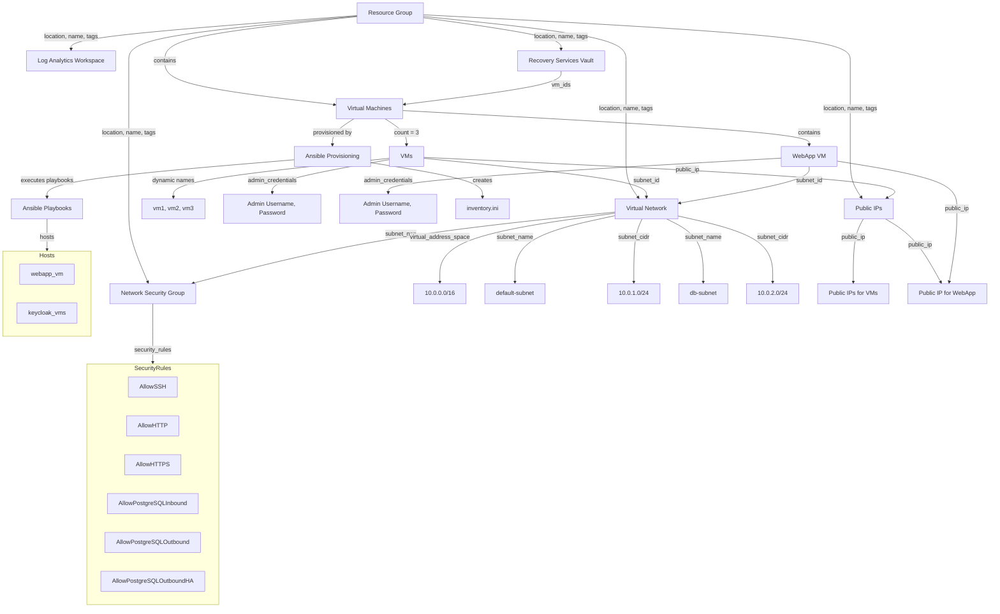
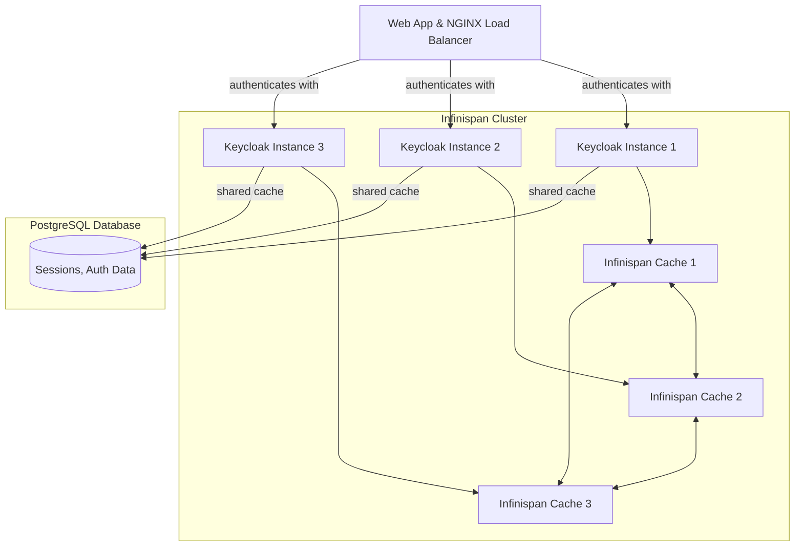

# CARIAD EngIT Frame – Tech Task – WP03 – Base Platform

This repository contains the Terraform, Ansible, Python, and Shell script code along with configuration files for setting up a Keycloak server and a Flask-based web application, using tools like NGINX and PostgreSQL.

## Delivered Components
- Terraform code for infrastructure setup
- Ansible playbooks for configuration management of Keycloak and Flask
- Shell script for automated deployment
- Configuration files for NGINX, Keycloak, and PostgreSQL
- Backup and Restore Strategy
- Day 1 Operations

## Prerequisites
Ensure that the following tools are installed and configured on Ubuntu 22.04 LTS:

1. `Azure CLI`: [Install Azure CLI](https://learn.microsoft.com/en-us/cli/azure/install-azure-cli-windows?tabs=azure-cli)
2. `Terraform`: [Install Terraform](https://developer.hashicorp.com/terraform/install)
3. `Ansible`: [Install Ansible](https://docs.ansible.com/ansible/latest/installation_guide/installation_distros.html#installing-distros)
4. `DNS zone and domain`: A DNS zone is necessary to manage the domains for both the KeyCloak Test App and KeyCloak itself. This ensures that the applications can be accessed via their respective domain names.

## Deployment Requirements

1. **Service Principal**
   - The Service Principal must be assigned the **Owner** role at the **Subscription** level where the deployment will occur.
   - Generate a valid secret and provide it to the deployment script.
   - **Azure Tenant ID**: Ensure you have the Azure Tenant ID for the tenant where the subscription resides.
   - **Application Client ID**: Obtain the Application Client ID associated with the Service Principal.
   - **Subscription ID**: Obtain the Subscription ID where resource will be deployed.

2. **Resource Group**
   - Ensure that the Resource Group named **rg-cariad-WP03-Base-Platform** does not already exist in the Subscription.

2. **Internet Access**
    Ensure that the machine running the deployment script has internet access to facilitate the download of necessary components.

## Deployment Steps

### Step 1: Running the Deployment Script
1. Ensure the following directory structure is in place:
    ```plaintext
    scripts/
    └── deploy-keycloak.sh
    ```

2. Navigate to the `scripts` folder:
    ```bash
    cd scripts
    ```

3. Open the `deploy-keycloak.sh` file and configure the necessary environment variables with your credentials:

    - **ARM_TENANT_ID**: `YOUR_TENANT_ID`
    - **ARM_SUBSCRIPTION_ID**: `YOUR_SUBSCRIPTION_ID`
    - **ARM_CLIENT_ID**: `YOUR_CLIENT_ID`
    - **ARM_CLIENT_SECRET**: `YOUR_CLIENT_SECRET`

    - **ADMIN_USERNAME**: `YOUR_ADMIN_USERNAME`
    - **ADMIN_PASSWORD**: `YOUR_ADMIN_PASSWORD`
    - **PSQL_ADMIN_USERNAME**: `YOUR_PSQL_ADMIN_PASSWORD`
    - **PSQL_ADMIN_PASSWORD**: `YOUR_PSQL_ADMIN_USERNAME`
    - **KEYCLOAK_ADMIN_USERNAME**: `YOUR_KEYCLOAK_ADMIN_USERNAME`
    - **KEYCLOAK_ADMIN_PASSWORD**: `YOUR_KEYCLOAK_ADMIN_PASSWORD`
    - **SERVER_DOMAIN**: `YOUR_DOMAIN`

    Defaults:
    - **KEYCLOAK_VMS_COUNT**: `3`
    - **JAVA_VERSION**: `21`
    - **KC_VERSION**: `25.0.0`


### Step 2: Execute the Deployment Script
1. Make sure the `deploy-monitoring.sh` script has execute permissions:

    ```bash
    chmod +x deploy-monitoring.sh
    ```

2. Run the script with elevated privileges to start the deployment process:
    ```bash
    ./deploy-keycloak.sh
    ```

### Script Flow:
1. Verify that all critical executables are present on the local machine.
2. Apply the Terraform infrastructure modules:
    - Terraform will prompt with the plan of the deployment, type `yes` and hit `enter` to proceed.
    - Terraform will run the infrastucture modules to create necessary infrastructure for KeyCloak setup.
3. Apply the Terraform Ansible modules:
    - After the infrastructure is deployed, the script will prompt you to create a DNS record with the specific IP of the WEBAPP VM. Once you add the DNS record to your DNS zone, enter `yes` to continue the script execution.
    - Terraform will prompt with the plan of the deployment, type `yes` and hit `enter` to proceed.
    - Terraform will run the `local-exec` provider to start the Ansible script that will manage virtual machines, NGINX, the Flask web app, and Keycloak.

### Accessing Virtual Machines and Keycloak
You can access the virtual machines using the credentials you specified in the environment variables `ADMIN_USERNAME` and `ADMIN_PASSWORD`. Similarly, access Keycloak using `KEYCLOAK_ADMIN_USERNAME` and `KEYCLOAK_ADMIN_PASSWORD`.

## Important Notes

- **For demonstration purposes, output will not be suppressed; however, please exercise caution and handle these values securely in production environments.**

- If you are using this Terraform setup in production, it is strongly recommended to mark sensitive information in the `terraform/main/variables.tf` file.

    Example:
    ```hcl
    variable "ADMIN_USERNAME" {
      sensitive = true
    }
    variable "ADMIN_PASSWORD" {
      sensitive = true
    }
    ```

# Terraform Infrastructure Code
The Terraform code provisions the infrastructure needed for Keycloak and Flask deployments, including virtual machines, network resources, and security groups.

### Directory Structure
```plaintext
terraform
├── main
│   ├── main.tf
│   ├── providers.tf
│   └── variables.tf
└── modules
    ├── log_analytics_workspace
    │   ├── main.tf
    │   ├── outputs.tf
    │   └── variables.tf
    ├── monitor_data_collection_rule
    │   ├── main.tf
    │   ├── outputs.tf
    │   └── variables.tf
    ├── monitor_data_collection_rule_association
    │   ├── main.tf
    │   └── variables.tf
    ├── network_security_group
    │   ├── main.tf
    │   ├── outputs.tf
    │   └── variables.tf
    ├── postgresql
    │   ├── main.tf
    │   ├── outputs.tf
    │   └── variables.tf
    ├── public_ip
    │   ├── main.tf
    │   ├── outputs.tf
    │   └── variables.tf
    ├── recovery_services_vault
    │   ├── main.tf
    │   ├── outputs.tf
    │   └── variables.tf
    ├── resource_group
    │   ├── main.tf
    │   ├── outputs.tf
    │   └── variables.tf
    ├── subnet
    │   ├── main.tf
    │   ├── outputs.tf
    │   └── variables.tf
    ├── virtual_machine
    │   ├── main.tf
    │   ├── output.tf
    │   └── variables.tf
    └── virtual_network
        ├── main.tf
        ├── outputs.tf
        └── variables.tf
```

## Provider
This configuration uses the `azurerm` provider to deploy Azure resources.

### Provider Configuration:
```hcl
terraform {
  required_providers {
    azurerm = {
      source  = "hashicorp/azurerm"
      version = "3.92.0"
    }
  }
}
provider "azurerm" {
  features {}
  client_id       = var.client_id
  client_secret   = var.client_secret
  subscription_id = var.subscription_id
  tenant_id       = var.tenant_id
}
```

## Resources
The following resources are defined in the Terraform code:

1. Resource Group
2. Virtual Machine
   1. Network Interface Card (NIC) (subresource of Virtual Machine)
   2. OS Disk (subresource of Virtual Machine)
3. Virtual Network
   1. Subnet (subresource of Virtual Network)
4. Public IP
5. Network Security Group (associated with Subnet)
6. Ansible provisioner

## Inbound Network Security Group Rules
For this task, the following inbound Network Security Group rules are permitted for all addresses:

- Port 22: SSH
- Port 80: HTTP
- Port 443: HTTPS

**Note**: In a production environment, it is essential to restrict access by whitelisting only specific addresses to enhance security.

## Important Notes
- Since provisioning is done locally, the `terraform.tfstate` file will be generated in the `terraform/main` directory. For future deployments, users should back up this file. Best practice is to configure a backend block for the `azurerm` provider and store the `terraform.tfstate` file in an Azure Storage Account.
- The `local-exec` provisioner triggers a local executable, which subsequently calls Ansible. Ansible first generates the `inventory.ini` file in the `ansible` directory, passing the Terraform outputs into the appropriate groupings within `inventory.ini`, and then executes the playbooks on the specified hosts.

## Scalability and Resilience

### Scalability
The infrastructure is designed to be scalable, allowing you to adjust the number of Keycloak instances based on your needs. This is achieved through the `KEYCLOAK_VMS_COUNT` environment variable in the deployment script.

#### Scaling Up
To scale up the number of Keycloak instances, follow these steps:

1. **Configure the Deployment Script**:
   Open the `deploy-keycloak.sh` file and update the `KEYCLOAK_VMS_COUNT` environment variable to the desired number of instances. For example, to increase the number of VMs from 3 to 5, update the variable as follows:

    ```plaintext
    KEYCLOAK_VMS_COUNT=5
    ```

   The default value is 3 VMs.

### Virtual Machines
The following Terraform code provisions the necessary virtual machines for Keycloak. The number of VMs is determined by the `keycloak_vms_count` variable, which is set by the `KEYCLOAK_VMS_COUNT` environment variable in the deployment script.

```hcl
// ----- VIRTUAL MACHINES -----
module "virtual_machine_keycloak" {
  source                  = "../modules/virtual_machine"
  count                   = var.keycloak_vms_count
  resource_group_name     = module.resource_group.name
  location                = module.resource_group.location
  name                    = "vm${count.index + 1}-${var.tags.project-name}-${var.tags.environment}"
  size                    = "Standard_B1ms"
  zone                    = count.index % 3 + 1
  ADMIN_USERNAME       = var.ADMIN_USERNAME
  ADMIN_PASSWORD       = var.ADMIN_PASSWORD
  log_analytics_workspace = module.log_analytics_workspace.id
  subnet_id               = module.default_subnet.subnet_id
  public_ip_id            = module.public_ip_vm[count.index].public_ip_id
  tags                    = var.tags

  depends_on = [
    module.virtual_network,
    module.default_subnet,
    module.public_ip_vm
  ]
}

variable "keycloak_vms_count" {
  description = "The number of virtual machines for Keycloak."
  default     = 3
}
```

### Resilience
The infrastructure is designed to be resilient, ensuring high availability and fault tolerance. This is achieved through the following mechanisms:

1. **Availability Zones**:
   - The virtual machines are distributed across all 3 availability zones (`zone = count.index % 3 + 1`). This ensures that if one zone experiences an outage, the other zones can continue to operate, providing high availability.

2. **PostgreSQL High Availability**:
   - The PostgreSQL database is configured with high availability (HA) enabled. This ensures that the database remains accessible even if one of the instances fails, providing continuous service without interruption.

By leveraging these scalability and resilience features, the infrastructure can handle varying loads and maintain high availability, ensuring a robust and reliable Keycloak environment.

# Terraform Infrastructure Diagram



# Terraform and Ansible Integration
This configuration utilizes Terraform to execute Ansible playbooks. It dynamically generates an `inventory.ini` file based on the virtual machines (VMs) provisioned by Terraform. Once the inventory is set up, playbooks are executed against the specified VM groupings.

## Configuration Overview
### Resource: `null_resource.ansible_playbook`
The `null_resource` is utilized to trigger the execution of a local command that sets up and runs an Ansible playbook on the provisioned virtual machines (VMs). Key components include:

1. **Inventory Generation**
   The script dynamically generates an Ansible inventory file (`inventory.ini`) with public IP addresses from the Terraform-managed VMs. It divides the VMs into groups:

    ```plaintext
    [webapp_vm]
    <VM_WEB_APP_PUBLIC_IP> ansible_user=<ADMIN_USERNAME> ansible_password=<ADMIN_PASSWORD> ansible_connection=ssh ansible_ssh_common_args='-o StrictHostKeyChecking=no'

    [node_vms]
    <VM0_KC_PUBLIC_IP> ansible_user=<ADMIN_USERNAME> ansible_password=<ADMIN_PASSWORD> ansible_connection=ssh ansible_ssh_common_args='-o StrictHostKeyChecking=no'
    <VM1_KC_PUBLIC_IP> ansible_user=<ADMIN_USERNAME> ansible_password=<ADMIN_PASSWORD> ansible_connection=ssh ansible_ssh_common_args='-o StrictHostKeyChecking=no'
    ...
    ```

2. **Ansible Playbook Execution**
   The script executes the Ansible playbook with the generated inventory file and passes variables to the playbook:

    ```bash
    export KEYCLOAK_PRIVATE_IPS=<array of private IPs, comma-separated>
    export SERVER_DOMAIN=<desired domain name>
    export KEYCLOAK_ADMIN_USERNAME=<Keycloak admin username>
    export KEYCLOAK_ADMIN_PASSWORD=<Keycloak admin password>
    export KC_DB_URL=<Keycloak database URL>
    export KC_DB_NAME=<Keycloak database name>
    export KC_DB_USERNAME=<Keycloak database

 admin username>
    export KC_DB_PASSWORD=<Keycloak database password>
    export JAVA_VERSION=<version of Java needed to run Keycloak>
    export KC_VERSION=<desired Keycloak version>
    ansible-playbook -i ../../ansible/inventory.ini ../../ansible/main.yaml
    ```

3. **Clean Up**
   After playbook execution, the inventory file is deleted:
    ```bash
    rm ../../ansible/inventory.ini
    ```

## Trigger: `always_run`
Ensures that the playbook runs every time based on the current timestamp:
```hcl
triggers = {
  always_run = "${timestamp()}"
}
```

# Ansible Playbook Overview
The Ansible playbook (`main.yaml`) is used to configure both Keycloak and the Flask web application.

## Playbook for Keycloak
This section configures the Keycloak identity management server:
```yaml
- name: PLAYBOOKS FOR KEYCLOAK
  hosts: keycloak_vms
  become: true
  vars:
    java_version: "{{ lookup('env', 'JAVA_VERSION') }}"
    kc_version: "{{ lookup('env', 'KC_VERSION') }}"
    admin_username: "{{ lookup('env', 'KEYCLOAK_ADMIN_USERNAME') }}"
    admin_password: "{{ lookup('env', 'KEYCLOAK_ADMIN_PASSWORD') }}"
  tasks:
    - name: Install Keycloak
      include_tasks: keycloak/tasks.yaml
```

**Explanation**:
- **hosts**: Targets VMs in the `keycloak_vms` group.
- **become: true**: Ensures elevated privileges are used for task execution.
- **variables**: Needed to run this task, defined as environment variables.
- **Included Tasks**:
    - Installing Java (based on the `java_version` variable).
    - Downloading and installing Keycloak.
    - Configuring Keycloak settings.
    - Ensuring the Keycloak service is running.
    -
```yaml
- name: PLAYBOOKS FOR KEYCLOAK REALM
  hosts: keycloak_vms
  become: true
  serial: 1
  vars:
    server_domain: "{{ lookup('env', 'SERVER_DOMAIN') }}"
    admin_username: "{{ lookup('env', 'KEYCLOAK_ADMIN_USERNAME') }}"
    admin_password: "{{ lookup('env', 'KEYCLOAK_ADMIN_PASSWORD') }}"
  tasks:
    - name: Configure Keycloak Realm
      include_tasks: keycloak/realm_tasks.yaml
```

**Explanation**:
- **hosts**: Targets VMs in the `keycloak_vms` group.
- **become: true**: Ensures elevated privileges are used for task execution.
- **serial: 1**: Makes sure to run playbook one VM at a time
- **variables**: Needed to run this task, defined as environment variables.
- **Included Tasks**:
    - Configuring Keycloak realm and client to accept new users

## Playbook for Flask App
This section deploys and configures the Flask app on the web application virtual machines:
```yaml
- name: PLAYBOOKS FOR FLASK APP
  hosts: webapp_vm
  become: true
  tasks:
    - name: Run Flask App
      include_tasks: flask/tasks.yaml
```

## NGINX Configuration
The playbook also sets up NGINX as a reverse proxy for both Keycloak and Flask applications, with SSL configuration if required:
```yaml
- name: PLAYBOOKS FOR NGINX
  hosts: webapp_vm
  become: true
  tasks:
    - name: Setup Nginx
      include_tasks: nginx/tasks.yaml
```

# Configuration Overview

## Keycloak Configuration
Keycloak is a comprehensive identity and access management solution designed for modern applications. Keycloak is configured with the following key components:

1. **Keycloak as the Identity Provider**:
   Keycloak is used to manage user identities, providing Single Sign-On (SSO) functionality for web applications. Users can authenticate once and access various applications securely.

2. **Session Management and Security**:
   - **Session Caching with Infinispan**: Keycloak uses Infinispan to cache sessions, improving the performance of session handling and user authentication, especially in clustered environments.
   - **Security Context**: Keycloak ensures that users only have access to resources for which they are authorized, using roles and permissions defined in the system.

3. **Integration with External Components**:
   - **Keycloak** has been customized to work in High Availability mode, using environment variables for parameters such as admin credentials, database credentials, and other deployment-specific variables. These variables ensure flexibility in deployment while keeping sensitive information secure.
   - **NGINX Integration**: NGINX is configured as a reverse proxy for the Keycloak server, handling SSL/TLS termination and securely routing requests to the Keycloak service.
   - **Database Integration**: Keycloak is connected to a PostgreSQL database, where it stores user data, sessions, and authorization configurations. This ensures persistence, data backup, and integrity, even if the Keycloak service is restarted or scaled horizontally.

### Keycloak HA Diagram


### Achieving High Availability (HA) in Keycloak

In this setup, Keycloak High Availability (HA) is achieved through clustering multiple Keycloak instances with Infinispan for distributed caching and NGINX as a load balancer. Below is a step-by-step explanation of how the HA was designed and implemented:

#### 1. **Keycloak Cluster Setup**
Keycloak HA was implemented by running multiple Keycloak instances across different virtual machines. Each instance operates independently, but all instances share state and are synchronized to ensure failover capabilities and load distribution. The cluster consists of three Keycloak instances, each installed on its own virtual machine.

#### 2. **NGINX as Load Balancer**
An **NGINX** server is deployed in front of the Keycloak instances, serving as the **load balancer**. It is configured to distribute incoming traffic evenly across all Keycloak instances, ensuring that no single instance is overwhelmed with requests. The load balancer is crucial for achieving HA by directing authentication requests to different Keycloak nodes based on availability and performance.

Key aspects of NGINX in the setup:
- Distributes traffic among Keycloak instances.
- Provides failover: if one Keycloak instance fails, NGINX automatically redirects requests to the other available instances.

**NGINX Configuration:**
The NGINX configuration ensures it can forward incoming requests to the three Keycloak instances. Each Keycloak instance is registered with the NGINX configuration using their respective IP addresses and ports.

#### 3. **Infinispan for Distributed Caching**
Keycloak uses **Infinispan**, a distributed caching solution, to share state and data among the instances. This ensures that session data, authentication sessions, and other important state information are consistent across all Keycloak nodes in the cluster.

Each Keycloak instance has its own Infinispan server running locally, and they all participate in a distributed cache cluster. Infinispan enables data replication between Keycloak nodes, so even if one instance fails, the others can take over without any data loss or session disruption.

Key caches configured in the Infinispan setup include:
- **Sessions Cache**: Stores user sessions and ensures that users remain authenticated even if they are switched between Keycloak instances.
- **Authentication Sessions Cache**: Handles data related to the authentication process, making it accessible across all Keycloak instances.
- **Client Sessions Cache**: Used for managing OAuth2 clients’ sessions across the Keycloak instances.
- **Distributed Cache**: Ensures that session and authentication data is available on all Keycloak nodes by replicating or distributing the data across instances.

#### 4. **JDBC-Ping for Cluster Synchronization**
Keycloak instances use **JDBC-Ping** as the clustering mechanism to synchronize between different nodes. JDBC-Ping enables Keycloak instances to discover each other and synchronize state via the central PostgreSQL database. The configuration ensures that Keycloak nodes in the cluster can maintain a view of the entire cluster, which helps during recovery and failover.

Key aspects of JDBC-Ping:
- **Cluster discovery**: Keycloak nodes use the shared database for discovering other nodes and ensuring synchronization.
- **Consistency**: It ensures that any changes in the cluster (e.g., a node failure) are immediately reflected across all nodes.

**Configuration Example (Infinispan with JDBC-Ping):**
The JDBC-Ping configuration specifies the PostgreSQL database credentials and connection details used by each Keycloak instance to participate in the cluster. It uses a shared table to keep track of the cluster nodes.

```xml
<infinispan>
    <jgroups>
        <stack name="jdbc-ping-tcp" extends="tcp">
            <JDBC_PING connection_driver="org.postgresql.Driver"
                      connection_username="{{ kc_db_username }}"
                      connection_password="{{ kc_db_password }}"
                      connection_url="jdbc:postgresql://{{ kc_db_url }}:5432/{{ kc_db_name }}"
                      initialize_sql="CREATE TABLE IF NOT EXISTS JGROUPSPING (own_addr varchar(200) NOT NULL, cluster_name varchar(200) NOT NULL, ping_data BYTEA, constraint PK_JGROUPSPING PRIMARY KEY (own_addr, cluster_name));"
                      info_writer_sleep_time="500"
                      remove_all_data_on_view_change="true"
                      stack.combine="REPLACE"
                      stack.position="MPING" />
        </stack>
    </jgroups>
</infinispan>
```

#### 5. **PostgreSQL Database for Session and Authentication Data**
A centralized **PostgreSQL database** is used to store shared session data, authentication sessions, and configuration metadata. All Keycloak instances connect to the same database, ensuring consistency and availability of session and authentication data across the cluster.

The database plays a central role in synchronizing the state between different Keycloak nodes:
- **Session management**: Stores user session data, so all Keycloak instances have access to the same session state.
- **Cluster coordination**: Helps in cluster synchronization by allowing nodes to keep track of each other and synchronize state changes.

#### 6. **Failover and Fault Tolerance**
- **Session persistence**: Thanks to the Infinispan distributed cache and PostgreSQL database, sessions are persisted across Keycloak instances, so users don't experience any interruptions even if a node fails.
- **Load distribution**: NGINX ensures that traffic is evenly distributed across the Keycloak instances, preventing overload on a single node.

#### 7. **Cache Types Configured**
Different cache types were configured in Infinispan to ensure efficient resource management and failover capabilities:
- **Distributed Cache**: Used for session and authentication data, allowing all Keycloak nodes to share the same information.
- **Local Cache**: For storing specific data that doesn't need to be shared across the entire cluster.
- **Replicated Cache**: Used for certain types of configuration data that need to be replicated across all Keycloak instances.

#### Summary of HA Architecture:
- **Keycloak Instances**: Three instances, each running on a separate virtual machine.
- **Load Balancer**: NGINX acts as the load balancer, distributing traffic between the Keycloak instances.
- **Caching**: Infinispan is used for distributed caching to ensure consistency across the cluster.
- **Session Data**: Centralized in a PostgreSQL database, with all Keycloak instances sharing the same data.
- **Cluster Discovery**: Achieved using JDBC-Ping with PostgreSQL for node synchronization.

This setup ensures that Keycloak is highly available, scalable, and fault-tolerant, with seamless failover and distributed session management.

# Backup and Restore Strategy

## Backup Strategy

### Keycloak and WebApp Virtual Machines
Since Keycloak is deployed on virtual machines (VMs), the backup strategy will include backing up these VMs.

1. **Azure Recovery Services Vault**:
   - **Backup Policy**: Configure a daily backup policy with a retention period of 30 days.
   - **Protected VMs**: Ensure all VMs running Keycloak and the webapp VM are included in the backup policy.
   - **Soft Delete**: Enabled for 14 days to provide an additional layer of protection against accidental deletions.

### PostgreSQL Database
The PostgreSQL database will be backed up using Azure's built-in backup features.

1. **Azure PostgreSQL Flexible Server**:
   - **Backup Retention**: Set the backup retention period to 35 days.
   - **Geo-Redundant Backup**: Enable geo-redundant backups to ensure data is replicated across different regions.

### Automation
Automate the backup process using Terraform to ensure consistency and reliability.

## Restore Plan

### Keycloak and Virtual Machines

#### Identify the Recovery Point
1. **Azure Portal**:
   - Navigate to the Recovery Services Vault.
   - Select the "Backup Items" option.
   - Choose the appropriate VM and view the available recovery points.

2. **Azure CLI**:
   - Use the following command to list recovery points:
     ```bash
     az backup recoverypoint list --resource-group <ResourceGroupName> --vault-name <VaultName> --container-name <ContainerName> --item-name <VMName>
     ```

#### Restore the VM
1. **Azure Portal**:
   - Select the desired recovery point.
   - Click on "Restore VM" and follow the prompts to initiate the restore process.

2. **Azure CLI**:
   - Use the following command to restore the VM:
     ```bash
     az backup restore restore-disks --resource-group <ResourceGroupName> --vault-name <VaultName> --container-name <ContainerName> --item-name <VMName> --rp-name <RecoveryPointName> --storage-account <StorageAccountName>
     ```

#### Verify the Restore
1. **Access the Restored VM**:
   - Use SSH or RDP to access the restored VM.
   - Verify that Keycloak is running and accessible.

2. **Check Keycloak Functionality**:
   - Ensure that Keycloak services are operational and that users can log in and access the necessary resources.

### PostgreSQL Database

#### Identify the Backup
1. **Azure Portal**:
   - Navigate to the PostgreSQL Flexible Server.
   - Select the "Backups" option to view available backups.

2. **Azure CLI**:
   - Use the following command to list backups:
     ```bash
     az postgres flexible-server backup list --resource-group <ResourceGroupName> --name <ServerName>
     ```

#### Restore the Database
1. **Azure Portal**:
   - Select the desired backup.
   - Click on "Restore" and follow the prompts to initiate the restore process.

2. **Azure CLI**:
   - Use the following command to restore the database:
     ```bash
     az postgres flexible-server restore --resource-group <ResourceGroupName> --name <NewServerName> --source-server <SourceServerName> --restore-time <RestoreTime>
     ```

#### Verify the Restore
1. **Access the Restored Database**:
   - Connect to the restored PostgreSQL server using a database client.
   - Verify that the data is intact and accessible.

2. **Check Keycloak Connectivity**:
   - Ensure that Keycloak can connect to the restored database.
   - Verify that all user data and configurations are correctly restored.

### Testing the Restore Process
1. **Regular Testing**:
   - Periodically test the restore process to ensure that it works as expected.
   - Document any issues encountered and update the restore plan accordingly.

2. **Simulated Failures**:
   - Conduct simulated failure scenarios to test the robustness of the backup and restore strategy.

## Terraform Configuration
The Azure Recovery Services Vault, backup policies, and PostgreSQL backups are created and managed using Terraform. The WebApp VM, which hosts the Flask App and runs NGINX for the Keycloak setup, is also included in the backup services vault.

# DAY 1 Operations

## Debugging Keycloak Issues
Keycloak is a critical component of the setup. If Keycloak is not working as expected, follow these steps:

#### Step 1: Verify Keycloak Service Status
SSH into the Keycloak virtual machine and check if Keycloak is running:

```bash
ssh <ADMIN_USERNAME>@<KEYCLOAK_VM_IP>
```

Once logged in, check the Keycloak service:

```bash
sudo systemctl status keycloak
```

If the service is not running, attempt to restart it:

```bash
sudo systemctl restart keycloak
```

#### Step 2: Check Keycloak Logs
If Keycloak is running but not responding, check the logs for any errors:

```bash
sudo journalctl -u keycloak -f
```

#### Common errors may include:

Port conflicts: Ensure Keycloak is not trying to bind to a port already in use.
Database connectivity issues: Check if Keycloak can connect to PostgreSQL (see the PostgreSQL debugging section below).

#### Step 3: Test Keycloak API
To verify that Keycloak is functioning correctly, try accessing the Keycloak admin console via the browser using the IP address or domain:

```plaintext
https://<KEYCLOAK_DOMAIN>:8080/admin
```

If the admin console is inaccessible, try curling the API to check if it is listening:

```bash
curl -I https://<KEYCLOAK_VM_IP>:8080
```

You should receive an HTTP 200 response. If not, there may be a firewall issue or Keycloak may not be bound to the correct IP address.


## Debugging NGINX Issues
NGINX is a critical component of the setup. If NGINX is not working as expected, follow these steps:

#### Step 1: Verify NGINX Service Status
SSH into the Web app virtual machine and check if NGINX is running:

```bash
ssh <ADMIN_USERNAME>@<WEB_APP_VM_IP>
```

Once logged in, check the NGINX service:

```bash
sudo systemctl status nginx
```

If the service is not running, attempt to restart it:

```bash
sudo systemctl restart nginx
```

#### Step 2: Check NGINX Configuration
If NGINX fails to start or is misbehaving, the configuration may be incorrect. Test the configuration for syntax errors:

```bash
sudo nginx -t
```

If there are any configuration issues, they will be displayed here. Check the NGINX configuration files for errors, especially the proxy settings for Keycloak and Flask.

#### Common errors may include:

Port conflicts: Ensure Keycloak is not trying to bind to a port already in use.
Database connectivity issues: Check if Keycloak can connect to PostgreSQL (see the PostgreSQL debugging section below).

#### Step 3: Check NGINX Logs
Check NGINX logs to diagnose any issues:

```bash
sudo tail -f /var/log/nginx/error.log
sudo tail -f /var/log/nginx/access.log
```

Common issues include:

Incorrect proxy settings: Verify that the proxy settings for both Flask and Keycloak are correctly set in NGINX.
SSL certificate errors: Ensure that SSL certificates are correctly configured if HTTPS is being used.

#### Step 4: Test NGINX
Try accessing the NGINX server via the domain or public IP:

```arduino
http://<SERVER_DOMAIN>
```

If the website is unresponsive, curl the domain from the terminal:

```bash
curl -I http://<SERVER_DOMAIN>
```

You should receive an HTTP 200 response. If not, review the NGINX configuration, especially the proxy and firewall settings.


## Utilizing Azure Log Analytics, Monitor and Alerts

The Monitor Data Collection module provisions resources that are essential for collecting, managing, and analyzing monitoring data within the infrastructure. These resources are designed to enable the collection of system metrics, logs, and diagnostic information, which can then be utilized to monitor the health and performance of the deployed applications and services.

The following sections describe the key resources created by the module and how they can be utilized effectively.

### 1. **Log Analytics Workspace**
A **Log Analytics Workspace** is provisioned to store monitoring data, including logs and metrics from virtual machines, applications, and other Azure resources. This workspace serves as a centralized location for querying and analyzing monitoring data.

#### Usage:
- **Log Queries**: Users can run Kusto queries in Azure Monitor to analyze collected data, extract trends, and troubleshoot issues. Queries can be executed through the Azure Portal, allowing for detailed insights into performance metrics, error rates, and other critical information.
- **Alerting**: The collected data can be used to define alert rules that trigger notifications or automated actions when specific conditions are met. For example, an alert can be set for high CPU utilization across virtual machines or disk space running low.

### 2. **Data Collection Rules (DCR)**
The **Monitor Data Collection Rule (DCR)** is responsible for defining which data should be collected and where it should be sent (e.g., Log Analytics Workspace or Azure Monitor). These rules allow the configuration of granular data collection from virtual machines, containers, and other resources.

#### Usage:
- **Custom Metrics and Logs**: Data Collection Rules can be customized to gather specific metrics or log entries from virtual machines. These rules allow administrators to fine-tune which types of data are collected (e.g., CPU, memory, disk usage, or application-specific logs).
- **Cross-Resource Data Collection**: DCR can be applied across multiple resources, enabling consistent monitoring across a diverse set of virtual machines or other infrastructure elements.

### 3. **Data Collection Rule Associations**
The **Monitor Data Collection Rule Association** binds the Data Collection Rules to specific resources, such as virtual machines, application gateways, or other monitored entities. This association ensures that the defined metrics and logs are collected from the appropriate resources.

#### Usage:
- **Resource Targeting**: Administrators can apply the Data Collection Rules to specific virtual machines or services using associations. This enables targeted monitoring of critical infrastructure components, allowing administrators to monitor important performance indicators at scale.
- **Real-Time Monitoring**: The association ensures that data is collected in real-time, feeding into the Log Analytics Workspace or Azure Monitor for immediate analysis or troubleshooting when necessary.

### 4. **Integration with Azure Monitor and Alerts**
The resources created by the Monitor Data Collection module integrate seamlessly with **Azure Monitor** to provide continuous insights into the performance and health of the infrastructure.

#### Usage:
- **Dashboards**: Administrators can create custom dashboards in Azure Monitor using the data collected from the provisioned resources. These dashboards can display metrics such as CPU usage, network latency, or error rates, providing a centralized view of the environment’s health.
- **Alerts and Automated Actions**: The collected data can be leveraged to configure alerts that trigger based on threshold conditions. For example, if a virtual machine’s memory usage exceeds a specified limit, an alert can be triggered, and an automated action can be executed (e.g., scaling out the infrastructure or restarting a service).

### 5. **Compliance and Security**
The resources created by the Monitor Data Collection module also contribute to the security and compliance posture of the infrastructure by collecting audit logs, security logs, and performance metrics.

#### Usage:
- **Audit Logs**: Administrators can collect and analyze audit logs to ensure compliance with internal policies and regulatory standards. This can include tracking user access, configuration changes, or failed login attempts across the infrastructure.
- **Security Monitoring**: Logs from security services (e.g., firewalls, network security groups) can be collected and analyzed to detect potential threats or vulnerabilities in the system. This enables proactive monitoring of potential security risks.
