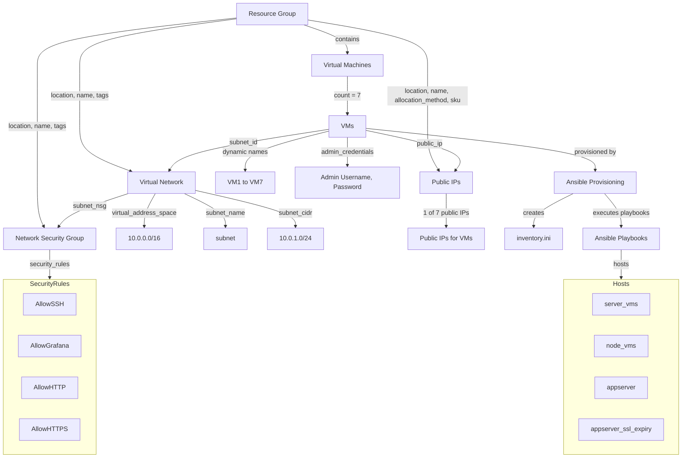

# CARIAD EngIT Frame – Tech Task – WP04 – Monitoring / Logging / Alerting

This repository contains the Terraform, Ansible, and Python code along with configuration files and scripts for setting up monitoring, logging, and alerting systems using Grafana, Prometheus, Loki, Alloy, Blackbox, and Alertmanager.

## Delivered Components

- Terraform code for infrastructure setup
- Ansible playbooks for configuration management
- Python scripts
- Grafana dashboards
- Configuration files for Prometheus, Loki, Grafana, Alloy, Blackbox, and Alertmanager
- Bash script for automated deployment

## Prerequisites

Before running the code, ensure that you are running Ubuntu 22.04 LTS and have the following tools installed:

1. `Azure CLI`: [Install Azure CLI](https://learn.microsoft.com/en-us/cli/azure/install-azure-cli-windows?tabs=azure-cli)
2. `Terraform`: [Install Terraform](https://developer.hashicorp.com/terraform/install)
3. `Ansible`: [Install Ansible](https://docs.ansible.com/ansible/latest/installation_guide/installation_distros.html#installing-distros)
4. `Ansible Collection - community.grafana`: [Install Grafana Collection](https://docs.ansible.com/ansible/latest/collections/community/grafana/index.html)
5. `Ansible Collection - community.general`: [Install General Collection](https://docs.ansible.com/ansible/latest/collections/community/general/index.html)

### Deployment Requirements

To ensure a successful deployment, please verify the following prerequisites:

1. **Service Principal**
   - The Service Principal must be assigned the **Owner** role at the **Subscription** level where the deployment will occur.
   - Generate a valid secret and provide it to the deployment script.
   - **Azure Tenant ID**: Ensure you have the Azure Tenant ID for the tenant where the subscription resides.
   - **Application Client ID**: Obtain the Application Client ID associated with the Service Principal.
   - **Subscription ID**: Obtain the Subscription ID where resource will be deployed. 

2. **Resource Group**
   - Ensure that the Resource Group named **WP04-rg-cariad-monitoring-demo** does not already exist in the Subscription.

3. **Internet Access**
   - The machine executing the deployment must have internet access to facilitate the process.

## Deployment Steps

### Task 1: Running the Deployment Bash Script

#### Step 1: Prepare the Deployment Script

1. Ensure the following directory structure is in place:

```plaintext
scripts/
└── deploy-monitoring.sh
```

2. Navigate to `scripts` folder

 ```bash
 cd scripts
 ```

3. Open the `deploy-monitoring.sh` file and configure the necessary environment variables with your credentials:

- **ADMIN_USERNAME**: `YOUR_ADMIN_USERNAME`
- **ADMIN_PASSWORD**: `YOUR_ADMIN_PASSWORD`
- **ARM_TENANT_ID**: `YOUR_TENANT_ID`
- **ARM_SUBSCRIPTION_ID**: `YOUR_SUBSCRIPTION_ID`
- **ARM_CLIENT_ID**: `YOUR_CLIENT_ID`
- **ARM_CLIENT_SECRET**: `YOUR_CLIENT_SECRET`

4. Make sure the `deploy-monitoring.sh` script has execute permissions:
 
 ```bash
 chmod +x deploy-monitoring.sh
 ```

#### Step 2: Execute the Deployment Script

1. Run the script with elevated privileges to start the deployment process:
 ```bash
 ./deploy-monitoring.sh
 ```

2. Terraform will prompt with the plan of the deployment, type `yes` and hit `enter` to proceed.

3. Wait for the deployment script to complete. The Ansible provisioner will then display the Public IP address of Grafana, which you can use to access the Grafana interface.

### Access Credentials for Virtual Machines and Grafana

The username and password for accessing the Virtual Machines and Grafana are identical to the credentials defined in the following environment variables:

- **ADMIN_USERNAME**: `YOUR_ADMIN_USERNAME`
- **ADMIN_PASSWORD**: `YOUR_ADMIN_PASSWORD`

## Important Notes

- The Ansible provisioner will display sensitive values for the `ADMIN_PASSWORD` and `ARM_CLIENT_SECRET` variables, as they are not marked as sensitive.

- **For the purpose of this demo, output will not be suppressed; however, please exercise caution and handle these values securely in production environments.** 

- If you are using these variables in a production setting with Terraform, it is strongly recommended to mark them as sensitive in `terraform/main/variables.tf` file.

```hcl
variable "client_secret" {
  description = "The Client Secret of the Service Principal used for accessing Azure resources."
  type        = string
  sensitive   = true
}
variable "admin_password" {
  description = "The administrator password for the virtual machines."
  type        = string
  sensitive   = true
}
```

# Terraform Infrastructure Code

This Terraform configuration provisions six Virtual Machines (VMs) for monitoring and one Grafana VM, along with all related resources.

## Directory Structure

All resources are deployed as modules, with the following directory structure:

```plaintext
terraform/
├── main.tf
├── variables.tf
├── outputs.tf
└── modules/
    ├── resource_group/
    │   ├── main.tf
    │   ├── variables.tf
    │   └── outputs.tf
    ├── network_security_group/
    │   ├── main.tf
    │   ├── variables.tf
    │   └── outputs.tf
    ├── virtual_network/
    │   ├── main.tf
    │   ├── variables.tf
    │   └── outputs.tf
    ├── virtual_machine/
    │   ├── main.tf
    │   ├── variables.tf
    │   └── outputs.tf
    └── public_ip/
        ├── main.tf
        ├── variables.tf
        └── outputs.tf
```

## Provider

This configuration uses the `azurerm` provider to deploy Azure resources.

Provider configuration:
```hcl
terraform {
  required_providers {
    azurerm = {
      source  = "hashicorp/azurerm"
      version = "3.92.0"
    }
  }
}
provider "azurerm" {
  features {}
  client_id       = var.client_id
  client_secret   = var.client_secret
  subscription_id = var.subscription_id
  tenant_id       = var.tenant_id
}

```
## Resources

The following resources are defined in the Terraform code:

1. **Resource Group**
2. **Virtual Machine**
   - **Network Interface Card (NIC)** *(subresource of Virtual Machine)*
   - **OS Disk** *(subresource of Virtual Machine)*
3. **Virtual Network**
   - **Subnet** *(subresource of Virtual Network)*
4. **Public IP**
5. **Network Security Group** *(associated with Subnet)*
6. **Ansible provisioner**

### Inbound Network Security Group Rules

For this task, the following **inbound** Network Security Group rules are permitted for all addresses:

- **Port 22**: SSH
- **Port 80**: HTTP
- **Port 443**: HTTPS
- **Port 3000**: Grafana

**Note**: In a production environment, it is essential to restrict access by whitelisting only specific addresses as necessary to enhance security.

## Important Notes
- Since provisioning is done locally, the `terraform.tfstate` file will be generated in the `terraform/main` directory. For future deployments, users should back up this file. The best practice is to configure a backend block for the `azurerm` provider and store the `terraform.tfstate` file in an `Azure Storage Account`.
- The `local-exec` provisioner triggers a local executable, which subsequently calls Ansible. Ansible first generates the inventory.ini file in the `ansible` directory, passing the Terraform outputs into the appropriate groupings within inventory.ini, and then executes the playbooks on the specified hosts.

# Terraform Infrastructure Diagram



# Terraform and Ansible Integration

This configuration utilizes Terraform to execute Ansible playbooks. It installs the necessary Ansible Galaxy collections and dynamically generates an `inventory.ini` file based on the virtual machines (VMs) provisioned by Terraform. Once the inventory is set up, playbooks are executed against the specified VM groupings.

## Configuration Overview

### Resource: `null_resource.ansible_playbook`

The `null_resource` is utilized to trigger the execution of a local command that sets up and runs an Ansible playbook on the provisioned virtual machines (VMs). Key components include:

1. **Ansible Galaxy Collections Installation**  
   Installs the necessary Ansible Galaxy collections, including `community.grafana` and `community.general`.

    ```bash
    ansible-galaxy collection install community.grafana community.general
    ```

2. **Inventory Generation**  
   The script dynamically generates an Ansible inventory file (`inventory.ini`) with public IP addresses from the Terraform-managed VMs. It divides the VMs into groups:
   
    ```ini
    [server_vms]
    <VM6_PUBLIC_IP> ansible_user=<ADMIN_USERNAME> ansible_password=<ADMIN_PASSWORD> ansible_connection=ssh ansible_ssh_common_args='-o StrictHostKeyChecking=no'

    [node_vms]
    <VM0_PUBLIC_IP> ansible_user=<ADMIN_USERNAME> ansible_password=<ADMIN_PASSWORD> ansible_connection=ssh ansible_ssh_common_args='-o StrictHostKeyChecking=no'
    <VM1_PUBLIC_IP> ansible_user=<ADMIN_USERNAME> ansible_password=<ADMIN_PASSWORD> ansible_connection=ssh ansible_ssh_common_args='-o StrictHostKeyChecking=no'
    <VM2_PUBLIC_IP> ansible_user=<ADMIN_USERNAME> ansible_password=<ADMIN_PASSWORD> ansible_connection=ssh ansible_ssh_common_args='-o StrictHostKeyChecking=no'
    <VM3_PUBLIC_IP> ansible_user=<ADMIN_USERNAME> ansible_password=<ADMIN_PASSWORD> ansible_connection=ssh ansible_ssh_common_args='-o StrictHostKeyChecking=no'
    <VM4_PUBLIC_IP> ansible_user=<ADMIN_USERNAME> ansible_password=<ADMIN_PASSWORD> ansible_connection=ssh ansible_ssh_common_args='-o StrictHostKeyChecking=no'

    [appserver]
    <VM0_PUBLIC_IP> ansible_user=<ADMIN_USERNAME> ansible_password=<ADMIN_PASSWORD> ansible_connection=ssh ansible_ssh_common_args='-o StrictHostKeyChecking=no'
    <VM1_PUBLIC_IP> ansible_user=<ADMIN_USERNAME> ansible_password=<ADMIN_PASSWORD> ansible_connection=ssh ansible_ssh_common_args='-o StrictHostKeyChecking=no'

    [appserver_ssl_expiry]
    <VM5_PUBLIC_IP> ansible_user=<ADMIN_USERNAME> ansible_password=<ADMIN_PASSWORD> ansible_connection=ssh ansible_ssh_common_args='-o StrictHostKeyChecking=no'
    ```

3. **Ansible Playbook Execution**  
   The script executes the Ansible playbook with the generated inventory file and passes variables to the playbook:
   
    ```bash
    ansible-playbook -i ../../ansible/inventory.ini ../../ansible/main.yml \
        -e "PUBLIC_IP_VM1=<VM0_PUBLIC_IP>" \
        -e "PUBLIC_IP_VM2=<VM1_PUBLIC_IP>" \
        -e "PUBLIC_IP_VM3=<VM2_PUBLIC_IP>" \
        -e "PUBLIC_IP_VM4=<VM3_PUBLIC_IP>" \
        -e "PUBLIC_IP_VM5=<VM4_PUBLIC_IP>" \
        -e "PUBLIC_IP_VM6=<VM5_PUBLIC_IP>" \
        -e "PRIVATE_IP_VM1=<VM0_PRIVATE_IP>" \
        -e "PRIVATE_IP_VM2=<VM1_PRIVATE_IP>" \
        -e "PRIVATE_IP_VM3=<VM2_PRIVATE_IP>" \
        -e "PRIVATE_IP_VM4=<VM3_PRIVATE_IP>" \
        -e "PRIVATE_IP_VM5=<VM4_PRIVATE_IP>" \
        -e "PRIVATE_IP_VM6=<VM5_PRIVATE_IP>" \
        -e "PRIVATE_IP_VM7=<VM6_PRIVATE_IP>" \
        -e "GRAFANA_USER=<ADMIN_USERNAME>" \
        -e "GRAFANA_PASSWORD=<ADMIN_PASSWORD>"
    ```

4. **Clean Up**  
   After playbook execution, the inventory file is deleted:
   
    ```bash
    rm ../../ansible/inventory.ini
    ```

### Trigger: `always_run`
Ensures that the playbook runs every time based on the current timestamp:
   
```hcl
triggers = {
  always_run = "${timestamp()}"
}
```

# Ansible Playbooks for Servers, Nodes, and Appservers

This Ansible playbook manages and configures multiple groups of virtual machines (VMs), including:
- **`server_vms`**
- **`node_vms`**
- **`appserver`**
- **`appserver_ssl_expiry`**

---

## Playbook Overview

### 1. Playbook for Servers (`server_vms`)

This playbook section configures server VM, installing monitoring and logging services:
- **Grafana**: For metrics visualization.
- **Loki**: For log aggregation.
- **Prometheus**: For monitoring and alerting.
- **Blackbox**: For probing endpoints.
- **AlertManager**: For managing alerts.

```yaml
- name: PLAYBOOKS FOR SERVER
  hosts: server_vms
  become: true
  tasks:
    - name: Include Dependencies Tasks
      include_tasks: dependencies/tasks.yml

    - name: Include Grafana Tasks
      include_tasks: grafana/tasks.yml

    - name: Include Loki Tasks
      include_tasks: loki/tasks.yml

    - name: Include Prometheus Tasks
      include_tasks: prometheus/server/tasks.yml

    - name: Include Alloy Tasks
      include_tasks: alloy/tasks.yml
```

#### Explanation:
- **`hosts: server_vms`**: Specifies that the tasks target VMs in the `server_vms` group.
- **`become: true`**: Ensures elevated privileges are used for task execution.
- **Included Tasks**:
  - **`dependencies/tasks.yml`**: Installs common dependencies.
  - **`grafana/tasks.yml`**: Configures Grafana, including dashboard and data source setup, and SSL certificate generation.
  - **`loki/tasks.yml`**: Sets up Loki for log aggregation.
  - **`prometheus/server/tasks.yml`**: Configures Prometheus and Blackbox for monitoring server metrics and external endpoints.

---

### 2. Playbook for Nodes (`node_vms`)

This section manages the configuration of node VMs by installing required services for monitoring and application management:
- **Alloy**: Log collector.
- **Prometheus Node Exporter**: A Prometheus component for collecting and exporting node-level metrics.

```yaml
- name: PLAYBOOKS FOR NODES
  hosts: node_vms
  become: true
  tasks:
    - name: Include Dependencies Tasks
      include_tasks: dependencies/tasks.yml

    - name: Include Alloy Tasks
      include_tasks: alloy/tasks.yml

    - name: Include Prometheus Node Exporter Tasks
      include_tasks: prometheus/nodes/tasks.yml
```

#### Explanation:
- **`hosts: node_vms`**: Targets VMs in the `node_vms` group.
- **`become: true`**: Ensures elevated privileges are used for task execution.
- **Included Tasks**:
  - **`dependencies/tasks.yml`**: Installs common dependencies.
  - **`alloy/tasks.yml`**: Configures the Alloy log collector.
  - **`prometheus/nodes/tasks.yml`**: Installs and configures Prometheus Node Exporter to monitor node performance metrics.

---

### 3. Playbook for Appservers (`appserver`)

This playbook configures application servers.
- **Alloy**: Log collector.

```yaml
- name: PLAYBOOKS FOR APPSERVER
  hosts: appserver
  become: true
  tasks:
    - name: Include Dependencies Tasks
      include_tasks: dependencies/tasks.yml

    - name: Include App Server Tasks
      include_tasks: appserver/tasks.yml
```

#### Explanation:
- **`hosts: appserver`**: Targets VMs in the `appserver` group.
- **`become: true`**: Ensures elevated privileges are used for task execution.
- **Included Tasks**:
  - **`dependencies/tasks.yml`**: Installs common dependencies.
  - **`appserver/tasks.yml`**:  Configures an Nginx web server, generates an SSL certificate, and deploys a Flask application for the file-sharing service.

---

### 4. Playbook for Appserver SSL Expiry (`appserver_ssl_expiry`)

This playbook section is responsible for managing SSL certificates on app servers, particularly focusing on certificates that are about to expire (within 30 days).

```yaml
- name: PLAYBOOKS FOR APPSERVER SSL EXPIRY
  hosts: appserver_ssl_expiry
  become: true
  tasks:
    - name: Include Dependencies Tasks
      include_tasks: dependencies/tasks.yml

    - name: Include App Server SSL Expiry Tasks
      include_tasks: appserver-ssl-expiry/tasks.yml
```

#### Explanation:
- **`hosts: appserver_ssl_expiry`**: Targets VMs in the `appserver_ssl_expiry` group.
- **`become: true`**: Ensures elevated privileges are used for task execution.
- **Included Tasks**:
  - **`dependencies/tasks.yml`**: Installs common dependencies.
  - **`appserver-ssl-expiry/tasks.yml`**: Configures an Nginx web server, generates an SSL certificate that expires in less than 30 days, and deploys a Flask application for the file-sharing service.

---

## Configuration Overview

### 1. Grafana Configuration

Grafana is set up to serve dashboards over HTTPS with a self-signed SSL certificate. It automatically adds Prometheus and Loki as data sources.

#### Configuration Highlights:
- **GPG Key**: Adds Grafana's official GPG key and APT repository for secure package management.
- **SSL Certificate**: A self-signed certificate is generated for secure access.
- **Data Sources**: Prometheus and Loki are added as data sources.
- **Dashboards**: Pre-defined dashboards for Node Exporter and Blackbox Exporter are imported.

```yaml
    [server]
    # Protocol (http, https, h2, socket)
    protocol = https

    # https certs & key file
    cert_file = /etc/grafana/selfsigned.crt
    cert_key = /etc/grafana/selfsigned.key

    [security]
    # default admin user, created on startup
    admin_user = {{ GRAFANA_USER }}

    # default admin password, can be changed before first start of grafana,  or in profile settings
    admin_password = {{ GRAFANA_PASSWORD }}
```
---

### 2. Loki Configuration

Loki aggregates logs from multiple servers.

#### Configuration Highlights:
- **Loki Server**: Configured to listen on port `3100`.
- **Storage**: Uses local filesystem storage for log chunks and rules.
- **Ruler**: Integrated with Prometheus Alertmanager to trigger alerts based on logs.

```yaml
    auth_enabled: false

    server:
    http_listen_port: 3100
    grpc_listen_port: 9096

    common:
    instance_addr: 127.0.0.1
    path_prefix: /tmp/loki
    storage:
        filesystem:
        chunks_directory: /tmp/loki/chunks
        rules_directory: /tmp/loki/rules
    replication_factor: 1
    ring:
        kvstore:
        store: inmemory

    query_range:
    results_cache:
        cache:
        embedded_cache:
            enabled: true
            max_size_mb: 100

    schema_config:
    configs:
        - from: 2020-10-24
        store: tsdb
        object_store: filesystem
        schema: v13
        index:
            prefix: index_
            period: 24h

    ruler:
    alertmanager_url: http://localhost:9093

    frontend:
    encoding: protobuf
```

---

### 3. Prometheus Configuration

#### Configuration Highlights:
- **Targets**: Scrapes metrics from multiple virtual machines (VMs) and Blackbox probes.
- **Alertmanager**: Integrated with Prometheus Alertmanager for alerts.
- **Node Exporter**: Pre-configured rules to trigger alerts based on CPU, memory, and disk space usage.

```yaml
    global:
    scrape_interval:     5s
    evaluation_interval: 5s

    alerting:
    alertmanagers:
    - static_configs:
        - targets: ['localhost:9093']

    rule_files:
        - '/etc/prometheus/alertmanager_templates/*.yml'

    scrape_configs:

    - job_name: "vmgrafanacariadmonitoringdemo"
        scrape_interval: 5s
        static_configs:
        - targets: ["{{ PRIVATE_IP_VM7 }}:9100"]

    - job_name: 'vm1cariadmonitoringdemo'
        scrape_interval: 5s
        scrape_timeout: 5s
        static_configs:
        - targets: ['{{ PRIVATE_IP_VM1 }}:9100']

    - job_name: "vm2cariadmonitoringdemo"
        scrape_interval: 5s
        static_configs:
        - targets: ['{{ PRIVATE_IP_VM2 }}:9100']

    - job_name: "vm3cariadmonitoringdemo"
        scrape_interval: 5s
        static_configs:
        - targets: ['{{ PRIVATE_IP_VM3 }}:9100']

    - job_name: "vm4cariadmonitoringdemo"
        scrape_interval: 5s
        static_configs:
        - targets: ['{{ PRIVATE_IP_VM4 }}:9100']

    - job_name: "vm5cariadmonitoringdemo"
        scrape_interval: 5s
        static_configs:
        - targets: ['{{ PRIVATE_IP_VM5 }}:9100']

    - job_name: "vm6cariadmonitoringdemo"
        scrape_interval: 5s
        static_configs:
        - targets: ['{{ PRIVATE_IP_VM6 }}:9100']

    - job_name: 'blackbox_tls_status'
        metrics_path: /probe
        params:
        module: [http_tls]  # Use the http_tls module
        static_configs:
        - targets:
            - https://{{ PUBLIC_IP_VM1 }}
            - https://{{ PUBLIC_IP_VM2 }}
            - https://{{ PUBLIC_IP_VM3 }}
            - https://{{ PUBLIC_IP_VM4 }}
            - https://{{ PUBLIC_IP_VM5 }}
            - https://{{ PUBLIC_IP_VM6 }}
        relabel_configs:
        - source_labels: [__address__]
            target_label: __param_target
        - source_labels: [__param_target]
            target_label: instance
        - target_label: __address__
            replacement: localhost:9115  # Blackbox Exporter's address

    - job_name: 'flask_speed_status'
        tls_config:
        insecure_skip_verify: true
        metrics_path: /metrics
        scrape_interval: 1s
        static_configs:
        - targets:
            - {{ PUBLIC_IP_VM1 }}
            - {{ PUBLIC_IP_VM2 }}
            - {{ PUBLIC_IP_VM3 }}
            - {{ PUBLIC_IP_VM4 }}
            - {{ PUBLIC_IP_VM5 }}
            - {{ PUBLIC_IP_VM6 }}

    - job_name: "alertmanager"
        scrape_interval: 5s
        static_configs:
        - targets: ["localhost:9093"]
```

### 4. Alertmanager Rules Configuration

Prometheus utilizes alerting rules to trigger alerts that are subsequently forwarded to Alertmanager. These rules are defined in YAML format and specify the conditions under which alerts should be activated.

**Note**: We have not implemented any notification policies in this setup due to the absence of an SMTP server. In a production environment, it is essential to configure an SMTP server and set up notification policies to ensure alert delivery. 

However, the status of alerts can still be monitored through the Grafana.

#### Example Alert Rules Configuration:

```yaml
    groups:
    - name: SystemMetrics
    rules:
        - alert: HighCpuUsage
        expr: "(sum by (instance) (avg by (mode, instance) (rate(node_cpu_seconds_total{mode!=\"idle\"}[2m]))) > 0.8) * on(instance) group_left (nodename) node_uname_info{nodename=~\".+\"}"
        for: 10m
        labels:
            severity: warning
        annotations:
            summary: "High CPU usage (instance {{ $labels.instance }})"
            description: "CPU usage is above 80%\n  VALUE = {{ $value }}\n  LABELS = {{ $labels }}"

        - alert: LowDiskSpace
        expr: "((node_filesystem_avail_bytes * 100) / node_filesystem_size_bytes < 20 and ON (instance, device, mountpoint) node_filesystem_readonly == 0) * on(instance) group_left (nodename) node_uname_info{nodename=~\".+\"}"
        for: 2m
        labels:
            severity: critical
        annotations:
            summary: "Low disk space (instance {{ $labels.instance }})"
            description: "Disk space is below 20%\n  VALUE = {{ $value }}\n  LABELS = {{ $labels }}"

        - alert: HighMemoryUsage
        expr: "(node_memory_MemAvailable_bytes / node_memory_MemTotal_bytes * 100 < 20) * on(instance) group_left (nodename) node_uname_info{nodename=~\".+\"}"
        for: 2m
        labels:
            severity: critical
        annotations:
            summary: "High memory usage (instance {{ $labels.instance }})"
            description: "Memory usage is above 80%\n  VALUE = {{ $value }}\n  LABELS = {{ $labels }}"

    - name: BlackboxExporter
    rules:
        - alert: SSLValidityUnder30Days
        expr: "probe_ssl_earliest_cert_expiry - time() < 30 * 24 * 3600"
        for: 1h
        labels:
            severity: warning
        annotations:
            summary: "SSL certificate expiring soon (instance {{ $labels.instance }})"
            description: "The SSL certificate for {{ $labels.instance }} is expiring in less than 30 days.\n  VALUE = {{ $value }}\n  LABELS = {{ $labels }}"

        - alert: EndpointDown
        expr: "probe_success == 0"
        for: 5m
        labels:
            severity: critical
        annotations:
            summary: "Endpoint down (instance {{ $labels.instance }})"
            description: "The endpoint {{ $labels.instance }} is down.\n  VALUE = {{ $value }}\n  LABELS = {{ $labels }}"

        - alert: EndpointAvailabilityReport
        expr: "probe_success"
        for: 24h
        labels:
            severity: info
        annotations:
            summary: "Daily availability report for {{ $labels.instance }}"
            description: "The endpoint {{ $labels.instance }} has been up for the past 24 hours.\n  VALUE = {{ $value }}\n  LABELS = {{ $labels }}"
```

#### Rules Explained:

1. **HighCpuUsage**:
   - **Expression**: This rule triggers if the average CPU usage across instances exceeds 80% over the past 2 minutes, ignoring idle time.
   - **Duration**: The alert remains active if the condition is true for 10 minutes.
   - **Severity**: Warning.

2. **LowDiskSpace**:
   - **Expression**: Triggers if available disk space is less than 20% and the filesystem is not read-only.
   - **Duration**: The alert remains active for 2 minutes.
   - **Severity**: Critical.

3. **HighMemoryUsage**:
   - **Expression**: This rule activates when available memory falls below 20% of total memory.
   - **Duration**: The alert remains active for 2 minutes.
   - **Severity**: Critical.

4. **SSLValidityUnder30Days**:
   - **Expression**: Triggers if an SSL certificate is set to expire in less than 30 days.
   - **Duration**: The alert stays active for 1 hour.
   - **Severity**: Warning.

5. **EndpointDown**:
   - **Expression**: This rule fires if a probe to an endpoint fails (i.e., probe_success equals 0).
   - **Duration**: The alert is active for 5 minutes.
   - **Severity**: Critical.

6. **EndpointAvailabilityReport**:
   - **Expression**: Triggers based on successful probe results, providing a daily availability report.
   - **Duration**: This alert remains active for 24 hours.
   - **Severity**: Info.

---

### 6. Blackbox Exporter Configuration

Blackbox Exporter allows Prometheus to probe endpoints for availability and SSL status.

```yaml
    modules:
    http_2xx:
        prober: http
        timeout: 5s
        http:
        valid_http_versions: ["HTTP/1.1", "HTTP/2"]
        valid_status_codes: []  # Defaults to 2xx
        method: GET
        fail_if_ssl: false
        fail_if_not_ssl: false
        preferred_ip_protocol: "ip4"  # IPv4 only
    http_tls:
        prober: http
        timeout: 5s
        http:
        fail_if_not_ssl: true
        preferred_ip_protocol: "ip4"
        tls_config:
            insecure_skip_verify: true
```

# File Upload/Download Service Documentation

## Overview

This project implements a Flask-based web service that allows users to upload and download files exclusively through a client application. The service is designed for performance monitoring, with speed calculations and logging for both upload and download operations. A Grafana dashboard can be set up to visualize the logs in real time, providing insights based on the instance where uploads and downloads occur.

## Features

- **File Upload**: Upload files to the server via the client application.
- **File Download**: Download files from the server using the client application.
- **Performance Logging**: Logs the duration and speed of upload and download operations.
- **Grafana Integration**: Visualize performance metrics with Grafana.

## Server Code

### File: `flask_app.py`

This file sets up the Flask server to handle file uploads and downloads via the client application.

```python
from flask import Flask, request, send_from_directory
import os

app = Flask(__name__)

# Directory to save uploaded files
UPLOAD_FOLDER = 'uploads'
os.makedirs(UPLOAD_FOLDER, exist_ok=True)

@app.route('/')
def index():
    return 'Server is running', 200

@app.route('/upload', methods=['POST'])
def upload_file():
    if 'file' not in request.files:
        return 'No file part', 400
    file = request.files['file']
    if file.filename == '':
        return 'No selected file', 400
    file_path = os.path.join(UPLOAD_FOLDER, file.filename)
    file.save(file_path)
    return 'File uploaded successfully', 200

@app.route('/download/<filename>', methods=['GET'])
def download_file(filename):
    file_path = os.path.join(UPLOAD_FOLDER, filename)
    response = send_from_directory(UPLOAD_FOLDER, filename, as_attachment=True)
    
    # Remove the file after download
    os.remove(file_path)
    
    return response

if __name__ == '__main__':
    app.run(debug=True)
```
# File Upload and Download Speed Test Script

This script is designed to test the upload and download speeds of files to and from multiple servers. It generates test files of various sizes, uploads them to specified servers, and then downloads them back, logging the performance metrics.

### File: `file_client.py`

```python
import requests
import time
import os

SERVER_URLS = [
    'https://{{ PUBLIC_IP_VM1 }}',
    'https://{{ PUBLIC_IP_VM2 }}',
    'https://{{ PUBLIC_IP_VM3 }}',
    'https://{{ PUBLIC_IP_VM4 }}',
    'https://{{ PUBLIC_IP_VM5 }}',
    'https://{{ PUBLIC_IP_VM6 }}',
]
FILE_SIZES_MB = [1, 5, 10]
LOG_DIR = '/var/log/'
UPLOAD_INTERVAL = 5 * 60 

def generate_test_file(file_size_mb):
    """Generate a test file of specified size in MB."""
    file_name = f'example_{file_size_mb}MB.txt'
    with open(file_name, 'wb') as f:
        f.write(os.urandom(file_size_mb * 1024 * 1024))
    return file_name

def upload_file(server_url, file_path):
    if os.path.getsize(file_path) == 0:
        print("Error: The file is empty.")
        return

    start_time = time.perf_counter()
    with open(file_path, 'rb') as f:
        files = {'file': f}
        response = requests.post(f'{server_url}/upload', files=files, verify=False)
    end_time = time.perf_counter()

    duration = end_time - start_time
    file_size = os.path.getsize(file_path)

    if duration > 0:
        speed = file_size / duration / (1024 * 1024)
    else:
        speed = 0

    log_upload(server_url, file_path, duration, speed)

    print(response.text)

def download_file(server_url, filename):
    start_time = time.perf_counter()
    response = requests.get(f'{server_url}/download/{filename}', stream=True, verify=False)

    if response.status_code == 200:
        with open(filename, 'wb') as f:
            for chunk in response.iter_content(chunk_size=8192):
                f.write(chunk)
    else:
        print(f"Error: {response.text}")
        return

    end_time = time.perf_counter()

    duration = end_time - start_time
    file_size = os.path.getsize(filename)

    if duration > 0:
        speed = file_size / duration / (1024 * 1024)
    else:
        speed = 0

    log_download(server_url, filename, duration, speed)

    print(f'Downloaded {filename} successfully from {server_url}.')

def log_upload(server_url, file_path, duration, speed):
    upload_log = os.path.join(LOG_DIR, f'upload_log_{server_url.split("//")[-1].replace(":", "_")}.log')
    with open(upload_log, 'a') as log_file:
        log_file.write(f'Uploaded {file_path} to {server_url}: Duration: {duration:.2f}s, Speed: {speed:.2f} MB/s\n')

def log_download(server_url, filename, duration, speed):
    download_log = os.path.join(LOG_DIR, f'download_log_{server_url.split("//")[-1].replace(":", "_")}.log')
    with open(download_log, 'a') as log_file:
        log_file.write(f'Downloaded {filename} from {server_url}: Duration: {duration:.2f}s, Speed: {speed:.2f} MB/s\n')

if __name__ == '__main__':
    while True:
        for size in FILE_SIZES_MB:
            test_file = generate_test_file(size)
            for server_url in SERVER_URLS:
                upload_file(server_url, test_file)
                download_file(server_url, test_file)

        print(f'Sleeping for {UPLOAD_INTERVAL / 60} minutes...')
        time.sleep(UPLOAD_INTERVAL)

```

## Upload Speed Calculation

Speed Calculations

The speed for both upload and download is calculated using the following formula:

    Speed (MB/s) = File Size (bytes) / Duration (seconds) / (1024 * 1024)

Where:

    File Size is the size of the file being uploaded or downloaded, measured in bytes.
    Duration is the time taken for the upload or download operation, measured in seconds.

# Grafana Dashboard for Log Visualization

## Overview

This documentation provides details on the Grafana dashboard set up to visualize upload and download logs stored in `/var/log/`. The dashboard allows for real-time monitoring and analysis of file transfer performance across different server instances.

## Log Sources

The following logs are monitored:

- **Upload_Logs:** These logs record details about file uploads.
- **Download_Logs:** These logs capture information related to file downloads.

## Grafana Queries

The following queries can be used to filter and visualize the respective logs in Grafana:
 
 ```json
Upload Log: {filename=~".*upload_log.*"}
Download Log: {filename=~".*download_log.*"}
 ```
