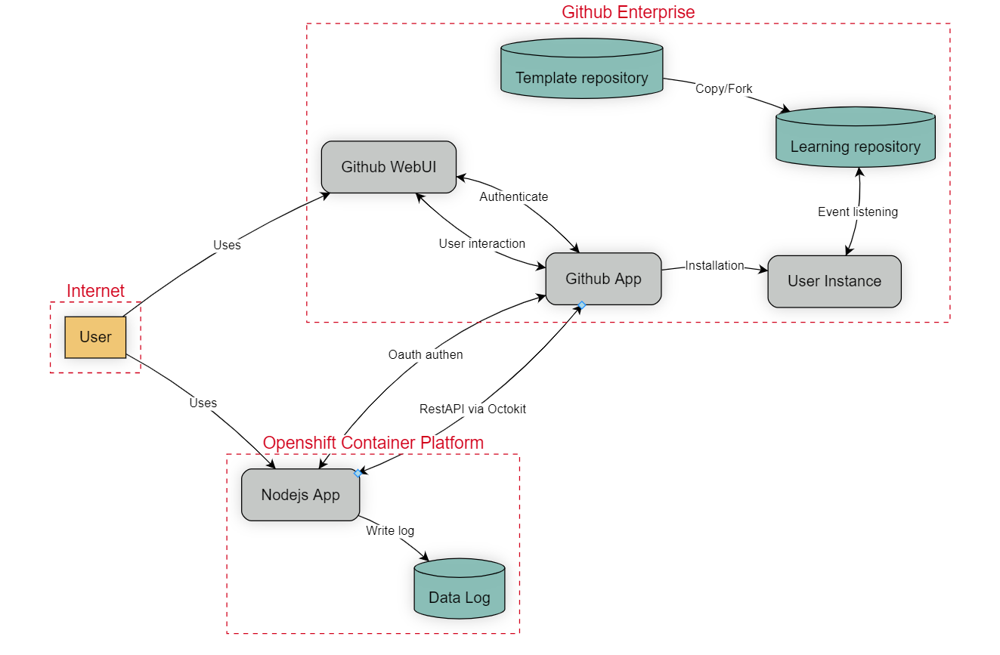

# Introduction #
This system is a Learning Lab platform designed to provide training courses for employees within the organization. The system utilizes GitHub Learning Lab to create and manage its own custom courses, supporting internal skill development.
# Assets #
Through the process of system analysis, we have identified the following key assets that are critical to the operation, security, and functionality of the application. These assets include user data, sensitive information, system configurations, and essential components that are vital for maintaining the integrity and performance of the system. Below is the list of identified assets:

| **Asset ID** | **Asset Name**                 | **Description**                                                             |
|--------------|---------------------------------|-----------------------------------------------------------------------------|
| **A01**      | User PII                        | Personally Identifiable Information (PII) of users, such as names, emails, etc. |
| **A02**      | User Credential                 | User credentials, including passwords and authentication information.       |
| **A03**      | User Source Code                | Source code stored in the user's GitHub repositories.                       |
| **A04**      | Authentication Tokens           | OAuth tokens or API tokens used for authenticating requests and accessing services. |
| **A05**      | Log Data                        | Application and system logs, including security and operational events.     |
| **A06**      | LearningLab Template Repository | Templates used for the LearningLab, stored in a GitHub repository.          |
| **A07**      | GitHub User Instance            | A GitHub account, including permissions, repositories, and activities.      |
| **A08**      | LearningLab POD                 | Kubernetes pods running the LearningLab, including configuration and data.  |
| **A09**      | Docker Images                   | Docker images used for deploying and running instances of the LearningLab.  |
| **A10**      | Configuration Files             | Files containing system configurations, including environment variables and secrets. |
| **A11**      | Kubernetes Secrets              | Sensitive information such as API keys and database credentials stored in Kubernetes secrets. |

# Components and Technology #

| **Component ID** | **Component Name**            | **Description**                                                                 |
|------------------|-------------------------------|---------------------------------------------------------------------------------|
| **C01**          | NodeJS App                    | The core application logic written in Node.js, handling backend processes.       |
| **C02**          | Express.js                    | A web framework for Node.js used to build the backend web services and API.      |
| **C03**          | Handlebars                    | A templating engine used to dynamically generate HTML pages for the Node.js app. |
| **C04**          | Log4js                         | A logging library integrated with the system to log application events.          |
| **C05**          | Octokit                       | A library used for interacting with GitHub Enterprise via REST API.              |
| **C06**          | GitHub Enterprise             | A platform used for source code management, collaboration, and version control.  |
| **C07**          | GitHub User Instance          | Represents a GitHub user who interacts with repositories and services on GitHub Enterprise. |
| **C08**          | LearningLab Template Repository | A GitHub repository that stores templates for the LearningLab.                   |
| **C09**          | GitHub App                    | An OAuth application that integrates with GitHub Enterprise to authenticate users and services. |
| **C10**          | User's Learning Repository    | A user-owned repository where personal learning content or code is stored.       |
| **C11**          | LearningLab Namespace         | A namespace in OCP-Node that isolates resources for the LearningLab. |
| **C12**          | LearningLab POD               | A Kubernetes pod in the Namespace LearningLab that runs the LearningLab services.          |
| **C13**          | Docker Container              | A containerized environment used to run isolated instances of the LearningLab.   |
| **C14**          | OpenShiftNode              |    |

# Dataflows #
The system’s data flow primarily revolves around interactions between the Node.js website and GitHub Learning Lab. Users access the platform through the website, which communicates with GitHub via REST API (using Octokit). Data such as course progress, user credentials, and learning resources are managed on GitHub, while the website processes and displays the data for the users.

The application consists of the following main flows:

### 1. Login Flow using GitHubApp SSO
1. **User → Application**: The user accesses the **NodeJS App (C01)** and selects the option to log in via **GitHub App (C09)**.
2. **Application → GitHub App**: The application redirects the user to **GitHub App (C09)** to handle authentication via OAuth2.0.
3. **GitHub App → GitHub Enterprise**: **GitHub App** calls **GitHub Enterprise (C06)** for authentication, requesting permission to access the user’s data.
4. **GitHub Enterprise → User**: **GitHub Enterprise (C06)** prompts the user to log in with their **GitHub credentials (A02)** or confirm access permissions.
5. **User → GitHub Enterprise**: The user enters credentials or grants permission.
6. **GitHub Enterprise → GitHub App**: After successful authentication, **GitHub Enterprise (C06)** issues an access token to **GitHub App (C09)**.
7. **GitHub App → Application**: **GitHub App (C09)** returns the access token to the **NodeJS App (C01)**.
8. **Application → User**: The **NodeJS App (C01)** return data to user.

---

### 2. Install New User Instance
1. **User → Application**: The user logs into the **NodeJS App (C01)** using **GitHub App (C09)** for SSO.
2. **User → Application**: After login, the user requests access to the  **NodeJS App (C01)**.
3. **Application → User**: The **NodeJS App (C01)** rendering the web interface via **Handlebars (C03)**.
4. **User → Application**: The user requests the creation of a new **GitHub User Instance (A07)**.
5. **Application → GitHub App**: The **NodeJS App (C01)** calls **GitHub Enterprise (C06)** via API using **Octokit (C05)**.
6. **GitHub Enterprise → Application**: **GitHub Enterprise (C06)** creates a new **GitHub User Instance (A07)** and responds to **NodeJS App (C01)**.
7. **Application → User**: The **NodeJS App (C01)** logs the event using **Log4js (C04)** and renders the response to the user via **Handlebars (C03)**.

---

### 3. Create New User LearningLab Repository
1. **User → Application**: The user logs into the **NodeJS App (C01)** using **GitHub App (C09)** for SSO.
2. **User → Application**: After login, the user requests access to the **LearningLab Web UI**.
3. **Application → User**: The **NodeJS App (C01)**  rendering the web interface via **Handlebars (C03)**.
4. **User → Application**: The user requests the creation of a new **LearningLab Repository (A03)**, selecting the COPY or FORK option.
5. **Application → GitHub App**: The **NodeJS App (C01)** calls **GitHub Enterprise (C06)** via API using **Octokit (C05)**.
6. **GitHub Enterprise → GitHub App**: **GitHub Enterprise (C06)** creates the new **LearningLab Repository (A03)** and responds to **GitHub App** the **NodeJS App (C01)**.
7. **Application → User**: The **NodeJS App (C01)** logs the event using **Log4js (C04)** and renders the response to the user via **Handlebars (C03)**.

---

### 4. User Direct Interaction with GitHub Enterprise via Web UI
1. **User → GitHub Enterprise**: The user directly accesses **GitHub Enterprise (C06)** via the **GitHub Web UI**.
2. **GitHub Enterprise → User**: **GitHub Enterprise (C06)** prompts the user to log in with their **GitHub credentials (A02)**.
3. **User → GitHub Enterprise**: The user enters credentials to access their **GitHub User Instance (A07)**.
4. **GitHub Enterprise → User**: **GitHub Enterprise (C06)** lists the user's repositories, including the **User's Learning Repository (A03)**.
5. **User → GitHub Enterprise**: The user interacts directly with the **Learning Repository (A03)**, performing actions such as commits, pull requests, or other repository management.
6. **GitHub Enterprise → User**: **GitHub Enterprise (C06)** processes the actions and reflects the updated repository information in the **GitHub Web UI**.

---

### 5. User Instance Event Trigger
1. **User → GitHub Enterprise**: The user configures event triggers on their **GitHub User Instance (A07)** for activities such as commits, pull requests, or issues.
2. **Event Occurs**: A relevant event (e.g., a commit to the **User's Learning Repository (A03)**) occurs, triggering the configured action.
3. **GitHub Enterprise → External System**: **GitHub Enterprise (C06)** triggers a webhook or sends a notification to an **External System** (e.g., CI/CD pipeline).
4. **External System → GitHub Enterprise**: The external system processes the event based on the user’s configuration.
5. **GitHub Enterprise → User**: The **GitHub Web UI** reflects the triggered event, and the user can review the event log in the repository.

# Storage Points  #
Storage points represent locations within a system where data stored, and which a threat actor may seek to access, modify or destroy. The data stored within these locations could be highly sensitive, including personal information, data log, etc
| **Storage Point ID** | **Storage Point** | **Explanation** |
|---------------------|------------------|-----------------|
| **SP01** |Template repository|A pre-configured Github repository that serves as a starting point for specific exercises, tutorials, or hands-on labs|
| **SP02** |Learning repository|A personal or oganizational repository created as part of Learning Lab course|
| **SP01** |User Instance|The unique instance of a github enterprise deployment where that user operates|
| **SP01** |Data Log|Where the logs generated by the application are stored|

# Threat Actors #
Threat actors are individuals that attack the system to either gain access to sensitive information or disrupt the system’s normal behaviour. We could consider the following potential threat actors to model attack scenarios against LearningLab.

### **Threat Agent Table**
| **Threat Agent ID** | **Threat Agent** | **Explanation** |
|---------------------|------------------|-----------------|
| **TA01** | Internal attacker or malicious user | Internal users who have authorized access but misuse or abuse their privileges for malicious purposes, such as data theft, tampering, or unauthorized actions. |
| **TA02** | Compromised internal service | Internal services or components that have been compromised by an attacker, allowing further malicious actions inside the network. |
| **TA03** | Compromised external service | External services integrated into your system that are compromised, allowing attackers to access your infrastructure or data. |
| **TA04** | External attacker over the Internet | Unauthorized attackers attempting to exploit system vulnerabilities, gain unauthorized access, or launch attacks such as phishing, brute force, and denial of service. |

---

# **STRIDE-LM Threat Table**

---

### **Spoofing**
| **ID** | **Description** | **Threat Agent** | **Mapped Threat Agent ID** |
|---|---|---|---|
| S01 | An attacker performs multiple authentication attempts using different passwords to gain access to a targeted account (Brute Force). | Internal attacker or malicious user,External attacker | TA01, TA04 |
| S02 | An attacker can inject malicious scripts into the HTML content to steal the user's token (Cross-Site Scripting - XSS). | Internal attacker or malicious user,External attacker | TA01, TA04 |
| S03 | An attacker without authenticated access can access the Template repository, which leads to disclosure, modification, or loss of data. | Internal attacker or malicious user,External attacker | TA01, TA04|
| S04 | An attacker without authenticated access can access the Learning repository, which leads to disclosure, modification, or loss of data. | Internal attacker or malicious user,External attacker | TA01, TA04 |
| S05 | An attacker with leaked credentials can impersonate an employee, leading to unauthorized access to employee data. | Internal attacker or malicious user,External attacker | TA01, TA04 |
| S06 | An attacker exploits a vulnerability in the OAuth authentication flow to bypass the login mechanism, gaining unauthorized access without valid credentials. | Internal attacker or malicious user,External attacker | TA01, TA04 |
| S07 | An application which uses container images from untrusted sources or images that are not up to date which leads to the docker containers have security vulnerabilities or malware | Internal attacker or malicious user,External attacker| TA01, TA04 |

---

### **Tampering**
| **ID** | **Description** | **Targeted Assets** | **Mapped Threat Agent ID** |
|---|---|---|---|
| T01 | An attacker could write malicious content to the GitHub Enterprise Repository (LearningLab Template Repository and User's LearningLab's Repository). | Internal attacker or malicious user,External attacker | TA01, TA04 |
| T02 | An attacker could delete log entries in the logging service, affecting the integrity of logs. | Internal attacker or malicious user,External attacker | TA01, TA04 |
| T03 | An attacker modifies Docker images in the container registry, leading to the deployment of malicious containers into OCP. | Internal attacker or malicious user,External attacker | TA01, TA04|
| T04 | An attacker exploits default or unnecessary components or functions (Express.js, GitHub Enterprise, OpenShift Platform) left in the application, leading to the introduction of vulnerabilities or malicious code execution. | Internal attacker or malicious user,External attacker | TA01, TA04 |
| T05 | An attacker injects malicious code into Handlebars templates, resulting in unauthorized execution of scripts in the client’s browser (Server-Side Template Injection). | Internal attacker or malicious user,External attacker | TA01, TA04 |
| T06 | An attacker injects malicious input into request parameters (e.g., URL, query, form) in an attempt to exploit web vulnerabilities (e.g., Command injection, Code injection). | Internal attacker or malicious user,External attacker | TA01, TA04 |
---

### **Repudiation**
| **ID** | **Description** | **Threat Agent** | **Mapped Threat Agent ID** |
|---|---|---|---|
| R01 | Logs do not capture enough data to support an investigation following an incident, making it difficult to trace actions during a security incident. | Internal attacker or malicious user,External attacker | TA01,TA04 |

---

### **Information Disclosure**
| **ID** | **Description** | **Threat Agent** | **Mapped Threat Agent ID** |
|---|---|---|---|
| I01 | An attacker gains unauthorized access to sensitive data (e.g., confidential or PII data) by exploiting insecure direct object references (IDOR). | Internal attacker or malicious user,External attacker | TA1,TA04 |
| I02 | An attacker exploits vulnerable third-party libraries, frameworks, or APIs to gain access to sensitive data (Third-Party Component Vulnerabilities). | Internal attacker or malicious user,External attacker | TA01, TA04 |
| I03 | An attacker gains unauthorized access to private repositories in GitHub Enterprise, exposing sensitive source code or credentials. | Internal attacker or malicious user,External attacker | TA01, TA04 |
| I04 | Sensitive data, such as API keys or credentials, PII data, are accidentally committed to public repositories in GitHub Enterprise. | Internal attacker or malicious user,External attacker | TA01, TA04 |
| I05 | Sensitive data, such as sensitive container logs, environment variables, or secrets, could be exposed through misconfigured Docker containers. | Internal attacker or malicious user,External attacker | TA01,TA04 |
| I06 | Misconfigured Handlebars templates expose sensitive data, such as user credentials, session tokens, or API keys, in the rendered HTML. | Internal attacker or malicious user,External attacker | TA01,TA04 |
| I07 | Sensitive error messages or stack traces in Express.js could be exposed to users, revealing internal system information. | Internal attacker or malicious user,External attacker | TA01,TA04 |

---

### **Denial of Service (DoS)**
| **ID** | **Description** | **Threat Agent** | **Mapped Threat Agent ID** |
|---|---|---|---|
| D01 | An attacker overloads the system with excessive requests, causing the service to become unavailable (Denial of Service - DoS). | Internal attacker or malicious user,External attacker | TA01, TA04 |
| D02 | An attacker overloads the OCP-Node with excessive resource requests (CPU, memory), causing legitimate workloads to fail. | Internal attacker or malicious user,External attacker | TA01, TA04 |
| D03 | An attacker exploits vulnerabilities in NodeJS or Express.js middleware (e.g., body parsers) to send oversized payloads, causing memory exhaustion and service disruption. | Internal attacker or malicious user,External attacker | TA01, TA04 |

---

### **Elevation of Privilege**
| **ID** | **Description** | **Threat Agent** | **Mapped Threat Agent ID** |
|---|---|---|---|
| E01 | An attacker steals credentials stored on a user’s computer or external service, gaining access to the NodeJS App, GitHub Enterprise, OpenShift platform, Azure services. | Internal attacker or malicious user,External attacker| TA01, TA04 |
| E02 | An attacker exploits a known vulnerability in Express.js, Octokit, Log4js, Handlebars, GitHub Enterprise, OpenShift Platform leading to system compromise. | Internal attacker or malicious user,External attacker | TA01, TA04 |
| E03 | An attacker exploits security flaws in the NodeJS App code, potentially compromising the affected NodeJS App, NodeJS App Pod, NodeJS App Namespace, or OCP-Node. | Internal attacker or malicious user,External attacker| TA01, TA04 |
| E04 | An attacker exploits undiscovered vulnerabilities in Express.js, Octokit, Log4js, Handlebars, GitHub Enterprise, OpenShift Platform, compromising the system. | Internal attacker or malicious user,External attacker | TA01, TA04 |
| E05 | An attacker compromises a GitHub Enterprise service account, using it to escalate privileges within the organization. | Internal attacker or malicious user,External attacker | TA01, TA04 |
| E06 | An application which containers running in privileged mode can access pod or cluster resources, leading to high risk if the pod is compromised | Internal attacker or malicious user,External attacker | TA01, TA04 |
| E07 | An attacker exploits weaknesses in the OAuth flow to escalate privileges, gaining administrative access to GitHub Enterprise resources. | Internal attacker or malicious user,External attacker | TA01, TA04 |
| E08 | An attacker exploits improper access control in Express.js routes, gaining access to restricted endpoints or functionalities. | Internal attacker or malicious user,External attacker | TA01, TA04 |

---

### **Lateral Movement**
| **ID** | **Description** | **Threat Agent** | **Mapped Threat Agent ID** |
|---|---|---|---|
| L01 | An attacker compromises one pod and moves laterally through the network to compromise other pods or services within the OCP-Node. | Internal attacker or malicious user,External attacker | TA01, TA04 |
| L02 | An attacker uses improperly isolated network policies to move between namespaces or Kubernetes services within the cluster. | Internal attacker or malicious user,External attacker | TA01, TA04 |
| L03 | An attacker exploits insufficient connection restrictions to access the  OpenShift Container Platform Webconsole or Kubernetes API, allowing unauthorized actions that compromise the system. | Internal attacker or malicious user,External attacker | TA01, TA04 |
| L04 | Compromised web components (NodeJS, Express.js, Octokit, Handlebar, Log4js) allow an attacker to move laterally across different areas by gaining access to other sensitive functions or resources. | Internal attacker or malicious user,External attacker |TA01, TA04 |

---

### **Man-in-the-Middle**
| **ID** | **Description** | **Threat Agent** | **Mapped Threat Agent ID** |
|---|---|---|---|
| M01 | A threat actor can read and manipulate transmitted information by intercepting the communication between the User and the NodeJS App (Man-in-the-Middle attack). | Internal attacker or malicious user,External attacker | TA01, TA04 |
| M02 | A threat actor intercepts and manipulates communication between the NodeJS App and GitHub Enterprise during the OAuth flow or REST API interactions, compromising data integrity. | Internal attacker or malicious user,External attacker | TA01, TA04 |
| M03 | A threat actor can read and manipulate transmitted information by intercepting the communication between the User and GitHub Enterprise (Man-in-the-Middle attack). | Internal attacker or malicious user,External attacker| TA01, TA04|

---

# Security Requirements #

| **Category** | **Requirements** | **NIST 800-53 Controls** | **Threat ID** | **Countermeasure contents** |
|:-------------|:-----------------|:----------------|:----------------|:----------------|
| **Environmental requirements** | Identify all components used within the application, ensuring that unnecessary ones (e.g., libraries, frameworks) are removed. | CM-8 | T04 E8 | With NodeJS App: Use tools like npm list, npm audit, or depcheck to identify all libraries and frameworks in the application. Review each component’s usage. Identify and remove unused or redundant components. Remove unnecessary libraries (e.g., npm uninstall) and refactor any affected code.   Disable unnecessary features and functions in components in GitHub Enterprise, OpenShift Container Platform. |
| **Environmental requirements** | Assess security risks for APIs, libraries, and SDKs (e.g., NodeJS, Express.js, Octokit, Handlebars, GitHub Enterprise) prior to usage. Only use components with no known vulnerabilities. |RA-5| I02 | Evaluate NodeJS, Express.js, Octokit, Handlebars, and GitHub Enterprise version before use. Ensure all components are free from known security vulnerabilities by regularly scanning for issues and applying security patches or updates.   Regularly scan all dependencies and fix reported issues.
| **Environmental requirements** | Regularly review vulnerability reports for the APIs, libraries, and SDKs in use (e.g., NodeJS, Express.js, Octokit, Handlebars, GitHub Enterprise) and apply necessary patches or countermeasures. | SI-2| I02 | Subscribe to vulnerability feeds or mailing lists (e.g., GitHub Security Advisories, NVD, or vendor-specific security announcements) for libraries and SDKs you are using.   Apply security patches and updates promptly when vulnerabilities are discovered.|
| **Personal information and privacy requirements** | Ensure that personal and sensitive data is excluded from logs and crash reports. |AU-9| I05 | Review all log-generating parts of the application, including error handling and crash reports.   Use log sanitization techniques to exclude sensitive data.|
| **Network communication requirements** | Encrypt all data in transit using secure communication protocols. |SC-8| M01 M02 M03| Enforce HTTPS for All Traffic between the User and the NodeJS App, the NodeJS App and GitHub Enterprise, User and the GitHub Enterprise.   Configure HTTPS using a valid SSL/TLS certificate, obtain an SSL/TLS certificate from a trusted Certificate Authority (CA) and ensure it does not expire.  Disable insecure SSL/TLS protocols (SSLv2, SSLv3, and TLSv1.0, TLSv1.1) and Enforce TLSv1.2 and TLSv1.3.
| **Authentication requirements** | Implement secure SSO OAuth authentication methods. |IA-2| S06 E07 |Ensure that the NodeJS application only delegates authentication to whitelisted GitHub Enterprise instances, which serve as the Identity Provider (IdP).  Use Strong Authentication Protocols: OAuth 2.0   Securely handle authentication using JWT for stateless, token-based authentication, ensuring proper signing (HMAC or RSA) and expiration. 
| **Authentication requirements** | Enforce stronger authentication methods for Github Enterprise | IA-2| S05 E01 S01 E05|Enforce MFA (Multi-Factor Authentication) for all Github Enterprise users. Enforce using strong password. Configure rate-limit. For more information: https://docs.github.com/en/enterprise-server@3.14/admin/configuring-settings/configuring-user-applications-for-your-enterprise/configuring-rate-limits, https://docs.github.com/en/authentication/securing-your-account-with-two-factor-authentication-2fa/configuring-two-factor-authentication
| **Access control requirements** | Ensure that only authorized users can access GitHub repositories.|AC-6| S03 S04 T01 I03|Define access policies that ensure only authorized users have access to sensitive repositories. Use GitHub’s built-in permission settings to assign roles such as Admin, Maintainer, and Read-only based on the principle of least privilege. Regularly review user access and permissions to ensure compliance.|
| **Access control requirements** | Limit access to servers, systems, and critical resources to a restricted set of authorized users or processes. |AC-3|E01 L01 L02 L03 L04|Ensure that administrative interfaces (e.g., Kubernetes control planes, OpenShift dashboards) are not exposed to the public internet. They should only be accessible through a secure network or VPN.   Configure firewalls to restrict access to critical systems and servers (such as administrative consoles or SSH access). Limit connections to only specific IP ranges, such as internal IPs or trusted external addresses.|
| **Access control requirements** |Ensure that all access to sensitive resources or objects is properly authenticated and authorized to prevent Insecure Direct Object References (IDOR) and Broken Access Control attacks|AC-03|I01 E8 |Implemenet Role-Based Access Control (RBAC) model by defining roles and permissions. Implement express.js middleware to check the user's role or permissions before allowing access to certain routes or actions. |
| **Secure application development requirements** | Ensure the application is designed to catch and handle potential exceptions effectively. |SI-10|E01 L04|Implement comprehensive error and exception handling across the application, ensuring errors are logged without revealing sensitive information. Use try-catch blocks and input validation routines to handle exceptions securely|
| **Secure application development requirements** | Implement strict input validation to prevent injection attacks. |SI-10|S02 T06|Use input validation libraries and frameworks that enforce strong validation rules for user inputs (e.g., whitelisting). Implement server-side validation for all inputs to ensure that invalid or malicious inputs are rejected.   In NodeJS App can use express-validator to enforce input validation rules for input.|
| **Secure application development requirements** | Ensure the safe integration and use of third-party libraries in applications to mitigate the risk of introducing vulnerabilities from external components |SA-12|I06 T05|Use the latest version of libraries (Nodejs, Octokit, Handlebars, express.js) available at the current time and regular updates and patch management.   When using Handlebars, all user input must be sanitized before rendering to prevent Server-Side Template Injection (SSTI).|
| **Secure application development requirements** |Ensure that all data, especially user-generated input, is properly encoded before being displayed in the browser or other output destinations.|SI-10|S02| Use the {{}} syntax in Handlebars template to escapes HTML entities. In Express.js, always set the Content-Type header to application/json when sending API responses to users to prevent Cross-Site Scripting (XSS) attacks. |
| **Secure application development requirements** | Conduct both static and dynamic application security testing as part of the development lifecycle, and apply the necessary security measures based on the findings. |SA-11| S1-S7, T1-T6, I1-I7, E1-E8|Incorporate static analysis tools (SAST) and dynamic analysis tools (DAST) in your CI/CD pipeline. Regularly run automated security tests as part of the development lifecycle and address any vulnerabilities discovered|
| **Secure application development requirements** | Ensure that all code repositories are configured to automatically perform secret scanning whenever code is pushed to the repository.| SA-12| I04|Enable the "Secret scanning alerts" feature in GitHub Advanced Security to detect and send early warnings when a user pushes code containing secrets.|
| **Logging requirements** | Ensure that sensitive information is not logged. | AU-9|I07|Review all logging configurations to ensure sensitive data (e.g., passwords, tokens) is excluded from logs. Use masking or redaction techniques to remove sensitive data from logs|
| **Cryptography requirements** | Use high-quality, high-performance cryptographic algorithms that have no known vulnerabilities.  |SC-13| M01 M02 M03|Use industry-standard cryptographic algorithms (e.g., AES-256, RSA) and stay updated on the latest security standards. Regularly review cryptographic libraries to ensure no vulnerabilities are present.   When configuring HTTPS, disable outdated and insecure SSL/TLS protocols such as SSLv2, SSLv3, TLSv1.0, and TLSv1.1. Enforce the use of TLSv1.2 and TLSv1.3 for secure communication.|
| **Monitoring requirements** | Implement centralized logging for all application components with real-time analysis capabilities. |AU-6| R01 T02| Centralizes log collection for all application components and allows for real-time monitoring and anomaly detection. Deploy a centralized logging platform (e.g., ELK stack, Splunk) to collect logs from all application components. Implement real-time analysis and monitoring for logs to detect security incidents promptly.|
| **Container security requirements** | Protect container logs and environment variables to ensure sensitive information is not exposed. | SI-11|I05|Audit containers for exposed secrets and apply secure storage solutions (e.g., Vault, Kubernetes Secrets), ensure secrets and credentials are stored in secure locations such as Azure Key Vault, instead of embedding them into code or configuration files.|
| **Container security requirements** | Implement container security measures (e.g., AppArmor, Seccomp) to prevent privilege escalation within containers.  |AC-3| E06 |Use security profiles like AppArmor and Seccomp to limit the system calls containers can make, reducing the risk of privilege escalation. Regularly audit container security settings|
| **Container security requirements** | Implement strict network policies within the Docker environment to limit communication between containers. |SC-7| L01 L02 |Define network policies in Openshift Container Platform NetworkPolicy to restrict communication between containers. Ensure only necessary traffic is allowed between containerized applications.|
| **Container security requirements** | Use Trusted Base Images or Golden Images |SC-12|T03 S07|Always pull container images from trusted and official repositories, and verify their integrity using checksums or signatures.|
| **Network security requirements** | Deploy a Web Application Firewall (WAF) to protect web applications from Distributed Denial of Service (DDoS) attacks, common web vulnerabilities (e.g., SQL Injection, Cross-Site Scripting), and unauthorized access. |SI-4| D01, D03, E2, E3, E4 | Deploy Azure WAF with either Azure Front Door or Application Gateway to monitor and filter HTTP/HTTPS traffic. Configure WAF to block known attack patterns such as SQL Injection, XSS, and Remote File Inclusion (RFI) and apply rate limiting to prevent DDoS Attacks.|