# Installing Packer and Running Packer

## 1. Prerequisites
- Azure Subscription: You will need an Azure subscription with permissions to create resources.
- Packer:
- The machine that running Ubuntu 22.04 with sudo or root privileges
- Internet connection
  
<div class="page"/>

## 2. Setup environment

### 2.1 Install prerequisites package

Please run the command below to install an nessessary packages:
```bash
apt update
apt install wget unzip -y
```

### 2.2 Install Azure CLI

This script runs all installation commands in one step. This script is downloaded via curl and piped directly to bash to install the CLI.

```bash
curl -sL https://aka.ms/InstallAzureCLIDeb | sudo bash
```

Set default subscription

After you sign in, CLI commands are run against your default subscription. If you have multiple subscriptions, change your default subscription using `az account set --subscription`

```bash
az account set --subscription "<subscription ID or name>"
```

Log in to Azure with the command:
```bash
az login
```

This will open a browser window where you can log in to your Azure account.

Next, we need create Azure credentinal that will be used by Packer
Run command below to create new service principal:

```
az ad sp create-for-rbac --role="Contributor" --scopes="/subscriptions/YOUR_SUBSCRIPTION_ID"
```

This will give you the following details:

- client_id
- client_secret
- tenant_id
- subscription_id

> Save these values; you'll need them later when configuring Packer.


### 2.3 Install Packer

To install the precompiled binary, [download](https://developer.hashicorp.com/packer/install) the appropriate package for your system. 


```bash
wget -O- https://apt.releases.hashicorp.com/gpg | sudo gpg --dearmor -o /usr/share/keyrings/hashicorp-archive-keyring.gpg
echo "deb [signed-by=/usr/share/keyrings/hashicorp-archive-keyring.gpg] https://apt.releases.hashicorp.com $(lsb_release -cs) main" | sudo tee /etc/apt/sources.list.d/hashicorp.list
sudo apt update && sudo apt install packer
```

After installing Packer, verify the installation worked by opening a new command prompt or console, and checking that packer is available:

```bash
packer -h
```

The output look like:

```sh

    packer
    Usage: packer [--version] [--help] <command> [<args>]
    Available commands are:
    build           build image(s) from template
    console         creates a console for testing variable interpolation
    fix             fixes templates from old versions of packer
    fmt             Rewrites HCL2 config files to canonical format
    hcl2_upgrade    transform a JSON template into an HCL2 configuration
    init            Install missing plugins or upgrade plugins
    inspect         see components of a template
    validate        check that a template is valid
    version         Prints the Packer version
```

<div class="page"/>

## 3. Create a Packer Template

### 3.1 What is a Packer Template?
A Packer template is a JSON file that defines how an image should be built. You'll write a template that defines the base image and hardening tasks.

### 3.2 Create the Packer Template

In this guide, we will use HCL syntax to create Packer template

Clone source code from github to server:

```bash
git clone <GIT_REPO_URL>
```

Folder structure as below:


This is a content of Packer template
```hcl
packer {
  required_plugins {
    azure = {
      source  = "github.com/hashicorp/azure"
      version = "~> 1"
    }
  }
}

source "azure-arm" "openscap_hardening" {
  azure_tags = {
    dept    = "Security"
    project = "OpenSCAP-Remediation"
  }
  client_id                         = "client-id"
  client_secret                     = "client-secret"
  subscription_id                   = "subscription_id"
  tenant_id                         = "tenant_id"
  image_offer                       = "0001-com-ubuntu-server-jammy"
  image_publisher                   = "Canonical"
  image_sku                         = "22_04-lts-gen2"
  build_resource_group_name         = "cariad-dev-wp09-west-us-02"
  managed_image_name                = "wp09-ubuntu-22-04-template"
  managed_image_resource_group_name = "cariad-dev-wp09-west-us-02"
  os_type                           = "Linux"
  vm_size                           = "Standard_DS2_v2"
}


build {
  sources = ["source.azure-arm.openscap_hardening"]
  provisioner "shell" {
    inline          = ["sudo apt-get update", "sudo apt-get upgrade -y", "sudo apt-get install unzip -y", "sudo apt-get install libopenscap8 -y"]
    max_retries       = 5
  }
  provisioner "shell" {
    execute_command = "chmod +x {{ .Path }}; {{ .Vars }} sudo -E sh '{{ .Path }}'"
    script          = "./setup.sh"
  }
  provisioner "file" {
    source      = "cloud-init.yaml"
    destination = "/tmp/cloud-init.yaml"
  }
  provisioner "shell" {
    inline = [
      "sudo mv /tmp/cloud-init.yaml /etc/cloud/cloud.cfg.d/99_remove_waagent.cfg"
    ]
  }
  provisioner "file" {
    source      = "/tmp/reports/report-before.html"
    destination = "/tmp/report-before.html"
    direction   = "download"
  }
  provisioner "file" {
    source      = "/tmp/reports/report-after.html"
    destination = "/tmp/report-after.html"
    direction   = "download"
    max_retries = 5
  }
  provisioner "shell" {
    inline          = ["/usr/sbin/waagent -force -deprovision+user export HISTSIZE=0 sync"]
  }

}

```

**Explanation**: This document outlines a Packer template used to create a custom hardened Ubuntu 22.04 virtual machine image following OpenSCAP remediation guidelines. The image is built using Packer with Azure as the infrastructure provider, and it includes multiple provisioning steps to install necessary packages and run custom shell scripts.

#### Packer Configuration
```hcl
packer {
  required_plugins {
    azure = {
      source  = "github.com/hashicorp/azure"
      version = "~> 1"
    }
  }
}
```
**Explanation**:
- Packer Block: Defines the required Packer plugin for Azure (github.com/hashicorp/azure) to interact with Azure's ARM infrastructure.
- Version: Specifies that Packer should use version 1.x of the plugin.

---

#### Azure ARM Source Block
```hcl
source "azure-arm" "openscap_hardening" {
  azure_tags = {
    dept    = "Security"
    project = "OpenSCAP-Remediation"
  }
  client_id                         = "client-id"
  client_secret                     = "client-secret"
  subscription_id                   = "subscription_id"
  tenant_id                         = "tenant_id"
  image_offer                       = "0001-com-ubuntu-server-jammy"
  image_publisher                   = "Canonical"
  image_sku                         = "22_04-lts-gen2"
  build_resource_group_name         = "cariad-dev-wp09-west-us-02"
  managed_image_name                = "wp09-ubuntu-22-04-template"
  managed_image_resource_group_name = "cariad-dev-wp09-west-us-02"
  os_type                           = "Linux"
  vm_size                           = "Standard_DS2_v2"
}
```
**Explanation**:
- Source Block: Defines the Azure resource that Packer will use to build the VM image.
- Azure Tags: Metadata tags that identify the department (`dept: Security`) and project (project: `OpenSCAP-Remediation`).
- Client ID, Secret, Subscription, Tenant: Azure authentication credentials. These should be securely provided as environment variables or secrets.
- Image Settings:
    - image_offer: The base Ubuntu image being used, i.e., Ubuntu Server Jammy (22.04).
    - image_publisher: Canonical, the publisher of the Ubuntu image.
    - image_sku: Specifies the exact SKU for Ubuntu 22.04 LTS with Generation 2 support.
- Resource Groups:
    - build_resource_group_name: Resource group where the build VM will reside.
    - managed_image_name: The name of the final custom image created after provisioning.
    - managed_image_resource_group_name: The resource group where the final image will be stored.
- VM Size: Defines the virtual machine size (`Standard_DS2_v2`), a general-purpose VM optimized for most workloads.
- os_type: Operating system type (`Linux`).

---

#### Build Block
```hcl
build {
  sources = ["source.azure-arm.openscap_hardening"]
  provisioner "shell" {
    inline          = ["sudo apt-get update", "sudo apt-get upgrade -y", "sudo apt-get install unzip -y", "sudo apt-get install libopenscap8 -y"]
    max_retries       = 5
  }
  provisioner "shell" {
    execute_command = "chmod +x {{ .Path }}; {{ .Vars }} sudo -E sh '{{ .Path }}'"
    script          = "./setup.sh"
  }
  provisioner "file" {
    source      = "cloud-init.yaml"
    destination = "/tmp/cloud-init.yaml"
  }
  provisioner "shell" {
    inline = [
      "sudo mv /tmp/cloud-init.yaml /etc/cloud/cloud.cfg.d/99_remove_waagent.cfg"
    ]
  }
  provisioner "file" {
    source      = "/tmp/reports/report-before.html"
    destination = "/tmp/report-before.html"
    direction   = "download"
  }
  provisioner "file" {
    source      = "/tmp/reports/report-after.html"
    destination = "/tmp/report-after.html"
    direction   = "download"
    max_retries = 5
  }
  provisioner "shell" {
    inline          = ["/usr/sbin/waagent -force -deprovision+user export HISTSIZE=0 sync"]
  }

}
```

**Explanation**:
- Build Block: Specifies the provisioning steps and image creation process.
- Sources: Refers to the source block defined earlier (`azure-arm.openscap_hardening`).

**Provisioners**:
- Shell Provisioner (APT updates):
  - Inline Command: Executes common Linux commands to update the system, upgrade all packages, and install unzip and libopenscap8.
  - max_retries: Specifies the number of retries in case of failure.
- Shell Provisioner (Custom Script):
  - Script: Runs a custom script (setup.sh), which is uploaded to the VM and executed with elevated permissions.
  - execute_command: Ensures the script is executable and runs with necessary privileges.
  - inline_shebang: Custom shell interpreter (/bin/sh -x) for verbose output.
- File Provisioners:
  - Before Remediation: Downloads the OpenSCAP scan report generated before remediation to the local machine (report-before.html).
  - After Remediation: Downloads the post-remediation OpenSCAP report (report-after.html).
  - Direction: download specifies that files are being pulled from the VM.
---


### 4.3 Provisioning Flow
1. System Update & OpenSCAP Installation:
   - The VM is updated, upgraded, and the OpenSCAP package is installed.
2. Custom Script Execution:
   - A custom hardening script (setup.sh) is executed to apply the desired system configurations.
3. File Transfers:
   - OpenSCAP reports are downloaded before and after the remediation process for auditing purposes.

<div class="page"/>

## 5. Run Packer

Run following command to initialize Packer based o HCL template above
```
packer init ami-script.pkr.hcl
```


Next, Run Packer Build
```
packer build ami-script.pkr.hcl
```
Install libopenscap8
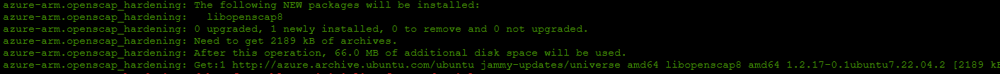
Start script, download and unzip OpenSCAP profile
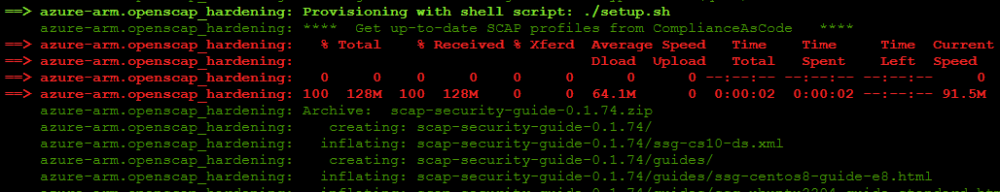
Create "report-before.html"
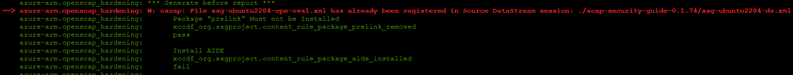
Starting remediation
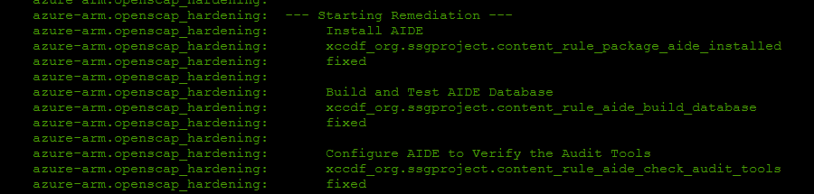
Create "report-after.html"
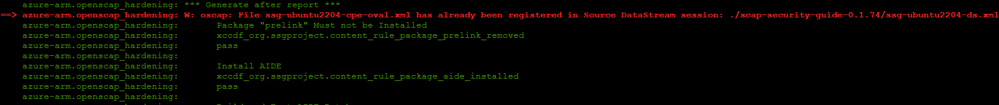
Download report to local machine


Create Image
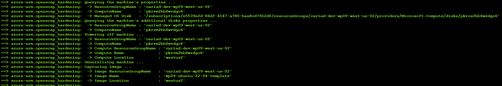

Remove template object 
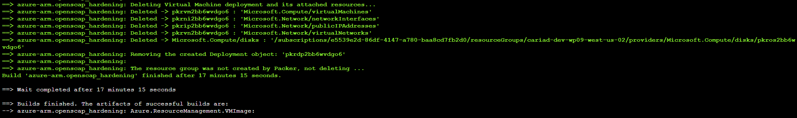

<div class="page"/>

## 6. Verify The Report

### 6.1 Report Before Bardening
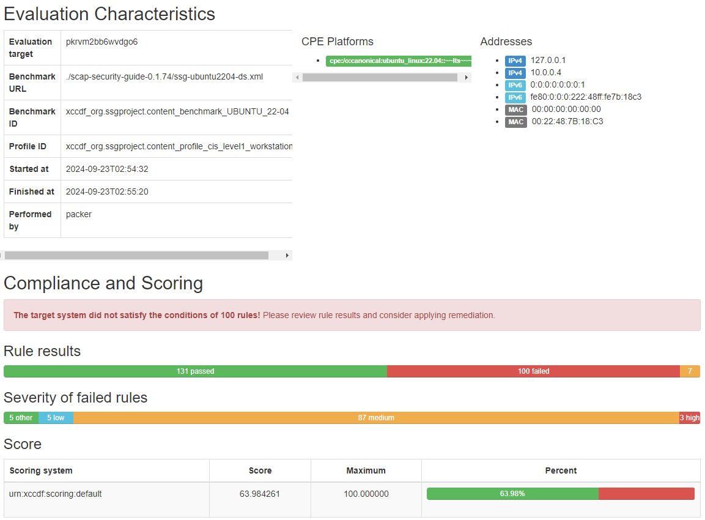

### 6.2 Report After Remediation
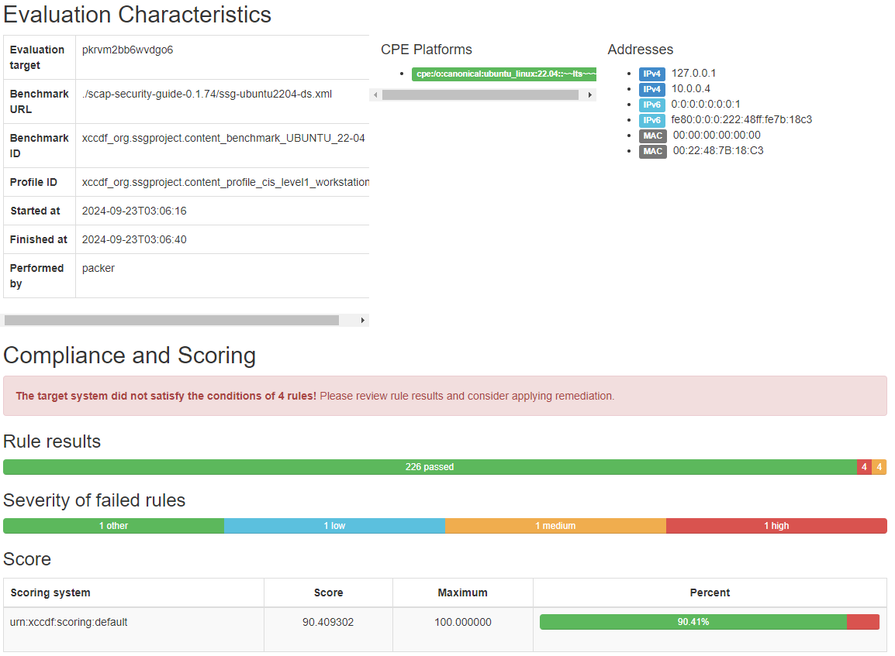

<div class="page"/>

## 7. Verify a new hardening image on Azure

We provisioned new Azure VM from custome image. Then ssh into that server and check

### 7.1 Package is deinstalled

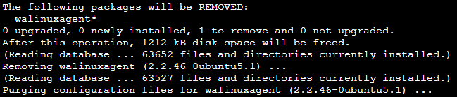
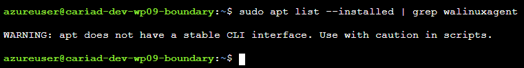
### 7.2 Systemd service unit-file not present
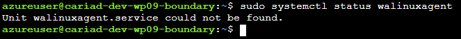
