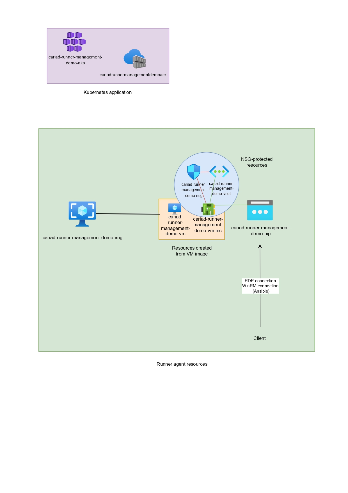

# CARIAD EngIT Frame – tech task – WP11 – Runner Mgmt
## Delivered

- Packer code
- Terraform code
- Ansible code
- Helm charts
- Github Actions workflows
- Kotlin code

## Prerequisites:
1. `azure-cli` <https://learn.microsoft.com/en-us/cli/azure/install-azure-cli-windows?tabs=azure-cli>
2. `packer` <https://developer.hashicorp.com/packer/tutorials/docker-get-started/get-started-install-cli>
3. `terraform` <https://developer.hashicorp.com/terraform/install>
4. `ansible` <https://docs.ansible.com/ansible/latest/installation_guide/installation_distros.html#installing-distros>
5. `kubectl` <https://kubernetes.io/docs/tasks/tools/#kubectl>
6. `docker` <https://docs.docker.com/get-started/get-docker/>
7. `helm` <https://helm.sh/docs/intro/install/>
8. `gradle` <https://gradle.org/install/> *build script included with application code*

## Task 1
### Step 1
### Build a Windows VM Image in Azure using Packer

#### Approaches
Directory hierarchy:

- packer/
    - packer/main.pkr.hcl
    - packer/variables.pkr.hcl

1. As delivered inside the `packer/` directory, the Image shall be built from the file `main.pkr.hcl`.
2. Reference image shall be Windows Server 2022 (2022-datacenter) from the Azure marketplace that will be customized using provisioner scripts.
3. Azure CLI authentication shall be used, for which purpose the line `use_azure_cli_auth = true` has been added to `main.pkr.hcl`. This is made possible by passing secrets to Azure Login Action or local `az login` session.
4. Variables inside the `main.pkr.hcl` source block are defined as `PKR_VAR` envs in Github Actions or local shell sessions.
5. Powershell and windows-restart provisioners shall be used for scripting the image build. Windows-restart provisioner is necessary before sysprep in cases of certain application installations when sysprep does not function correctly unless a restart is applied beforehand.

The custom image may be built in the following steps:

1. Configure following environment variables:

    - `PKR_VAR_buildResourceGroupName`
    - `PKR_VAR_imageSku`
    - `PKR_VAR_vmSize`
    - `PKR_VAR_winrmUsername`
    - `PKR_VAR_managedImageName`

2. Run `az login` *(or use azure-login action inside github actions workbook)*
3. Configure working subscription with `az account set --subscription [ID]`
4. Run `packer init .` *(will download required_plugins, not necessary to rerun if plugins unchanged)*
5. Run `packer validate .` to ensure valid syntax. *(optional)*
6. Run `packer build .` to start the build process.

- Working directory is assumed to be the `packer/` directory.

- **NOTE:** In case there is no existing resource group, it may be created from the Terraform code in `terraform/` (working directory) using the following commands prior to building the Packer image:

```shell
terraform init #"initalizes all plugins and providers"
terraform plan -target=module.rg -out=rg.tfstate #"saves the plan for this module"
terraform apply "rg.tfstate" #"uses the saved plan, therefore only deploying the resource group"
```
More on Terraform [in step 2](#terraform).

#### Packer code explaination
Blocks incoming scripts defined in the provisioner from executing until Azure agents on the machines have been started:
```pwsh
while ((Get-Service RdAgent).Status -ne 'Running') { Start-Sleep -s 5 }
while ((Get-Service WindowsAzureGuestAgent).Status -ne 'Running') { Start-Sleep -s 5 }
```

Chocolatey is utilized for quick installation of Docker and Telegraf inside the temporary Packer VM and for future Ansible installations when appropriate:
```pwsh
Invoke-Expression ((New-Object System.Net.WebClient).DownloadString('https://community.chocolatey.org/install.ps1'))
```

- WebClient object is used instead of "cleaner" approaches such as `Invoke-RestMethod` due to its faster download speed output.

Downloads Visual Studio, generates layouts and runs the offline installer generated from the layout:
```pwsh
Invoke-RestMethod -Uri https://aka.ms/vs/17/release/vs_community.exe -OutFile vs_community.exe
Start-Process .\\vs_Community.exe -Wait -ArgumentList '--wait','--quiet','--layout','C:\\localVSlayout\\','--add','Microsoft.VisualStudio.Workload.NativeDesktop','--includeRecommended','--includeOptional','--lang','en-US'
Start-Process $env:SYSTEMDRIVE\\localVSlayout\\vs_Community.exe -Wait -ArgumentList '--wait','--quiet','--noWeb','--add','Microsoft.VisualStudio.Workload.NativeDesktop','--includeRecommended','--includeOptional'
```

- Without `-Wait` defined for `Start-Process`, a race condition would be entered with ungenerated layouts, despite `--wait` already being specified for the `vs_community` executable.

Installs Telegraf and Docker via Chocolatey packages:
```shell
choco install telegraf -y
choco install docker-cli -y
choco install docker-desktop -y
```

Sets Docker backend to start automatically, as the default is manual:
```pwsh
Set-Service -Name com.docker.service -StartupType Automatic
```

Installs Hyper-V on host:
```pwsh
Install-WindowsFeature -Name Hyper-V -IncludeManagementTools
```

- Only available for select VM SKUs that supported nested virtualization, such as `Standard_D2s_v3`.

Restarts the temporary machine; needed for Sysprep to consistently function as expected:
```hcl
provisioner "windows-restart" {}
```

Downloads the `ConfigureRemotingForAnsible` script and sets it to be run with `-ForceNewSSLCert` on next login. This is necessary as a new certificate will need to be generated after the sysprep:
```pwsh
Invoke-RestMethod https://raw.githubusercontent.com/ansible/ansible-documentation/devel/examples/scripts/ConfigureRemotingForAnsible.ps1 -OutFile "$env:SYSTEMDRIVE\\ConfigureRemotingForAnsible.ps1",
"New-Item HKLM:\\SOFTWARE\\Microsoft\\Windows\\CurrentVersion\\RunOnce -Name AnsibleRemote -Value 'C:\\Windows\\System32\\WindowsPowerShell\\v1.0\\powershell.exe -ExecutionPolicy Bypass -File C:\\ConfigureRemotingForAnsible.ps1 -ForceNewSSLCert'
```

Start Sysprep OOBE process:
```pwsh
Start-Process $env:WINDIR\\System32\\Sysprep\\sysprep.exe -ArgumentList '/oobe','/generalize','/quiet','/quit'
```

- No shutdown is intended, as that will occur at the end of the scripts either way.

Blocks shutdown of the temporary machine until the image state has been recorded inside registry to be `IMAGE_STATE_GENERALIZE_RESEAL_TO_OOBE` and ready for reuse:
```pwsh
while($true) { $imageState = Get-ItemProperty HKLM:\\SOFTWARE\\Microsoft\\Windows\\CurrentVersion\\Setup\\State | Select ImageState; if($imageState.ImageState -ne 'IMAGE_STATE_GENERALIZE_RESEAL_TO_OOBE') { Write-Output $imageState.ImageState; Start-Sleep -s 10  } else { break } }
```

- This may be avoided by specifying `-Wait` with `Start-Process sysprep`, but the sleep approach is more helpful with debugging.

### Step 2 - Deploy the VM using Terraform
### Terraform
As delivered inside the `terraform/` directory, runner VM and related resources shall be deployed using Terraform code with Azure CLI for authentication.

The directory hierarchy shall contain the following:

- `terraform/`
    - `main.tf`
    - `locals.tf`
    - `providers.tf`
    - `data.tf`
    - `modules/`
        - *module-name*
            - `outputs.tf`
            - `main.tf`
            - `variables.tf`

- **Parent** `main.tf` describes modules that will be deployed. The modules themselves and their structure is defined in their respective directories.
- `locals.tf` defines local values that will only be referenced directly inside `main.tf` (tags and resource group name).
- `data.tf` defines data that shall be pulled from the cloud (current subscription scope in login session).
- `providers.tf` defines providers that shall be used for resource provisioning (`azurerm` - for deployments to the Azure cloud).

All resources are deployed as modules, with a valid directory structure containing `main.tf` for resource definition and `variables.tf` for variable declaration.
The variables themselves will be defined inside the parent `main.tf` for use inside modules.
`outputs.tf` is used to define outputs for modules that will be saved for properties that need to be referenced in another module, e.g. public IP ID.

The following resources are defined in Terraform modules:

1. Virtual machine
    1. Virtual machine NIC *(subresource of virtual machine)*
2. Virtual network
3. Public IP *(access to the VM for the purpose of this task)*
4. Network Security Group *(associated to virtual network and nic)*
5. Managed User identity

- OS disk, subresource of virtual machine, is auto-generated during the VM creation step.
- The virtual machine SKU defined for the module needs to support Nested virtualization in order for Hyper-V to work.

The VM and its related resources may be deployed in the following steps:

1. Run `az login` *(or use azure-login action inside github actions workbook)*
2. Configure working subscription with `az account set --subscription [ID]`
3. Run `terraform init` *(will download required_providers and modules, rerun is not necessary if no modules and providers changed)*
4. Run `terraform validate` to ensure valid syntax. *(optional)*
5. Run `terraform deploy` to start the deployment process.
- Working directory is assumed to be the `terraform/` directory.


When the resources are deployed, their state will be recorded in the file `terraform.tfstate` inside `terraform/`. Saving this file is crucial for future Terraform deployments, as it is important to avoid attempting redeployment of the same resources without making any changes to them.

The public IP address of the VM will be output as parameter `public_ip` after the first `plan` or `apply`, however, if this is missed, the information may be retrieved from the state file using the command `terraform state show module.pip.azurerm_public_ip.pip` or Azure portal.

- **IMPORTANT NOTE:** **The password for VM access is randomly generated using Terraform's `random_password` resource. This randomly generated password can later be retrieved by locating the `result` attribute property for `random_password` inside `terraform.tfstate`.**

- Best practice is to store the state file on an Azure Blob, but for the purposes of this task the state is saved locally.

Additionally, the following commands may be used:

- `terraform plan` in order to view the changes that will be made with the code, relative to the Terraform state.
- `terraform destroy` in order to delete all resources recorded in the state.
- `terraform deploy -auto-approve` in order to automate the deployment process in pipelines and scripts.

For the purpose of this task, the following **inbound** Network security group rules are permitted for all addresses:

- Port 3389 *(RDP)*
- Port 5985 *(WinRM HTTP)*
- Port 5986 *(WinRM HTTPS)*

These whitelists are necessary in order to be able to configure the machine. Different IP addresses can be added as necessary to the array `source_address_prefixes` for the network security group module inside the parent `main.tf`.

- **NOTE**: In a production envrionment the whitelist shall include only specific addresses as necessary.

### Infrastructure diagram


### Step 3 & 4 - Configure the VM with Ansible / Prepare the Image for CI/CD Integration
For the purpose of this task, Ansible playbooks will be run from a local machine, with a directory structure that allows flexible usage of roles, group variables, and more. The directory structure is delivered under directory `ansible/`.

Ansible will access the Windows VM deployed by Terraform using HTTPS WinRM (Remote Powershell) on port 5986, and it is referenced inside inventory file `ansible/hosts`. For the purpose of this task the password is declared inside the inventory file, but in a production environment certificate-based access is best practice.
The string `REPLACEIPHERE` inside the `hosts` inventory also needs to be replaced by proper IP addresses of the machines Ansible is supposed to access.

The directory structure is as follows:

- `main.yml` *playbook*
- `hosts` *inventory file*
- `group_vars/`
    - *group_name*
- `roles/`
    - `post_install/`
        - `tasks/`
            - `main.yml`
    - `github_runner/`
        - `tasks/`
            - `main.yml`
    - `jenkins/`
        - `tasks/`
            - `main.yml`

The playbook is defined in the parent `main.yml` (`ansible/main.yml`) and the structure includes three roles:
1. post_install *(step 3)*
2. github_runner *(step 4 - github actions runner)*
3. jenkins *(step 4 - jenkins)*

The playbook can be run with the following command:

- `ansible-playbook main.yml` inside `ansible/`
- `ansible-playbook -C or ansible-playbook --check` will not apply the changes and can be used as a dry-run, but it is important to remember that checks failing in this mode may be false positives, as they will fail in cases a task depends on the action of a previous one.

The roles' `main.yml` files have defined tasks relating to the role, unlike the parent playbook `main.yml` that just calls the roles. Variables are used for dynamic information such as version numbers in URLs. These variables are defined group-level in group_vars, but an alternative option would be to use `vars/` inside the appropriate role directory.

`ansible.windows` plugins are utilized for installation and configuration of the requirements, with specific conditionals and registration in tasks in order to avoid unnecessary triggers.

Ansible fact collection is used, most commonly in order to avoid hard-coding information prone to frequent change, such as the user profile directory. This information can be accessed with the following: `{{ ansible_facts['user_dir'] }}` or `{{ ansible_facts['env']['USERPROFILE'] }}`.

- **NOTE**: In case RunOnce from [Task 1](#task-1) Packer failed and issues with Ansible plugins outputting a TLS error are encountered, the script `ConfigureRemotingForAnsible.ps1` from Task 1 should be run on the machine with the argument `-ForceNewSSLCert`.

```pwsh
Invoke-RestMethod https://raw.githubusercontent.com/ansible/ansible-documentation/devel/examples/scripts/ConfigureRemotingForAnsible.ps1 -OutFile "$env:SYSTEMDRIVE\ConfigureRemotingForAnsible.ps1"
& $env:SYSTEMDRIVE\ConfigureRemotingForAnsible.ps1 -ForceNewSSLCert
```

#### Conclusion
Automated installation and configuration of the following has been achieved:

- [x] Docker
- [x] Telegraf
- [x] Jenkins / Java 17
- [x] Github Actions
    - Variables `actions_repo` and `actions_token` in `ansible/group_vars/runner` should be changed to the wanted repository URL and access token before running the `post_install` role.
    - The GitHub access token has a time limit, so when generated it should be used for the playbook as soon as possible.

- Docker desktop has been changed to use `Hyper-V` isolation by overwriting the file `daemon.json` inside the user profile directory, later restarting the service in order for this change to take effect. Because daemon defaults are used, and only the Hyper-V customization is asked, overwriting the entire file with content is the most simple option in this case. When the file has been overwritten, another Ansible task also creates a "lock" file so that a `when` condition on the file overwrite task skips it, avoiding an unnecessary service restart if the playbook has been rerun.
- InfluxDB2 metrics on Windows are not Ansible-friendly because an access token is required, which can be set up by accessing the web interface listening on port `8086` (`http://127.0.0.1:8086`). Installation of InfluxDB2 and Influx CLI is included in the role `post_install`. The following commands may be used to apply Windows and Docker metrics after the organization setup:

```shell
influx apply -u https://raw.githubusercontent.com/influxdata/community-templates/master/windows_system/windows_system.yml -o ORGNAME -t TOKEN
influx apply -u https://raw.githubusercontent.com/influxdata/community-templates/master/docker/docker.yml -o ORGNAME -t TOKEN
```

- Github Actions runner and Jenkins are installed by running the installation executables with appropriate arguments used for unattended installation. The Ansible tasks similarly contain conditionals if the applications are already installed, in case of a playbook rerun.
    - Jenkins listens on the port `8080` and we can access the web GUI for further configuration on that port.
    - User with anonymous credentials `NT AUTHORITY\NETWORK SERVICE` defined in Github Actions runner Ansible task may be replaced with `NT AUTHORITY\SYSTEM` (unsecure) if permission issues during workflow runs are encountered.
    - The Jenkins agent service uses user with anonymous credentials `NT AUTHORITY\SYSTEM` as well. This is an unsecure practice as this user has elevated privileges across Windows, so in a production environment a user with proper credentials but working permissions shall be considered.
    - Github Actions runner and Jenkins agent automation may be achieved in a similar way as with Ansible during the [Packer](#step-1) build, as part of the first Powershell provisioner. The scripts have been delivered to file `ansible/roles/post_install/scripts.ps1`.

## Task 2
### Infrastructure
For this task, Terraform code created in [Task 1](#task-1) has been expanded.
The following resources have been created:

- Azure Kubernetes Service (AKS) cluster
- Azure Container Registry (ACR) [with admin user]
- Role assignment of Kubelet managed identity to ACR

The Java 17 Kotlin Springboot application is delivered under `kotlin/`. This directory contains a `Dockerfile` for building the OpenJDK 17--based Docker image to Azure Registry (in this case `cariadrunnermanagementdemoacr.azurecr.io`) with the tag `demoapp:latest` and is configured so the app listens listening on port `8080`.
A sample Github Actions workflow for this task is delivered under `.github\workflows\build-app.yaml`.

The application uses h2, an in-memory database. The route for the pod health check is at `/actuator/health`.

- This route is used for liveness and readiness checks defined in the deployment Helm chart.

This application shall be built by Gradle, after which it will be prepared inside a Docker image and pushed to Azure Registry. Afterwards, Helm charts delivered in `helm/` shall be used for preparing the deployment to the Kubernetes cluster.
Inside the deployment helm chart, a container definition that pulls `demoapp:latest` from ACR will be used. Two static replicas (pods) inside a ReplicaSet shall be used for redundancy. The `RollingUpdate` deployment strategy also allows old pods to stay active until new ones spin up properly.

The Docker image from ACR is successfully pulled for containers inside the cluster because we have assigned the role `AcrPull` for the exported kubelet identity to the ACR in the Terraform code.

The following steps are performed:

- `./gradlew build --no-daemon` Gradle build inside `kotlin/`
    - `bash gradlew build --no-daemon` may be used if running inside a workflow in order to avoid issues with lack of execute bit.
- `docker login` or appropriate action/task for authentication to registry.
    - The ACR admin user credentials may be used for this purpose. They can be retrieved from `terraform.tfstate` file or Azure portal.
    - These credentials are defined as following variables in Github Actions workflow:
        - `$CONTAINER_REGISTRY`
        - `$CONTAINER_USERNAME`
        - `$CONTAINER_PASSWORD`
- Docker build and push:
    - `docker build -t demoapp:latest .`
    - `docker tag demoapp:latest https://${CONTAINER_REGISTRY}:latest`
    - `docker push https://${CONTAINER_REGISTRY}:latest`
    - *Alternatively use docker-build-and-push action that combines this*
- `az login`
- Configure working subscription with `az account set --subscription [ID]`
- `az aks get-credentials -n nameofakscluster -g nameofresourcegroup --overwrite-existing`
    - Login for AKS cluster, will add (or overwrite if existing) cluster name to kubeconfig and thus enabling the usage of kubectl and helm.
- `helm install demoapp . -f values.demo.yaml` inside working directory `helm/`

In order for pods to check themselves from the application, it is necessary to assign access roles to a service account that will be linked to a deployment. `ClusterRole`, `ClusterRoleBinding` and `ServiceAccount` are used for this purpose, as outlined in Helm chart templates.
The roles are as follows:

- get
- watch
- list

For resources:

- pods
- deployments

### Conclusion
In the setup above, two replica sets with one container each are running and ready:
```bash
kubectl get pods -n demoapp
NAME                                  READY   STATUS    RESTARTS   AGE
demoapp-deployment-68844899c5-6cc8z   1/1     Running   0          4h44m
demoapp-deployment-68844899c5-dxwcs   1/1     Running   0          4h44m
```

- Important to always keep in mind `-n` for namespace when using kubectl commands! The `demoapp` namespace has been defined for resources in Helm charts. Without specifying `-n` the namespace will be `default`, which may confuse on the lack of resources in output.

`/actuator/health` reports back as healthy:

- `kubectl exec demoapp-deployment-random-random -n demoapp -- /bin/bash -c "curl http://127.0.0.1:8080/actuator/health"`
- `{"status":"UP","groups":["liveness","readiness"]}`

New deployment rollouts will not cause downtime in this setup due to static two replicas available with the deployment strategy set to `RollingUpdate`.

In case of a Docker image update, manually deleting both pods is an option. As the image is pulled from the latest tag, the new pod will pull the new version because the tag stays the same so any code modifications are not necessary.

- Note: If the second pod from the old ReplicaSet is not deleted, some requests will still be served from the old image version.
- Additionally, if both pods are deleted at the same time without a third pod and its container properly running **and ready**, downtime will be encountered. This can occur with strategy set to `Recreate`.
