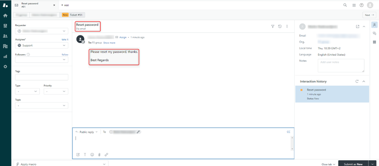

# CARIAD EngIT Frame - tech task - WP12 - Support

### Deliverables:

- Terraform code
- Ansible code
- GitHub Integration - python code
- Jira Integration - python code
- Slack Integration - python code
- Teams Integration - setup instructions
- Mail Integration - setup instructions

&nbsp;

* * *

* * *

* * *

## **Consolidation system – Zendesk**


Key factors in selecting a ticketing system include integration capabilities, security, ease of use, scalability, and features.

**1\. Integration Capabilities**

- **APIs**: Zendesk's powerful APIs enable custom workflows and seamless integration with any system.
- **Omnichannel Support**: Zendesk integrates with email, social media, live chat, phone systems, and messaging apps like **Microsoft Teams,** **Slack...**
- **Third-party Tools**: Zendesk integrates with popular CRM systems, project management tools, and eCommerce platforms like Salesforce, Jira, and Shopify.
- **Marketplace**: Access to hundreds of pre-built integrations in the **Zendesk**

**2\. Security and Compliance**

- **Data Encryption**: Zendesk ensures that all data, both at rest and in transit, is encrypted using industry-standard methods.
- **Compliance Certifications**: Zendesk complies with several key regulatory frameworks, including **GDPR**, **SOC 2**, **HIPAA**, and **ISO 27001**.
- **Role-Based Access Control (RBAC)**: Zendesk provides granular permissions, allowing organizations to control who has access to specific areas of the platform.
- **SAML Single Sign-On (SSO)**: Zendesk supports secure authentication methods like **SAML**, **OAuth**, and **LDAP**.

**3\. Ease of Use**

- **Intuitive interface**: The interface is simple, clean, and easy to navigate.
- **Quick setup and deployment**: Zendesk's quick deployment requires minimal setup, allowing teams to start without extensive technical expertise.
- **Agent collaboration features**: Zendesk offers tools like private notes, ticket sharing, and side conversations to help agents collaborate on complex issues.

**Conclusion**

Selecting Zendesk provides a customizable, scalable solution with strong integration capabilities, a user-friendly interface, and advanced features. Its focus on security, ease of use, and cost-effectiveness makes it a reliable platform for organizations of all sizes.

&nbsp;

* * *

* * *

* * *

## **Mail Integration - Zendesk**

**Mail to Zendesk** is a feature that allows incoming customer emails to automatically create support tickets in Zendesk. This provides a seamless way for customers to request help, and for agents to manage those requests within the Zendesk system.

**Workflow**

**1\. Customer (End User) Sends an Email**:

- The **end user** (customer or client) sends an email to your company's support email address (e.g., **support@yourcompany.com**).
- This email is received by Zendesk, which automatically creates a **ticket** in the system.


**2\. Ticket Appears in the Agent's Zendesk Interface**:

- Zendesk converts the **email subject** into the **ticket subject** and the **email body** into the **ticket description**.
- The email sender (end user) is automatically recognized as the **ticket requester**.
- If the customer is new, Zendesk creates a user profile for them; if they're a returning user, the system associates the ticket with their existing profile.
- The support **agent** sees the new ticket in their Zendesk dashboard.
- Agents can view the full **email content**, any attached files, and the customer’s contact information.
- Zendesk applies predefined **triggers and automations** to route the ticket to the correct department or agent based on criteria such as subject keywords or customer type.



**3\. Agent Replies via Zendesk**:

- The agent can reply to the ticket directly from Zendesk’s interface, writing their response in the ticket thread.
- Zendesk converts the agent's reply into an **outgoing email** and sends it back to the customer.
- The end user receives the response in their email inbox as if it were a standard email reply from the support team.

 

**4\. Conversation Continuation**:

- The end user can reply to the email they received, and Zendesk automatically updates the corresponding ticket with their new message.
- The agent can continue the conversation within Zendesk, and all communication is tracked in the ticket's history.

**End User’s Perspective:**

- They send and receive emails in their regular inbox. They see Zendesk as the company’s support email system, unaware that their emails are being processed by a ticketing system.
- End users don’t need to access Zendesk directly; everything happens through standard email interactions.
- Each email reply they send adds to the ticket conversation without requiring any special actions.

**Agent’s Perspective:**

- The agent works entirely within Zendesk’s interface, managing tickets without needing to use an external email client.
- They can view the entire **ticket history**, check customer details, add internal notes, reassign tickets, and even escalate them, all within the Zendesk platform.
- The agent can use **macros**, **triggers**, and **automations** to handle email tickets more efficiently, such as sending predefined responses or automatically tagging and categorizing tickets based on the content of the email.

&nbsp;

* * *

* * *

* * *

## **Teams Integration - Zendesk**

This integration allows support agents to manage tickets and collaborate in real-time within the familiar Teams environment. It enhances both operational efficiency and customer satisfaction by making it easier to track, manage, and resolve customer inquiries while staying connected to internal stakeholders.

1\. **Install the Zendesk plugin in Microsoft Teams**

- **Open Microsoft Teams** and navigate to the **Apps** section in the left sidebar.


- In the search bar, type **Zendesk** to find the **Zendesk for Microsoft Teams** app/plugin. Click on the **Zendesk app** and choose **Add**.


2\. **Sign in and Authorize Zendesk**

Once the Zendesk plugin is installed in Teams:

- In Microsoft Teams, click **Chat**, then click **Zendesk**. A welcome message is displayed.


- In the bottom-left corner of the message, click **Grant permissions**.You will be redirected to the **Azure AD** consent page in your browser. <span style="color: black;">Click **Accept**. A “Permissions granted” page is displayed.</span>
- <span style="color: black;">Go back to Microsoft Teams, select **Chat**, then select the Zendesk app. In the bottom-right corner of the message, click **Connect subdomain**.</span>
- You will be prompted to **sign in to your Zendesk account**. This requires your Zendesk **subdomain**. <span style="color: black;">Enter your Zendesk subdomain token and then click **Connect**.</span>
- <span style="color: black;">Make sure you entered correct subdomain and click Sign In.</span>

<span style="color: black;"></span>

- In the **Sign in** dialog, enter your Zendesk admin credentials into the **Email** and **Password** fields, and then click **Sign in**. If you are using SSO this step will be skipped.

3\. **Use Zendesk Commands in Teams**

Once integrated, you can interact with Zendesk tickets directly from Teams using commands. Easiest way to learn more about commands is to go to the Zendesk channel and in chat type “help”, Zendesk will give you list with all command that you can use to help you menage ticket:

****

4\. **Set Up Automation and Triggers**

You can further optimize your workflow by setting up automated triggers that send specific notifications or perform certain actions when Zendesk ticket conditions are met. For example:

- On left sidebar click on **Settings** and open **Zendesk Admin Center**

****

- Go to **Objects and Rules** > **Triggers**.
- **Create trigger** that sends a notification to a specific **Teams channel** when a high-priority ticket is created or when a ticket remains unresolved for too long.


&nbsp;

* * *

* * *

* * *

## **Jira Integration - Zendesk**

### 1\. Overview

This document outlines the steps required to deploy, maintain, and monitor the Python automation script for synchronizing Jira issues with Zendesk tickets. The script is designed to fetch issues from Jira, check for corresponding tickets in Zendesk, create new tickets if none exist, and update the status of existing tickets to match Jira statuses.

### 2\. Prerequisites

#### 2.1. Tools and Libraries

- Python 3.x
- Libraries: aiohttp, logging, asyncio, os
- A VM with internet access to interact with Jira and Zendesk APIs

#### 2.2. Accounts

- Jira API Credentials (Email and API token)
- Zendesk API Credentials (Email and API token)
- For more information about how to generate, configure and manage API key in Zendesk, visit the next URL: https://support.zendesk.com/hc/en-us/articles/4408889192858-Managing-access-to-the-Zendesk-API
- For more information about how to generate, configure and manage API key in Jira, visit the next URL: https://support.atlassian.com/atlassian-account/docs/manage-api-tokens-for-your-atlassian-account/

#### 2.3. Custom Fields in Zendesk

- We are required to add custom field in Zendesk which hold the values of Jira issues, values like `JIRA_ISSUE_KEY_FIELD_ID` and `JIRA_STATUS_FIELD_ID`. This way we can always track, both the issue status and id of an issue in Jira from Zendesk.
- For more information about how to manipulate custom fields in Zendesk, visit the next URL: https://support.zendesk.com/hc/en-us/articles/4420210121114-Using-custom-fields


#### 2.4. Environment Variables

Environment Variables:
- ZENDESK_EMAIL
- ZENDESK_API_TOKEN
- ZENDESK_TICKET_URL
- ZENDESK_SEARCH_URL
- ZENDESK_SUBDOMAIN
- JIRA_EMAIL
- JIRA_API_TOKEN
- JIRA_SEARCH_URL
- JIRA_STATUS_FIELD_ID
- JIRA_ISSUE_KEY_FIELD_ID

Variables will be stored as environment variables on our host and called into script from there.

#### 2.5. Integration Points

- Jira API: Fetches the list of Jira issues.
- Zendesk API: Queries for existing tickets and creates or updates them accordingly.

* * *

### 3\. Data Flow

#### 3.1. Step-by-Step Data Flow

**1\. Jira API Query**:

- The script starts by querying Jira for a list of issues using the `JIRA_URL` endpoint and Jira API credentials.

**2\. Issue Processing**:

For each Jira issue, the script extracts key details such as:

- Issue key
- Assignee (if any)
- Requester (reporter)
- Summary, description, and status

**3\. Zendesk ticket check**:

- The script queries Zendesk to check if a ticket with the same `issue_key` exists using the `ZENDESK_SEARCH_URL` endpoint

**4\. Ticket creation and updates**:

- If no corresponding ticket is found, the script creates a new Zendesk ticket.
- If a ticket is found but has a different status, the script updates the status to match the Jira issue.

#### 3.2. Data Mapping

- Jira statuses are mapped to corresponding Zendesk statuses using a dictionary `STATUS_MAPPING`.

Example:

```
STATUS_MAPPING = {
    <span style="color: #6aab73;">"Open"</span>: <span style="color: #6aab73;">"open"</span>,
    <span style="color: #6aab73;">"Work in progress"</span>: <span style="color: #6aab73;">"open"</span>,
    <span style="color: #6aab73;">"Under investigation"</span>: <span style="color: #6aab73;">"open"</span>,
    <span style="color: #6aab73;">"Under review"</span>: <span style="color: #6aab73;">"open"</span>,
    <span style="color: #6aab73;">"Waiting for approval"</span>: <span style="color: #6aab73;">"pending"</span>,
    <span style="color: #6aab73;">"Review"</span>: <span style="color: #6aab73;">"pending"</span>,
    <span style="color: #6aab73;">"Pending"</span>: <span style="color: #6aab73;">"pending"</span>,
    <span style="color: #6aab73;">"Resolved"</span>: <span style="color: #6aab73;">"solved"</span>,
    <span style="color: #6aab73;">"Completed"</span>: <span style="color: #6aab73;">"solved"</span>,
    <span style="color: #6aab73;">"Declined"</span>: <span style="color: #6aab73;">"solved"</span>,
    <span style="color: #6aab73;">"Failed"</span>: <span style="color: #6aab73;">"solved"</span>,
    <span style="color: #6aab73;">"Canceled"</span>: <span style="color: #6aab73;">"solved"</span>,
    <span style="color: #6aab73;">"Closed"</span>: <span style="color: #6aab73;">"solved"
</span>}
```

* * *

### 4\. Deployment Instructions

#### 4.1. Deploying the script to an Azure VM

In this particular case deploying itself will be done with Terraform module for creation of VM, and configuration of the VM will be done with Ansible. Terraform and Ansible will be integrated to work together for wanted results.

#### 4.2. Automating the script execution

In order to automate the execution of our script we will be using `systemd`. We will create a service where this script will be executed once in a while.

* * *

### 5\. Maintenance

#### 5.1. Logs and Monitoring

- Logs will be written to console. We can monitor them by using `journalctl` command. We can make a script output logs into file of our own.

#### 5.2. Error Handling

The script logs any errors encountered during the process.

#### 5.3. Updating the script

- If the script needs to be updated (e.g., for future enhancements), upload the new version to the VM and replace the old one. Restart the script using the same steps as outlined in the deployment section.

* * *

### 6\. Integration Points

#### 6.1. Jira API

- Endpoint: `JIRA_URL`
- Method: GET
- Authentication: Basic Auth (Email and API Token)
- Querying Issues:
- The script retrieves issues with the query provided in the `JIRA_URL`.
- The relevant data fields are extracted (key, summary, description, status, assignee).

#### 6.2. Zendesk API

**Ticket Search**:

- Endpoint: `ZENDESK_SEARCH_URL`
- Method: `GET`
- Querying by Jira Key: The Jira issue key is used to check if a corresponding ticket exists in Zendesk.

**Ticket Creation**:

- Endpoint: `ZENDESK_URL`
- Method: `POST`
- Request Payload: Contains the issue summary, description, status and custom fields.

**Ticket Update**:

- Endpoint: `ZENDESK_URL`
- Method: `PUT`
- Request Payload: Contains the updated status of the ticket and the Jira issue status.

* * *

### 7\. Necessary Transformations

**1\. Status Mapping**:

- Jira statuses are mapped to Zendesk statuses using the predefined `STATUS_MAPPING` dictionary.
- Ensure that any additional statuses are added to this mapping to prevent errors.

**2\. Data Fields**:

- Certain fields like `assignee`, and `requester` may require transformations to comply with Zendesk's format. For example, in Zendesk, the `assignee` field requires a user ID, not just the name.

**3\. Custom fields in Zendesk**:

- We are required to add custom field in Zendesk which hold the values of Jira issues, values like `JIRA_ISSUE_KEY_FIELD_ID` and `JIRA_STATUS_FIELD_ID`. This way we can always track, both the issue status and id of an issue in Jira from Zendesk.

&nbsp;    

- For more information about how to manipulate custom fields in Zendesk, visit next URL: https://support.zendesk.com/hc/en-us/articles/4420210121114-Using-custom-fields

&nbsp;

* * *

* * *

* * *

## **Slack Integration - Zendesk**

### 1\. Overview

This document outlines the steps required to deploy, maintain, and monitor the Python automation script for opening Zendesk tickets from Slack chat. The script is designed to fetch messages from Slack, check for corresponding tickets in Zendesk, create new tickets if none exist, and add comments from chat with user.

### 2\. Prerequisites

#### 2.1. Tools and Libraries

- Python 3.x
- Libraries: requests, substring, slack_bolt
- A VM with internet access to interact with Slack and Zendesk APIs

#### 2.2. Accounts

- Slack account with permission to create app for intended workspace.
- Zendesk API Credentials (Email and API token)

#### 2.2.1 Slack tokens and app registration

- First, you need to create a Slack app on the link: https://api.slack.com/apps/new
- After you fill out an app name and pick a workspace to install it to, hit the Create App button and you'll land on your app's Basic Information page
- Navigate to the OAuth & Permissions on the left sidebar and scroll down to the Bot Token Scopes section. Click Add an OAuth Scope.
- Add following scopes: im:history, im:write.
- Scroll up to the top of the OAuth & Permissions page and click Install App to Workspace. You'll be led through Slack's OAuth UI, where you should allow your app to be installed to your workspace.
- Once you authorize the installation, you'll land on the OAuth & Permissions page and see a Bot User OAuth Access Token. We will use this token as our 'Slack bot token' environment variable.
- Then head over to Basic Information and scroll down under the App Token section and click Generate Token and Scopes to generate an app-level token. Add the connections:write scope to this token and save the generated token. We will use this token as our 'Slack app token' environment variable.
- Navigate to Socket Mode on the left side menu and toggle to enable.
- Navigate to Event Subscriptions on the left sidebar and toggle to enable. Under Subscribe to Bot Events, chose Add Bot User Event and select message.im.
- For more information visit the next URL: https://tools.slack.dev/bolt-python/getting-started

#### 2.2.2 Zendesk user and token

- For more information visit the next URL: https://support.zendesk.com/hc/en-us/articles/4408889192858-Managing-access-to-the-Zendesk-API

#### 2.3. Environment Variables

- Zendesk subdomain
- Zendesk email
- Zendesk API token
- Zendesk group ID
- Slack app token
- Slack bot token

#### 2.4. Integration Points

- Slack API: Fetches the new tickets from Slack chats with tickets bot.
- Zendesk API: Queries for existing tickets and creates or updates them accordingly.

* * *

### 3\. Data Flow

#### 3.1. Step-by-Step Data Flow

**1\. Slack listens for messages**:

The script starts by creating slack bot that listens for messages starting with “ticket” or “reply” and when bot gets such message it sends the form to the user for creating/replying to ticket.

**2\. New ticket processing**:

For each submitted form for ticket creation, the script extracts key details such as:

- User ID (for tracking which user created and therefore can reply to ticket)
- Message ID (for ensuring that one form can only be submitted once)
- Ticket Summary
- Ticket Description

**3\. New reply to ticket processing**:

For each submitted form for ticket reply, the script extracts key details such as:

- User ID (for tracking which user created and therefore can reply to ticket)
- Message ID (for ensuring that one form can only be submitted once)
- Ticket ID
- Reply text

**4\. Zendesk ticket check**:

The script queries Zendesk to check if a ticket with the same message_id exists.

**5\. Ticket creation and updates**:

- For ticket creation, if no corresponding ticket is found, the script creates a new Zendesk ticket.
- For adding new reply, if a ticket is found and user has permissions to reply to it, new reply is added

* * *

### 4\. Deployment Instructions

#### 4.1. Deploying the script to an Azure VM

In this particular case deploying itself will be done with Terraform module for creation of VM, and configuration of the VM will be done with Ansible. Terraform and Ansible will be integrated to work together for wanted results.

#### 4.2. Automating the script execution

In order to automate the execution of our script we will be using `systemd`. We will create a service where this script will be executed once in a while.

* * *

### 5\. Maintenance

#### 5.1. Logs and Monitoring

Logs will be written to console. We can monitor them by using `journalctl` command. We can make a script output logs into file of our own.

#### 5.2. Error Handling

The script logs any errors encountered during the process.

#### 5.3. Updating the script

If the script needs to be updated (e.g., for future enhancements), upload the new version to the VM and replace the old one. Restart the script using the same steps as outlined in the deployment section.

* * *

### 6\. Integration Points

#### 6.1. Slack Bot

- Uses slack_bolt library for python with included commands for working with direct messages in Slack
- Authentication: using two tokens, one for app that listens to actions and other for bot to respond to messages
- The relevant data fields are extracted (user ID, message ID, description, summary).

#### 6.2. Zendesk API

**Ticket Search**:

- Endpoint: `ZENDESK_SEARCH_URL`
- Method: `GET`
- Authentication: Basic Auth (Email and API Token)
- Querying by Zendesk ticket ID: The form in Slack contains a field for ticket ID that is used to check if a corresponding ticket exists in Zendesk.

**Ticket Creation**:

- Endpoint: `ZENDESK_URL`
- Method: `POST`
- Authentication: Basic Auth (Email and API Token)
- Request Payload: Contains the issue summary, description, group ID and tags.

**Ticket Update**:

- Endpoint: `ZENDESK_URL`
- Method: `PUT`
- Authentication: Basic Auth (Email and API Token)
- Request Payload: Contains the users reply to the ticket and ticket ID.

* * *

### 7\. Necessary Transformations

**1\. Fields Mapping**:

- Textboxes from form sent to user are mapped to corresponding zendesk fields (ticket summary and description)

**2\. Tags in Zendesk**:

- userID and messageID from Slack message are mapped to tags in Zendesk

&nbsp;

* * *

* * *

* * *

## **GitHub Integration - Zendesk**

## 1\. Overview

This document covers Zendesk configuration and application for synchronizing GitHub issues with Zendesk tickets, and Checking Compliance of GitHub issues.

Useful information: If at any point in the setup you cannot add tags, or they dont exist, 
create a test ticket manually and add necessery tag in the ticket.
Zendesk will autocreate tag system-wide.

## 2\. Prerequisites

Variables that will be used in Terraform deployment. Please mark them down:

ZENDESK_SUBDOMAIN = Your subdomain for Zendesk  
ZENDESK_EMAIL = Account that will be used for automation for GitHub, created in Step 2.1 of this document  
ZENDESK_API_TOKEN = Token that will be used for automation for GitHub, created in Step 2.1 of this document  
ZENDESK_GROUP = this is `int` value of the GROUP ID from the step 2.2.1 of this document

### 2.1. Accounts

- Zendesk agent account (email) - To create account, please refer to: https://support.zendesk.com/hc/en-us/articles/4408886939930-Adding-agents-and-admins#topic_3zw_yl2_yg

- Enable ticket deletion: https://support.zendesk.com/hc/en-us/articles/4408832689818-Enabling-agents-to-delete-tickets

- Enable API token: https://support.zendesk.com/hc/en-us/articles/4408889192858-Managing-access-to-the-Zendesk-API


### 2.2. Zendesk Configuration

In order for the compliance check to work properly, it is necessary to configure Zendesk:

#### 2.2.1. Create Group in Zendesk for Github Issues

```
1. Navigate to Groups:
    In the Zendesk Admin Center, go to People > Team > Groups.
2. Add a New Group:
    Click on Add group.
    Enter Group Details:
3. Group name: Enter a name for the group “GitHub”.
    Description: Optionally, add a description for the group.
4. Add group members:
    Under the Add group members section, click the plus sign (+) next to newly created agent.
4. Save the Group:
Click Save to create the group.

```

- Retrieve GROUP ID:

```
To retrieve the GROUP ID in Zendesk, follow these steps:

1. Navigate to Groups:
    In the Zendesk Admin Center, go to People > Team > Groups.
2. Select the Group:
    Click on the name group “GitHub”.
3. Find the Group ID:
    Once you’re on the group’s page, look at the URL in your browser. The group ID will be part of the URL. 
    For example, if the URL is https://{ZENDESK_SUBDOMAIN}.zendesk.com/agent/admin/groups/123456, then 123456 is the group GitHub.
    
    Mark down this value, as it will be later used, as mentioned before.

```

#### 2.2.2 Create automations in Zendesk

First automation:

```
1. Navigate to Automations:
    In the Zendesk Admin Center, go to Objects and rules > Business rules > Automations.
2. Create a New Automation:
    Click on Add Automation.
3. Set Conditions:
    Meet all of the following conditions:
        Ticket: Status > Less than > Closed
        Ticket: Group > Is > GitHub
        Ticket: Hours since created > (business) Greater than > 40 (5 days)

4. Set Actions:
    Ticket: Add tags > not_updated_for_5_days
5. Save the Automation:
    Give your automation a name and click Create automation.
```

Second automation:

```
1. Navigate to Automations:
    In the Zendesk Admin Center, go to Objects and rules > Business rules > Automations.
2. Create a New Automation:
    Click on Add Automation.
3. Set Conditions:
    Meet all of the following conditions:
        Ticket: Status > Less than > Closed
        Ticket: Group > Is > GitHub
        Ticket: Hours since created > (calendar) Greater than > 720 (30 days)
4.Set Actions:
    Ticket: Add tags > open_for_30_days
5. Save the Automation:
    Give your automation a name and click Create automation.
```

#### 2.2.3 Create View for Non Compliant Github Issues

In order to see only non compliant issues, a custom View must be created: https://support.zendesk.com/hc/en-us/articles/4408888828570-Creating-views-to-build-customized-lists-of-tickets

```
1. In the Admin Center, click on Objects and rules > Business rules > Views.

2. Click on the Add view button.

3. Set Up the View:
    Title: Non Compliant Github Issues.
    Conditions: 
        Meet all of the following conditions:
        Group | is | GitHub
        Meet any of the following conditions:
        Tags | contains at least one of the following | open_for_30_days
        Tags | contains at least one of the following | not_updated_for_5_days
        Tags | contains at least one of the following | not_assigned
        Tags | contains at least one of the following | not_labeled

4. Formatting Options: Choose how you want the tickets to be displayed. You can select columns like Subject, Requester, Status, etc.
5. Availability: Available to all agents.
```

### 2.3. GitHub Webhook

```
Step 1: Navigate to Your Repository
    Navigate to the repository where you want to set up the webhook.
Step 2: Access Webhook Settings
    Go to Settings:
    Under your repository name, click on Settings.
    Open Webhooks:
    In the left sidebar, click on Webhooks.
Step 3: Add a New Webhook
    Click the Add webhook button.
    Enter Payload URL:https://{VM_PUBLIC_IP}:3000/github-webhook
    Set Content Type:
    Optionally, select the content type "application/json".
    Select Events:
        Issues
        Isuue Comments
        Labels
        Disable SSL (just for testing purposes)
        Ensure the webhook is set to Active.
Step 4: Save the Webhook

```

### 2.4. Integration Points

- GitHub Webhook reciever: Recieves payloads for events related to ticekts
- Zendesk API: Queries for existing tickets and creates or updates them accordingly.

* * *

## 3\. Data Flow

### 3.1. GitHub webhook

**1\. GitHub events trigger**:

- Application recieves 'payload' via webhook

Payloads come in two formats:

- issues
- comments

**2\. Issue Processing**:

For each payload, application checks the type of payload. For format `issues` types are:

- opened
- closed
- unlabeled
- labeled
- unnasigned

For issue type `opened` application opens a new ticket in Zendesk. Subject,body, description and labels are added to new Zendesk ticket. If the ticket is not assigned, tag `not_assigned` is added to the ticket. When the new ticket is created, at the bottom of the description Github issue is added, so it can be referenced later.

For issue type `closed`, application searches open tickets in the Github group in Zendesk. Key for search is GitHub issue ID. When ticket is located, it is Closed via Zendesk API request.

For issue type `unlabeled` as for `labeled` application runs label update. Label update checks if predefined labels are missing, and if so, adds a tag in Zendesk ticket named `missing_labels`.

For issue type `unnasigned`, application adds tag `not_assigned` to Zendesk ticket.

* * *

## 4\. Deployment Instructions

## 4.1. Deploying the script to an Azure VM

In this particular case deploying itself will be done with Terraform module for creation of VM, and configuration of the VM will be done with Ansible. Terraform and Ansible will be integrated to work together for wanted results.

## 4.2. Automating the script execution

In order to automate the execution, application will be deployed as  
a Linux service.

* * *

## 5\. Maintenance

### 5.1. Logs and Monitoring

- Logs will be written to console. We can monitor them by using `journalctl` command. We can make a script output logs into file of our own.

### 5.2. Error Handling

Application logs any errors encountered during the process.

### 5.3. Updating the script

- If the script needs to be updated (e.g., for future enhancements), upload the new version to the VM and replace the old one. Restart the script using the same steps as outlined in the deployment section.
- Daemon-reload is needed before restarting

* * *

## 6\. Integration Points

### 6.1. GitHub API

- Endpoint: `github-webhook`
- Method: POST
- Authentication: none (nete that this is just for the purposes of this demo. To create proper authetification, use field SECRET in webhook. More on that in chapter 7)
- Querying payload: The script retrieves relevant information based on payload type

### 6.2. Zendesk API

**Ticket Search**:

- Endpoint: `https://{ZENDESK_SUBDOMAIN}.zendesk.com/api/v2/tickets/{ticket_id}.json`
- Method: `GET`
- Querying by GitHub Issue ID: The GitHub issue ID is used to check if a corresponding ticket exists in Zendesk.

**Ticket Creation**:

- Endpoint: `https://{ZENDESK_SUBDOMAIN}.zendesk.com/api/v2/tickets.json`
- Method: `POST`
- Request Payload: Contains the issue summary, description and status.

**Add comments**:

- Endpoint: `ZENDESK_URL`
- Method: `PUT`
- Request Payload: Contains the new comments added to the ticket.

**Label Update**:

- Endpoint: `https://{ZENDESK_SUBDOMAIN}.zendesk.com/api/v2/tickets/{ticket_id}.json`
- Method: `PUT`
- Request Payload: Contains the updated labels added to the ticket.

* * *

## 7\. Necessary Transformations

**1\. Required labels**:

For testing purposes, currently the required labels on GitHub are:

```
['bug', 'devops', 'good_first_issue']
```

For custom labels please change corresponding values in `update_ticket_tags` function:

```
required_labels = ['bug', 'devops', 'good_first_issue']
```

**2\. Webhook authentification**:

- For the purposes of this demo, authentification is not set up, as there is already NSG rule in place that limits incoming traffic to just GitHub webhooh IP ranges on port `3000`. If used in production, please use  
  `secret from GitHub Webhook setup`. It should be stored as environment variable, and called in Python application:

- Libreraries:


```
import hmac
import hashlib
```

- New function:

```
def verify_signature(secret, payload, signature):
    mac = hmac.new(secret.encode(), msg=payload, digestmod=hashlib.sha256)
    return hmac.compare_digest('sha256=' + mac.hexdigest(), signature)
```

- Variable for GitHub secret:

```
WEBHOOK_SECRET = os.environ["WEBHOOK_SECRET"]
```

- Call function in `github-webhook` endpoint:

```
@app.route('/github-webhook', methods=['POST'])
def github_webhook():
    secret = os.environ['GITHUB_WEBHOOK_SECRET']
    signature = request.headers.get('X-Hub-Signature-256')
    payload = request.data

    if not verify_signature(secret, payload, signature):
        return jsonify({'status': 'unauthorized'}), 401
        
    # Rest of the code...
```

* * *

* * *

* * *

# **Infrastructure Deployment Instructions**

This repository contains the Terraform, Ansible, and Python code along with configuration files and scripts for setting up Support requirements

## Delivered Components

- Terraform code for infrastructure setup
- Ansible playbooks for configuration management
- Python scripts
- Bash script for automated deployment

## Prerequisites

Before running the code, ensure that you are running Ubuntu 22.04 LTS and have the following tools installed:

1. `Azure CLI`: [Install Azure CLI](https://learn.microsoft.com/en-us/cli/azure/install-azure-cli-windows?tabs=azure-cli)
2. `Terraform`: [Install Terraform](https://developer.hashicorp.com/terraform/install)
3. `Ansible`: [Install Ansible](https://docs.ansible.com/ansible/latest/installation_guide/installation_distros.html#installing-distros)


### Deployment Requirements

To ensure a successful deployment, please verify the following prerequisites:

1. **Service Principal**
   - The Service Principal must be assigned the **Owner** role at the **Subscription** level where the deployment will occur.
   - Generate a valid secret and provide it to the deployment script.
   - **Azure Tenant ID**: Ensure you have the Azure Tenant ID for the tenant where the subscription resides.
   - **Application Client ID**: Obtain the Application Client ID associated with the Service Principal.
   - **Subscription ID**: Obtain the Subscription ID where resource will be deployed. 

2. **Resource Group**
   - Ensure that the Resource Group named **rg-cariad-support-demo** does not already exist in the Subscription.

3. **Internet Access**
   - The machine executing the deployment must have internet access to facilitate the process.

## Deployment Steps

### Task 1: Running the Deployment Bash Script

#### Step 1: Prepare the Deployment Script

1. Ensure the following directory structure is in place:

```plaintext
scripts/
└── deploy-support.sh
```

2. Navigate to `scripts` folder

 ```bash
 cd scripts
 ```

3. Open the `deploy-suport.sh` file and configure the necessary environment variables with your credentials:

- **ADMIN_USERNAME**: `YOUR_ADMIN_USERNAME`
- **ADMIN_PASSWORD**: `YOUR_ADMIN_PASSWORD`
- **ARM_TENANT_ID**: `YOUR_TENANT_ID`
- **ARM_SUBSCRIPTION_ID**: `YOUR_SUBSCRIPTION_ID`
- **ARM_CLIENT_ID**: `YOUR_CLIENT_ID`
- **ARM_CLIENT_SECRET**: `YOUR_CLIENT_SECRET`
- **ZENDESK_SUBDOMAIN**: `YOUR_ZENDESK_SUBDOMAIN`
- **ZENDESK_EMAIL**: `YOUR_ZENDESK_LOGIN_EMAIL`
- **ZENDESK_API_TOKEN**: `YOUR_ZENDESK_API_TOKEN`
- **ZENDESK_GROUP**: `YOUR_ZENDESK_GROUP_ID`
- **ZENDESK_TICKET_URL**: `URL_FOR_ZENDESK_TICKET_API`
- **ZENDESK_SEARCH_URL**: `URL_FOR_ZENDESK_SEARCH_API`
- **JIRA_EMAIL**: `YOUR_JIRA_EMAIL`
- **JIRA_API_TOKEN**: `YOUR_JIRA_API_TOKEN`
- **JIRA_SEARCH_URL**: `JIRA_API_SEARCH_URL`
- **JIRA_STATUS_FIELD_ID**: `YOUR_JIRA_STATUS_FIELD_ID`
- **JIRA_ISSUE_KEY_FIELD_ID**: `YOUR_JIRA_ISSUE_KEY_FIELD_ID`
- **SLACK_BOT_TOKEN**: `YOUR_SLACK_BOT_TOKEN`
- **SLACK_APP_TOKEN**: `YOUR_SLACK_APP_TOKEN`
- **GROUP_ID_SLACK**: `YOUR_ZENDESK_GROUP_ID_FOR_SLACK`

4. Make sure the `deploy-suport.sh` script has execute permissions:
 
 ```bash
 chmod +x deploy-suport.sh
 ```

#### Step 2: Execute the Deployment Script

1. Run the script with elevated privileges to start the deployment process:
 ```bash
 ./deploy-suport.sh
 ```

2. Terraform will prompt with the plan of the deployment, type `yes` and hit `enter` to proceed.

3. Wait for the deployment script to complete. The Ansible provisioner will then display the Public IP address of support VM, which you can use to access the machine.

### Access Credentials for Virtual Machine

The username and password for accessing the Virtual Machines and Grafana are identical to the credentials defined in the following environment variables:

- **ADMIN_USERNAME**: `YOUR_ADMIN_USERNAME`
- **ADMIN_PASSWORD**: `YOUR_ADMIN_PASSWORD`

## Important Notes

- The Ansible provisioner will display sensitive values for the `ADMIN_PASSWORD` and `ARM_CLIENT_SECRET` variables, as they are not marked as sensitive.

- **For the purpose of this demo, output will not be suppressed; however, please exercise caution and handle these values securely in production environments.** 

- If you are using these variables in a production setting with Terraform, it is strongly recommended to mark them as sensitive in `terraform/main/variables.tf` file.

```hcl
variable "client_secret" {
  description = "The Client Secret of the Service Principal used for accessing Azure resources."
  type        = string
  sensitive   = true
}
variable "admin_password" {
  description = "The administrator password for the virtual machines."
  type        = string
  sensitive   = true
}
```

# Terraform Infrastructure Code

This Terraform configuration provisions one Virtual Machines (VM) for support ticket consolidation, along with all related resources.

## Directory Structure

All resources are deployed as modules, with the following directory structure:

```plaintext
terraform/
├── main.tf
├── variables.tf
├── outputs.tf
└── modules/
    ├── resource_group/
    │   ├── main.tf
    │   ├── variables.tf
    │   └── outputs.tf
    ├── network_security_group/
    │   ├── main.tf
    │   ├── variables.tf
    │   └── outputs.tf
    ├── virtual_network/
    │   ├── main.tf
    │   ├── variables.tf
    │   └── outputs.tf
    ├── virtual_machine/
    │   ├── main.tf
    │   ├── variables.tf
    │   └── outputs.tf
    └── public_ip/
        ├── main.tf
        ├── variables.tf
        └── outputs.tf
```

## Provider

This configuration uses the `azurerm` provider to deploy Azure resources.

Provider configuration:
```hcl
terraform {
  required_providers {
    azurerm = {
      source  = "hashicorp/azurerm"
      version = "3.92.0"
    }
  }
}
provider "azurerm" {
  features {}
  client_id       = var.client_id
  client_secret   = var.client_secret
  subscription_id = var.subscription_id
  tenant_id       = var.tenant_id
}

```
## Resources

The following resources are defined in the Terraform code:

1. **Resource Group**
2. **Virtual Machine**
   - **Network Interface Card (NIC)** *(subresource of Virtual Machine)*
   - **OS Disk** *(subresource of Virtual Machine)*
3. **Virtual Network**
   - **Subnet** *(subresource of Virtual Network)*
4. **Public IP**
5. **Network Security Group** *(associated with Subnet)*
6. **Ansible provisioner**

### Inbound Network Security Group Rules

For this task, the following **inbound** Network Security Group rules are permitted for all addresses:

- **Port 22**: SSH
- **Port 3000**: HTTPS, to recieve github webhooks

**Note**: In a production environment, it is essential to restrict access by whitelisting only specific addresses as necessary to enhance security.

## Important Notes
- Since provisioning is done locally, the `terraform.tfstate` file will be generated in the `terraform/main` directory. For future deployments, users should back up this file. The best practice is to configure a backend block for the `azurerm` provider and store the `terraform.tfstate` file in an `Azure Storage Account`.
- The `local-exec` provisioner triggers a local executable, which subsequently calls Ansible. Ansible first generates the inventory.ini file in the `ansible` directory, passing the Terraform outputs into the appropriate groupings within inventory.ini, and then executes the playbooks on the provisioned VM.

# Ansible Playbook for Server
This Ansible playbook manages and configures virtual machine

## Playbook Overview

### 1. Playbook for Server (`server_vm`)

This playbook section configures server VM and installs essential services:

```yaml
---
- name: PLAYBOOKS FOR SERVER
  hosts: server_vm
  become: true
  tasks:
    - name: Include Dependencies Tasks
      include_tasks: dependencies/tasks.yml

    - name: Include Configuration Tasks
      include_tasks: configuration/tasks.yml
```
#### Explanation:
- **`hosts: server_vms`**: Specifies that the tasks target VMs in the `server_vm` group.
- **`become: true`**: Ensures tasks are run with elevated privileges (e.g., `sudo`).
- **Included Tasks**:
  - **`dependencies/tasks.yml`**: Installs common dependencies (wget, curl, python and required libraries).
  - **`configuration/tasks.yml`**: Configures user and services for applications
---
